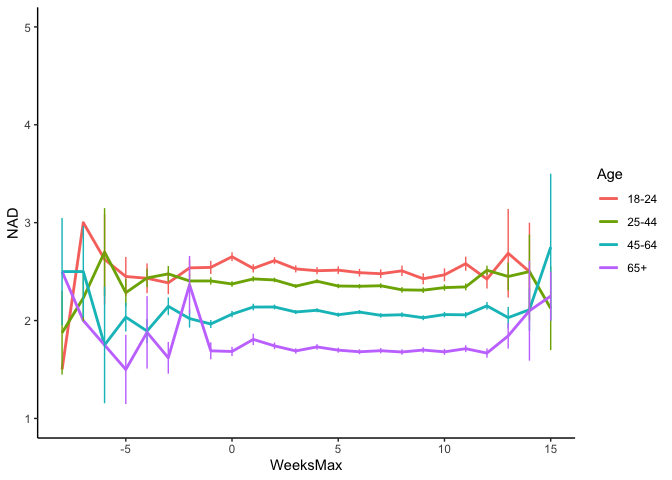
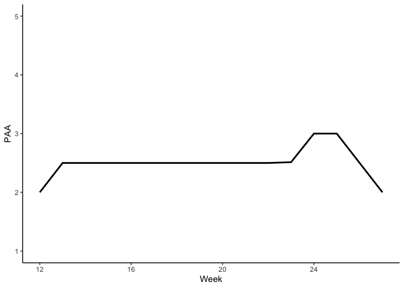

Descriptive statistics including gender
================
Anne Margit
5/02/2022

``` r
library(dplyr)
library(tidyverse)
library(stringr)
library(papaja)
library(ggpubr)
library(ggplot2)
library(stargazer)
```

``` r
load("data_imputed_emomeans_maxweeks.Rdata")
load("data_long_min3_gstr_age.Rdata")

data_long_min3_str_age <- data_long_min3_gstr_age
```

This dataset includes:

1.  Data from all weekly measurement waves (baseline through wave 11,
    Time 1 through 12)
2.  Participants who provided at least 3 measurements
3.  Participants who are residents of the country they currently live in
4.  Participants who provided info on age
5.  Participants who provided info on gender (either male or female)
6.  Data from countries with at least 20 participants
7.  Pooled age groups
8.  Imputed missing emotion scores
9.  Combined emotion scores (NAA, NAD, PAA, PAD)
10. An imputed Stringency index (StringencyIndex_imp)
11. A variable indicating the number of days before and after the day on
    which maximum stringency was reached for the respective country
    (DaysMax)
12. A variable indicating the number of weeks before and after the day
    on which maximum stringency was reached for the respective country
    (WeeksMax)
13. A variable indicating the date on which maximum Stringency was
    reached for that country (DateMaxStr)

# Missing data

``` r
#Missing data
missing.values <- data_imputed_emomeans_maxweeks %>%
  gather(key = "key", value = "val") %>%
  dplyr::mutate(is.missing = is.na(val)) %>%
  dplyr::group_by(key, is.missing) %>%
  dplyr::summarise(num.missing = n()) %>%
  dplyr::filter(is.missing==T) %>%
  dplyr::select(-is.missing) %>%
  dplyr::arrange(desc(num.missing))
```

    ## Warning: attributes are not identical across measure variables;
    ## they will be dropped

``` r
apa_table(missing.values, caption="Missing data")
```

<caption>
(#tab:unnamed-chunk-4)
</caption>

<div custom-style="Table Caption">

*Missing data*

</div>

| key             | num.missing |
|:----------------|:------------|
| Ang             | 66452       |
| Anxiety         | 66452       |
| Calm            | 66452       |
| Depr            | 66452       |
| Energ           | 66452       |
| Exh             | 66452       |
| Insp            | 66452       |
| NAA             | 66452       |
| NAD             | 66452       |
| Nerv            | 66452       |
| PAA             | 66452       |
| PAD             | 66452       |
| Rel             | 66452       |
| ConfirmedCases  | 66416       |
| ConfirmedDeaths | 66416       |
| Date            | 66416       |
| DaysMax         | 66416       |
| StringencyIndex | 66416       |
| Week            | 66416       |
| WeeksMax        | 66416       |

# Participants

**Number of participants per country with original data**

``` r
data_long_min3_str_age$Country <- as.factor(data_long_min3_str_age$Country)

Country_N <- data_long_min3_str_age %>%
  filter(Time == "1") %>%
  group_by(Country) %>%
  summarise(NCountry = n())
```

``` r
apa_table(Country_N, caption = "Number of participants per country on baseline")
```

<caption>
(#tab:unnamed-chunk-6)
</caption>

<div custom-style="Table Caption">

*Number of participants per country on baseline*

</div>

| Country        | NCountry |
|:---------------|:---------|
| Argentina      | 214      |
| Australia      | 208      |
| Brazil         | 220      |
| Canada         | 313      |
| Chile          | 87       |
| Croatia        | 142      |
| France         | 360      |
| Germany        | 403      |
| Greece         | 679      |
| Hungary        | 196      |
| Indonesia      | 187      |
| Italy          | 480      |
| Japan          | 77       |
| Kazakhstan     | 83       |
| Kosovo         | 29       |
| Malaysia       | 108      |
| Netherlands    | 682      |
| Peru           | 36       |
| Philippines    | 131      |
| Poland         | 133      |
| Serbia         | 510      |
| Romania        | 312      |
| Russia         | 202      |
| Saudi Arabia   | 71       |
| Singapore      | 44       |
| South Africa   | 222      |
| South Korea    | 22       |
| Spain          | 1031     |
| Turkey         | 184      |
| Ukraine        | 262      |
| United Kingdom | 469      |
| United States  | 2382     |
| Vietnam        | 30       |

**Mean number of participants per country, SD, min and max**

``` r
CountryN <- data_long_min3_str_age %>%
  group_by(Time, Country) %>%
  filter(Nmiss <9) %>%
  summarise(Ncountry = n_distinct(ID))

CountryNdistinct <- data_long_min3_str_age %>%
  group_by(Time) %>%
  filter(Nmiss <9) %>%
  summarise(Ncountry = n_distinct(Country))

CountryMean <- CountryN %>%
  group_by(Time) %>%
  summarise(MCountry = mean(Ncountry), SDCountry = sd(Ncountry)) %>%
  mutate(across(2:3, round, 2)) 
```

``` r
CountryMean <- as.matrix(CountryMean)

stargazer(CountryMean,
type="html", df = TRUE, out="CountryMean.doc",  single.row=TRUE, digits = 2, flip = TRUE, align = TRUE)
```

    ## 
    ## <table style="text-align:center"><tr><td colspan="13" style="border-bottom: 1px solid black"></td></tr><tr><td>Time</td><td>1</td><td>2</td><td>3</td><td>4</td><td>5</td><td>6</td><td>7</td><td>8</td><td>9</td><td>10</td><td>11</td><td>12</td></tr>
    ## <tr><td>MCountry</td><td>318.39</td><td>68.31</td><td>134.06</td><td>138.03</td><td>191.00</td><td>186.91</td><td>175.75</td><td>141.06</td><td>143.42</td><td>129.91</td><td>112.76</td><td>132.42</td></tr>
    ## <tr><td>SDCountry</td><td>433.56</td><td>133.13</td><td>304.49</td><td>287.24</td><td>235.57</td><td>203.56</td><td>193.85</td><td>147.84</td><td>166.27</td><td>149.72</td><td>127.68</td><td>153.35</td></tr>
    ## <tr><td colspan="13" style="border-bottom: 1px solid black"></td></tr></table>

``` r
apa_table(CountryMean, caption = "Mean number of participants per country on baseline")
```

<caption>
(#tab:unnamed-chunk-9)
</caption>

<div custom-style="Table Caption">

*Mean number of participants per country on baseline*

</div>

| Time | MCountry | SDCountry |
|:-----|:---------|:----------|
| 1    | 318.39   | 433.56    |
| 2    | 68.31    | 133.13    |
| 3    | 134.06   | 304.49    |
| 4    | 138.03   | 287.24    |
| 5    | 191.00   | 235.57    |
| 6    | 186.91   | 203.56    |
| 7    | 175.75   | 193.85    |
| 8    | 141.06   | 147.84    |
| 9    | 143.42   | 166.27    |
| 10   | 129.91   | 149.72    |
| 11   | 112.76   | 127.68    |
| 12   | 132.42   | 153.35    |

# Measurements

**Number of participants and measurements per wave with original data**
Create new variable that indicates sum of missings:

``` r
data_long_min3_str_age <- data_long_min3_str_age %>%
  group_by(ID, Time) %>%
mutate(Nmiss = sum(is.na(Ang)) + sum(is.na(Anxiety)) + sum(is.na(Nerv)) + sum(is.na(Depr)) + sum(is.na(Exh)) + 
               sum(is.na(Energ)) + sum(is.na(Insp)) + sum(is.na(Calm)) + sum(is.na(Rel))) %>%
  ungroup()
```

``` r
data_long_min3_str_age$Time <- as.factor(data_long_min3_str_age$Time)

Wave_N_original <- data_long_min3_str_age %>% 
group_by(Time)%>%
summarise(NParticipants = n_distinct(ID[Nmiss<9]), NWave = sum (!is.na(Date)), NAng= sum(!is.na(Ang)), NAnx= sum(!is.na(Anxiety)), NNerv= sum(!is.na(Nerv)), NDepr= sum(!is.na(Depr)), NExh= sum(!is.na(Exh)), NEnerg= sum(!is.na(Energ)),  NInsp= sum(!is.na(Insp)), NCalm= sum(!is.na(Calm)), NRel= sum(!is.na(Rel)), NStr = sum(!is.na(StringencyIndex)))
```

``` r
apa_table(Wave_N_original, caption="Number of measurements per wave original data")
```

<caption>
(#tab:unnamed-chunk-12)
</caption>

<div custom-style="Table Caption">

*Number of measurements per wave original data*

</div>

| Time | NParticipants | NWave | NAng | NAnx  | NNerv | NDepr | NExh  | NEnerg | NInsp | NCalm | NRel  | NStr  |
|:-----|:--------------|:------|:-----|:------|:------|:------|:------|:-------|:------|:------|:------|:------|
| 1    | 10507         | 10509 | 0    | 10455 | 10435 | 10439 | 10423 | 10421  | 10419 | 10440 | 10423 | 10509 |
| 2    | 1093          | 1093  | 1092 | 1092  | 1092  | 1093  | 1092  | 1092   | 1091  | 1092  | 1092  | 1093  |
| 3    | 4156          | 4157  | 4148 | 4149  | 4149  | 4147  | 4145  | 4147   | 4145  | 4150  | 4148  | 4157  |
| 4    | 4417          | 4423  | 4409 | 4409  | 4410  | 4407  | 4408  | 4408   | 4405  | 4408  | 4408  | 4423  |
| 5    | 6112          | 6118  | 6087 | 6093  | 6093  | 6090  | 6088  | 6090   | 6088  | 6097  | 6090  | 6118  |
| 6    | 5981          | 5983  | 5963 | 5967  | 5964  | 5964  | 5969  | 5966   | 5965  | 5971  | 5971  | 5983  |
| 7    | 5624          | 5628  | 5597 | 5608  | 5600  | 5601  | 5603  | 5596   | 5595  | 5610  | 5603  | 5628  |
| 8    | 4655          | 4662  | 4638 | 4641  | 4639  | 4638  | 4636  | 4637   | 4634  | 4646  | 4637  | 4662  |
| 9    | 4733          | 4739  | 4719 | 4716  | 4720  | 4721  | 4717  | 4723   | 4717  | 4722  | 4723  | 4739  |
| 10   | 4287          | 4288  | 4273 | 4273  | 4275  | 4274  | 4273  | 4274   | 4271  | 4279  | 4277  | 4288  |
| 11   | 3721          | 3721  | 3718 | 3716  | 3716  | 3715  | 3715  | 3712   | 3712  | 3713  | 3713  | 3721  |
| 12   | 4370          | 4371  | 4359 | 4355  | 4351  | 4355  | 4352  | 4351   | 4349  | 4356  | 4354  | 4371  |

``` r
Wave_N_original <- as.matrix(Wave_N_original)

stargazer(Wave_N_original,
type="html", df = TRUE, out="Wave_N_original.doc",  single.row=TRUE, flip = TRUE, align = TRUE)
```

    ## 
    ## <table style="text-align:center"><tr><td colspan="13" style="border-bottom: 1px solid black"></td></tr><tr><td>Time</td><td>1</td><td>2</td><td>3</td><td>4</td><td>5</td><td>6</td><td>7</td><td>8</td><td>9</td><td>10</td><td>11</td><td>12</td></tr>
    ## <tr><td>NParticipants</td><td>10507</td><td>1093</td><td>4156</td><td>4417</td><td>6112</td><td>5981</td><td>5624</td><td>4655</td><td>4733</td><td>4287</td><td>3721</td><td>4370</td></tr>
    ## <tr><td>NWave</td><td>10509</td><td>1093</td><td>4157</td><td>4423</td><td>6118</td><td>5983</td><td>5628</td><td>4662</td><td>4739</td><td>4288</td><td>3721</td><td>4371</td></tr>
    ## <tr><td>NAng</td><td>0</td><td>1092</td><td>4148</td><td>4409</td><td>6087</td><td>5963</td><td>5597</td><td>4638</td><td>4719</td><td>4273</td><td>3718</td><td>4359</td></tr>
    ## <tr><td>NAnx</td><td>10455</td><td>1092</td><td>4149</td><td>4409</td><td>6093</td><td>5967</td><td>5608</td><td>4641</td><td>4716</td><td>4273</td><td>3716</td><td>4355</td></tr>
    ## <tr><td>NNerv</td><td>10435</td><td>1092</td><td>4149</td><td>4410</td><td>6093</td><td>5964</td><td>5600</td><td>4639</td><td>4720</td><td>4275</td><td>3716</td><td>4351</td></tr>
    ## <tr><td>NDepr</td><td>10439</td><td>1093</td><td>4147</td><td>4407</td><td>6090</td><td>5964</td><td>5601</td><td>4638</td><td>4721</td><td>4274</td><td>3715</td><td>4355</td></tr>
    ## <tr><td>NExh</td><td>10423</td><td>1092</td><td>4145</td><td>4408</td><td>6088</td><td>5969</td><td>5603</td><td>4636</td><td>4717</td><td>4273</td><td>3715</td><td>4352</td></tr>
    ## <tr><td>NEnerg</td><td>10421</td><td>1092</td><td>4147</td><td>4408</td><td>6090</td><td>5966</td><td>5596</td><td>4637</td><td>4723</td><td>4274</td><td>3712</td><td>4351</td></tr>
    ## <tr><td>NInsp</td><td>10419</td><td>1091</td><td>4145</td><td>4405</td><td>6088</td><td>5965</td><td>5595</td><td>4634</td><td>4717</td><td>4271</td><td>3712</td><td>4349</td></tr>
    ## <tr><td>NCalm</td><td>10440</td><td>1092</td><td>4150</td><td>4408</td><td>6097</td><td>5971</td><td>5610</td><td>4646</td><td>4722</td><td>4279</td><td>3713</td><td>4356</td></tr>
    ## <tr><td>NRel</td><td>10423</td><td>1092</td><td>4148</td><td>4408</td><td>6090</td><td>5971</td><td>5603</td><td>4637</td><td>4723</td><td>4277</td><td>3713</td><td>4354</td></tr>
    ## <tr><td>NStr</td><td>10509</td><td>1093</td><td>4157</td><td>4423</td><td>6118</td><td>5983</td><td>5628</td><td>4662</td><td>4739</td><td>4288</td><td>3721</td><td>4371</td></tr>
    ## <tr><td colspan="13" style="border-bottom: 1px solid black"></td></tr></table>

Mean number of assessments per participant

``` r
pp_numbers <- data_long_min3_str_age  %>% 
 group_by(ID)%>%
  summarise(n_count = n_distinct(Date))

mean(pp_numbers$n_count)
```

    ## [1] 6.620611

``` r
sd(pp_numbers$n_count)
```

    ## [1] 2.532401

**Number of participants and measurements per wave with imputed data**

``` r
data_imputed_emomeans_maxweeks$Time <- as.factor(data_imputed_emomeans_maxweeks$Time)

Wave_N_imp <- data_imputed_emomeans_maxweeks %>% 
group_by(Time)%>%
summarise(NParticipants = n_distinct(ID[Nmiss<9]), NWave = sum (!is.na(Date)), NAng= sum(!is.na(Ang)), NAnx= sum(!is.na(Anxiety)), NNerv= sum(!is.na(Nerv)), NDepr= sum(!is.na(Depr)), NExh= sum(!is.na(Exh)), NEnerg= sum(!is.na(Energ)),  NInsp= sum(!is.na(Insp)), NCalm= sum(!is.na(Calm)), NRel= sum(!is.na(Rel)), NStr = sum(!is.na(StringencyIndex)))
```

``` r
apa_table(Wave_N_imp, caption="Number of measurements per wave imputed data")
```

<caption>
(#tab:unnamed-chunk-16)
</caption>

<div custom-style="Table Caption">

*Number of measurements per wave imputed data*

</div>

| Time | NParticipants | NWave | NAng  | NAnx  | NNerv | NDepr | NExh  | NEnerg | NInsp | NCalm | NRel  | NStr  |
|:-----|:--------------|:------|:------|:------|:------|:------|:------|:-------|:------|:------|:------|:------|
| 1    | 10507         | 10509 | 10507 | 10507 | 10507 | 10507 | 10507 | 10507  | 10507 | 10507 | 10507 | 10509 |
| 2    | 1093          | 1093  | 1093  | 1093  | 1093  | 1093  | 1093  | 1093   | 1093  | 1093  | 1093  | 1093  |
| 3    | 4156          | 4157  | 4156  | 4156  | 4156  | 4156  | 4156  | 4156   | 4156  | 4156  | 4156  | 4157  |
| 4    | 4417          | 4423  | 4417  | 4417  | 4417  | 4417  | 4417  | 4417   | 4417  | 4417  | 4417  | 4423  |
| 5    | 6112          | 6118  | 6112  | 6112  | 6112  | 6112  | 6112  | 6112   | 6112  | 6112  | 6112  | 6118  |
| 6    | 5981          | 5983  | 5981  | 5981  | 5981  | 5981  | 5981  | 5981   | 5981  | 5981  | 5981  | 5983  |
| 7    | 5624          | 5628  | 5624  | 5624  | 5624  | 5624  | 5624  | 5624   | 5624  | 5624  | 5624  | 5628  |
| 8    | 4655          | 4662  | 4655  | 4655  | 4655  | 4655  | 4655  | 4655   | 4655  | 4655  | 4655  | 4662  |
| 9    | 4733          | 4739  | 4733  | 4733  | 4733  | 4733  | 4733  | 4733   | 4733  | 4733  | 4733  | 4739  |
| 10   | 4287          | 4288  | 4287  | 4287  | 4287  | 4287  | 4287  | 4287   | 4287  | 4287  | 4287  | 4288  |
| 11   | 3721          | 3721  | 3721  | 3721  | 3721  | 3721  | 3721  | 3721   | 3721  | 3721  | 3721  | 3721  |
| 12   | 4370          | 4371  | 4370  | 4370  | 4370  | 4370  | 4370  | 4370   | 4370  | 4370  | 4370  | 4371  |

# Age

**Number of participants per age group on baseline**

``` r
data_long_min3_str_age$Age <- as.factor(data_long_min3_str_age$Age)

Age_N <- data_long_min3_str_age %>%
  filter(Time=="1" & Nmiss <9) %>%
  group_by(Age) %>%
  summarise(NAge = n())
```

``` r
apa_table(Age_N, caption="Number of participants per age group on baseline with original data")
```

<caption>
(#tab:unnamed-chunk-18)
</caption>

<div custom-style="Table Caption">

*Number of participants per age group on baseline with original data*

</div>

| Age | NAge |
|:----|:-----|
| 1   | 1365 |
| 2   | 1974 |
| 3   | 1912 |
| 4   | 1869 |
| 5   | 1805 |
| 6   | 1386 |
| 7   | 184  |
| 8   | 12   |

**Number of participants per pooled age group**

``` r
data_long_min3_str_age$Age_new <- as.factor(data_long_min3_str_age$Age_new)

Age_New <- data_long_min3_str_age %>%
  group_by(Time, Age_new) %>%
  filter(Nmiss <9) %>%
  summarise(NAge = n())
```

``` r
apa_table(Age_New, caption="Number of participants per pooled age group on baseline with original data")
```

<caption>
(#tab:unnamed-chunk-20)
</caption>

<div custom-style="Table Caption">

*Number of participants per pooled age group on baseline with original
data*

</div>

| Time | Age_new | NAge |
|:-----|:--------|:-----|
| 1    | 0       | 1365 |
| 1    | 1       | 3886 |
| 1    | 2       | 3674 |
| 1    | 3       | 1582 |
| 2    | 0       | 162  |
| 2    | 1       | 545  |
| 2    | 2       | 340  |
| 2    | 3       | 46   |
| 3    | 0       | 712  |
| 3    | 1       | 1959 |
| 3    | 2       | 1217 |
| 3    | 3       | 268  |
| 4    | 0       | 810  |
| 4    | 1       | 2007 |
| 4    | 2       | 1294 |
| 4    | 3       | 306  |
| 5    | 0       | 806  |
| 5    | 1       | 2194 |
| 5    | 2       | 2129 |
| 5    | 3       | 983  |
| 6    | 0       | 715  |
| 6    | 1       | 2067 |
| 6    | 2       | 2173 |
| 6    | 3       | 1026 |
| 7    | 0       | 602  |
| 7    | 1       | 1833 |
| 7    | 2       | 2152 |
| 7    | 3       | 1037 |
| 8    | 0       | 478  |
| 8    | 1       | 1426 |
| 8    | 2       | 1834 |
| 8    | 3       | 917  |
| 9    | 0       | 466  |
| 9    | 1       | 1454 |
| 9    | 2       | 1835 |
| 9    | 3       | 978  |
| 10   | 0       | 402  |
| 10   | 1       | 1328 |
| 10   | 2       | 1677 |
| 10   | 3       | 880  |
| 11   | 0       | 335  |
| 11   | 1       | 1082 |
| 11   | 2       | 1490 |
| 11   | 3       | 814  |
| 12   | 0       | 398  |
| 12   | 1       | 1327 |
| 12   | 2       | 1739 |
| 12   | 3       | 906  |

``` r
Age_New <- as.matrix(Age_New)

stargazer(Age_New,
type="html", df = TRUE, out="Age_New.doc",  single.row=TRUE, digits = 2, align = TRUE)
```

    ## 
    ## <table style="text-align:center"><tr><td colspan="3" style="border-bottom: 1px solid black"></td></tr><tr><td>Time</td><td>Age_new</td><td>NAge</td></tr>
    ## <tr><td colspan="3" style="border-bottom: 1px solid black"></td></tr><tr><td>1</td><td>0</td><td>1365</td></tr>
    ## <tr><td>1</td><td>1</td><td>3886</td></tr>
    ## <tr><td>1</td><td>2</td><td>3674</td></tr>
    ## <tr><td>1</td><td>3</td><td>1582</td></tr>
    ## <tr><td>2</td><td>0</td><td>162</td></tr>
    ## <tr><td>2</td><td>1</td><td>545</td></tr>
    ## <tr><td>2</td><td>2</td><td>340</td></tr>
    ## <tr><td>2</td><td>3</td><td>46</td></tr>
    ## <tr><td>3</td><td>0</td><td>712</td></tr>
    ## <tr><td>3</td><td>1</td><td>1959</td></tr>
    ## <tr><td>3</td><td>2</td><td>1217</td></tr>
    ## <tr><td>3</td><td>3</td><td>268</td></tr>
    ## <tr><td>4</td><td>0</td><td>810</td></tr>
    ## <tr><td>4</td><td>1</td><td>2007</td></tr>
    ## <tr><td>4</td><td>2</td><td>1294</td></tr>
    ## <tr><td>4</td><td>3</td><td>306</td></tr>
    ## <tr><td>5</td><td>0</td><td>806</td></tr>
    ## <tr><td>5</td><td>1</td><td>2194</td></tr>
    ## <tr><td>5</td><td>2</td><td>2129</td></tr>
    ## <tr><td>5</td><td>3</td><td>983</td></tr>
    ## <tr><td>6</td><td>0</td><td>715</td></tr>
    ## <tr><td>6</td><td>1</td><td>2067</td></tr>
    ## <tr><td>6</td><td>2</td><td>2173</td></tr>
    ## <tr><td>6</td><td>3</td><td>1026</td></tr>
    ## <tr><td>7</td><td>0</td><td>602</td></tr>
    ## <tr><td>7</td><td>1</td><td>1833</td></tr>
    ## <tr><td>7</td><td>2</td><td>2152</td></tr>
    ## <tr><td>7</td><td>3</td><td>1037</td></tr>
    ## <tr><td>8</td><td>0</td><td>478</td></tr>
    ## <tr><td>8</td><td>1</td><td>1426</td></tr>
    ## <tr><td>8</td><td>2</td><td>1834</td></tr>
    ## <tr><td>8</td><td>3</td><td>917</td></tr>
    ## <tr><td>9</td><td>0</td><td>466</td></tr>
    ## <tr><td>9</td><td>1</td><td>1454</td></tr>
    ## <tr><td>9</td><td>2</td><td>1835</td></tr>
    ## <tr><td>9</td><td>3</td><td>978</td></tr>
    ## <tr><td>10</td><td>0</td><td>402</td></tr>
    ## <tr><td>10</td><td>1</td><td>1328</td></tr>
    ## <tr><td>10</td><td>2</td><td>1677</td></tr>
    ## <tr><td>10</td><td>3</td><td>880</td></tr>
    ## <tr><td>11</td><td>0</td><td>335</td></tr>
    ## <tr><td>11</td><td>1</td><td>1082</td></tr>
    ## <tr><td>11</td><td>2</td><td>1490</td></tr>
    ## <tr><td>11</td><td>3</td><td>814</td></tr>
    ## <tr><td>12</td><td>0</td><td>398</td></tr>
    ## <tr><td>12</td><td>1</td><td>1327</td></tr>
    ## <tr><td>12</td><td>2</td><td>1739</td></tr>
    ## <tr><td>12</td><td>3</td><td>906</td></tr>
    ## <tr><td colspan="3" style="border-bottom: 1px solid black"></td></tr></table>

**Number of males and females on baseline**

``` r
Gender_N <- data_long_min3_str_age %>%
  filter(Time == "1" & Nmiss <9) %>%
  group_by(Gender) %>%
  count(Gender)
```

``` r
apa_table(Gender_N, caption="Number of males and females on baseline with original data", note= "Gender 0= male; 1= female")
```

<caption>
(#tab:unnamed-chunk-23)
</caption>

<div custom-style="Table Caption">

*Number of males and females on baseline with original data*

</div>

| Gender | n    |
|:-------|:-----|
| 0.00   | 3457 |
| 1.00   | 6998 |
| 3.00   | 52   |

<div custom-style="Compact">

*Note.* Gender 0= male; 1= female

</div>

 

**Number of males and females per wave with original data**

``` r
Gender_Wave <- data_long_min3_str_age %>%
  group_by(Time, Gender) %>%
    filter(Nmiss <9) %>%
  summarize(nGender = n_distinct(ID))
```

``` r
apa_table(Gender_Wave, caption="Number of males and females per wave", note= "Gender 0= male; 1= female")
```

<caption>
(#tab:unnamed-chunk-25)
</caption>

<div custom-style="Table Caption">

*Number of males and females per wave*

</div>

| Time | Gender | nGender |
|:-----|:-------|:--------|
| 1    | 0.00   | 3457    |
| 1    | 1.00   | 6998    |
| 1    | 3.00   | 52      |
| 2    | 0.00   | 318     |
| 2    | 1.00   | 765     |
| 2    | 3.00   | 10      |
| 3    | 0.00   | 1109    |
| 3    | 1.00   | 3014    |
| 3    | 3.00   | 33      |
| 4    | 0.00   | 1146    |
| 4    | 1.00   | 3235    |
| 4    | 3.00   | 36      |
| 5    | 0.00   | 2093    |
| 5    | 1.00   | 3985    |
| 5    | 3.00   | 34      |
| 6    | 0.00   | 2026    |
| 6    | 1.00   | 3928    |
| 6    | 3.00   | 27      |
| 7    | 0.00   | 1948    |
| 7    | 1.00   | 3645    |
| 7    | 3.00   | 31      |
| 8    | 0.00   | 1615    |
| 8    | 1.00   | 3020    |
| 8    | 3.00   | 20      |
| 9    | 0.00   | 1617    |
| 9    | 1.00   | 3095    |
| 9    | 3.00   | 21      |
| 10   | 0.00   | 1462    |
| 10   | 1.00   | 2805    |
| 10   | 3.00   | 20      |
| 11   | 0.00   | 1265    |
| 11   | 1.00   | 2442    |
| 11   | 3.00   | 14      |
| 12   | 0.00   | 1422    |
| 12   | 1.00   | 2928    |
| 12   | 3.00   | 20      |

<div custom-style="Compact">

*Note.* Gender 0= male; 1= female

</div>

 

``` r
Gender_Wave <- as.matrix(Gender_Wave)

stargazer(Gender_Wave,
type="html", df = TRUE, out="Gender_Wave.doc",  single.row=TRUE, digits = 2, flip = TRUE, align = TRUE)
```

    ## 
    ## <table style="text-align:center"><tr><td colspan="37" style="border-bottom: 1px solid black"></td></tr><tr><td>Time</td><td>1</td><td>1</td><td>1</td><td>2</td><td>2</td><td>2</td><td>3</td><td>3</td><td>3</td><td>4</td><td>4</td><td>4</td><td>5</td><td>5</td><td>5</td><td>6</td><td>6</td><td>6</td><td>7</td><td>7</td><td>7</td><td>8</td><td>8</td><td>8</td><td>9</td><td>9</td><td>9</td><td>10</td><td>10</td><td>10</td><td>11</td><td>11</td><td>11</td><td>12</td><td>12</td><td>12</td></tr>
    ## <tr><td>Gender</td><td>0</td><td>1</td><td>3</td><td>0</td><td>1</td><td>3</td><td>0</td><td>1</td><td>3</td><td>0</td><td>1</td><td>3</td><td>0</td><td>1</td><td>3</td><td>0</td><td>1</td><td>3</td><td>0</td><td>1</td><td>3</td><td>0</td><td>1</td><td>3</td><td>0</td><td>1</td><td>3</td><td>0</td><td>1</td><td>3</td><td>0</td><td>1</td><td>3</td><td>0</td><td>1</td><td>3</td></tr>
    ## <tr><td>nGender</td><td>3457</td><td>6998</td><td>52</td><td>318</td><td>765</td><td>10</td><td>1109</td><td>3014</td><td>33</td><td>1146</td><td>3235</td><td>36</td><td>2093</td><td>3985</td><td>34</td><td>2026</td><td>3928</td><td>27</td><td>1948</td><td>3645</td><td>31</td><td>1615</td><td>3020</td><td>20</td><td>1617</td><td>3095</td><td>21</td><td>1462</td><td>2805</td><td>20</td><td>1265</td><td>2442</td><td>14</td><td>1422</td><td>2928</td><td>20</td></tr>
    ## <tr><td colspan="37" style="border-bottom: 1px solid black"></td></tr></table>

**Number of males and females per pooled age group on baseline with
original data**

``` r
Age_New_Gender <- data_long_min3_str_age %>%
  filter(Time == "1") %>%
  select(Age_new, Gender) %>%
  group_by(Age_new, Gender) %>%
  count(Gender)
```

``` r
apa_table(Age_New_Gender, caption = "Number of males and females per pooled age group on baseline",
          note= "Age 0= 18-24; 1= 25-44; 2= 45-64; 3= 65+, Gender 0= male; 1= female")
```

<caption>
(#tab:unnamed-chunk-28)
</caption>

<div custom-style="Table Caption">

*Number of males and females per pooled age group on baseline*

</div>

| Age_new | Gender | n    |
|:--------|:-------|:-----|
| 0       | 0.00   | 247  |
| 0       | 1.00   | 1101 |
| 0       | 3.00   | 17   |
| 1       | 0.00   | 1067 |
| 1       | 1.00   | 2788 |
| 1       | 3.00   | 31   |
| 2       | 0.00   | 1306 |
| 2       | 1.00   | 2366 |
| 2       | 3.00   | 3    |
| 3       | 0.00   | 838  |
| 3       | 1.00   | 744  |
| 3       | 3.00   | 1    |

<div custom-style="Compact">

*Note.* Age 0= 18-24; 1= 25-44; 2= 45-64; 3= 65+, Gender 0= male; 1=
female

</div>

 

# StringencyIndex

**Mean and SD, minimum and maximum of Stringency Index and imputed
Stringency Index per country**

``` r
StringencySummary <- data_long_min3_str_age %>%
  group_by(Country)%>%
  summarize(Str_mean = mean(StringencyIndex, na.rm=TRUE), Str_SD = sd(StringencyIndex, na.rm=TRUE), 
            Str_max = max(StringencyIndex, na.rm=TRUE), Str_min = min(StringencyIndex, na.rm=TRUE),
            Str_imp_mean = mean(StringencyIndex_imp, na.rm=TRUE), Str_imp_SD = sd(StringencyIndex_imp, na.rm=TRUE), 
            Str_imp_max = max(StringencyIndex_imp, na.rm=TRUE), Str_imp_min = min(StringencyIndex_imp, na.rm=TRUE))
```

``` r
apa_table(StringencySummary, caption="Stringency Index per country with original data")
```

<caption>
(#tab:unnamed-chunk-30)
</caption>

<div custom-style="Table Caption">

*Stringency Index per country with original data*

</div>

| Country        | Str_mean | Str_SD | Str_max | Str_min | Str_imp_mean | Str_imp_SD | Str_imp_max | Str_imp_min |
|:---------------|:---------|:-------|:--------|:--------|:-------------|:-----------|:------------|:------------|
| Argentina      | 93.04    | 4.78   | 100.00  | 88.89   | 90.81        | 3.85       | 100.00      | 88.89       |
| Australia      | 65.39    | 6.55   | 73.15   | 46.76   | 67.31        | 4.81       | 73.15       | 46.76       |
| Brazil         | 78.10    | 2.52   | 81.02   | 74.54   | 77.67        | 1.74       | 81.02       | 74.54       |
| Canada         | 71.90    | 0.94   | 74.54   | 68.98   | 70.38        | 1.60       | 74.54       | 68.98       |
| Chile          | 75.34    | 5.05   | 78.24   | 51.85   | 76.97        | 3.64       | 78.24       | 51.85       |
| Croatia        | 81.09    | 21.15  | 96.30   | 32.41   | 57.07        | 28.62      | 96.30       | 32.41       |
| France         | 83.03    | 9.86   | 90.74   | 48.15   | 65.98        | 18.81      | 90.74       | 48.15       |
| Germany        | 67.69    | 7.78   | 76.85   | 57.87   | 65.67        | 6.02       | 76.85       | 57.87       |
| Greece         | 73.81    | 11.73  | 84.26   | 40.74   | 59.00        | 15.86      | 84.26       | 40.74       |
| Hungary        | 71.46    | 6.79   | 76.85   | 52.78   | 60.78        | 10.26      | 76.85       | 52.78       |
| Indonesia      | 70.28    | 8.96   | 80.09   | 43.52   | 63.97        | 7.69       | 80.09       | 43.52       |
| Italy          | 75.06    | 17.34  | 93.52   | 44.44   | 65.10        | 15.56      | 93.52       | 44.44       |
| Japan          | 40.47    | 7.74   | 47.22   | 24.07   | 32.54        | 9.91       | 47.22       | 24.07       |
| Kazakhstan     | 86.81    | 3.86   | 89.35   | 77.31   | 82.84        | 4.13       | 89.35       | 77.31       |
| Kosovo         | 81.13    | 12.30  | 92.59   | 59.26   | 66.24        | 12.34      | 92.59       | 59.26       |
| Malaysia       | 71.14    | 4.87   | 75.00   | 50.93   | 59.01        | 10.37      | 75.00       | 50.93       |
| Netherlands    | 72.76    | 6.98   | 79.63   | 59.26   | 66.42        | 8.44       | 79.63       | 59.26       |
| Peru           | 91.11    | 1.94   | 96.30   | 89.81   | 90.19        | 1.21       | 96.30       | 89.81       |
| Philippines    | 95.19    | 7.64   | 100.00  | 77.78   | 88.04        | 7.54       | 100.00      | 77.78       |
| Poland         | 74.66    | 12.82  | 83.33   | 50.93   | 61.67        | 14.62      | 83.33       | 50.93       |
| Serbia         | 81.03    | 26.87  | 100.00  | 24.07   | 50.45        | 33.78      | 100.00      | 24.07       |
| Romania        | 78.23    | 11.53  | 87.04   | 41.67   | 58.01        | 19.75      | 87.04       | 41.67       |
| Russia         | 81.67    | 4.34   | 87.04   | 71.76   | 76.48        | 5.26       | 87.04       | 71.76       |
| Saudi Arabia   | 88.47    | 7.00   | 94.44   | 69.91   | 76.84        | 9.95       | 94.44       | 69.91       |
| Singapore      | 77.28    | 14.44  | 85.19   | 36.11   | 64.95        | 15.44      | 85.19       | 36.11       |
| South Africa   | 84.25    | 4.62   | 87.96   | 55.56   | 80.16        | 4.80       | 87.96       | 55.56       |
| South Korea    | 48.33    | 10.36  | 82.41   | 39.81   | 53.94        | 7.35       | 82.41       | 39.81       |
| Spain          | 77.18    | 9.04   | 85.19   | 39.35   | 61.37        | 19.89      | 85.19       | 39.35       |
| Turkey         | 74.28    | 4.20   | 77.78   | 62.04   | 68.19        | 5.79       | 77.78       | 62.04       |
| Ukraine        | 87.61    | 9.20   | 92.59   | 37.96   | 59.09        | 25.28      | 92.59       | 37.96       |
| United Kingdom | 73.00    | 3.73   | 75.93   | 20.37   | 72.27        | 2.95       | 75.93       | 20.37       |
| United States  | 72.45    | 1.08   | 72.69   | 67.13   | 70.47        | 1.86       | 72.69       | 67.13       |
| Vietnam        | 68.68    | 7.20   | 96.30   | 51.85   | 58.72        | 9.47       | 96.30       | 51.85       |

**Mean and SD, minimum and maximum of Stringency Index per wave**

``` r
StringencySummary2 <- data_long_min3_str_age %>%
  group_by(Time)%>%
  filter(Nmiss <9)%>%
  summarize(Str_mean = mean(StringencyIndex, na.rm=TRUE), Str_SD = sd(StringencyIndex, na.rm=TRUE), 
            Str_max = max(StringencyIndex, na.rm=TRUE), Str_min = min(StringencyIndex, na.rm=TRUE)) %>%
  mutate(across(2:5, round, 2))
```

``` r
apa_table(StringencySummary2, caption="Stringency Index per wave with original data")
```

<caption>
(#tab:unnamed-chunk-32)
</caption>

<div custom-style="Table Caption">

*Stringency Index per wave with original data*

</div>

| Time | Str_mean | Str_SD | Str_max | Str_min |
|:-----|:---------|:-------|:--------|:--------|
| 1    | 79.39    | 10.86  | 100.00  | 20.37   |
| 2    | 76.07    | 7.49   | 100.00  | 38.89   |
| 3    | 80.21    | 8.73   | 100.00  | 45.37   |
| 4    | 80.63    | 8.71   | 100.00  | 47.22   |
| 5    | 81.61    | 9.05   | 100.00  | 43.52   |
| 6    | 80.55    | 9.03   | 96.30   | 40.74   |
| 7    | 76.92    | 9.45   | 96.30   | 40.74   |
| 8    | 73.79    | 9.77   | 96.30   | 39.81   |
| 9    | 71.36    | 9.11   | 96.30   | 31.48   |
| 10   | 68.66    | 9.33   | 91.67   | 24.07   |
| 11   | 63.35    | 12.96  | 89.81   | 24.07   |
| 12   | 62.07    | 13.58  | 89.81   | 24.07   |

``` r
StringencySummary2 <- as.matrix(StringencySummary2)

stargazer(StringencySummary2,
type="html", df = TRUE, out="StringencySummary2.doc",  single.row=TRUE, digits = 2, flip = TRUE, align = TRUE)
```

    ## 
    ## <table style="text-align:center"><tr><td colspan="13" style="border-bottom: 1px solid black"></td></tr><tr><td>Time</td><td>1</td><td>2</td><td>3</td><td>4</td><td>5</td><td>6</td><td>7</td><td>8</td><td>9</td><td>10</td><td>11</td><td>12</td></tr>
    ## <tr><td>Str_mean</td><td>79.39</td><td>76.07</td><td>80.21</td><td>80.63</td><td>81.61</td><td>80.55</td><td>76.92</td><td>73.79</td><td>71.36</td><td>68.66</td><td>63.35</td><td>62.07</td></tr>
    ## <tr><td>Str_SD</td><td>10.86</td><td>7.49</td><td>8.73</td><td>8.71</td><td>9.05</td><td>9.03</td><td>9.45</td><td>9.77</td><td>9.11</td><td>9.33</td><td>12.96</td><td>13.58</td></tr>
    ## <tr><td>Str_max</td><td>100.00</td><td>100.00</td><td>100.00</td><td>100.00</td><td>100.00</td><td>96.30</td><td>96.30</td><td>96.30</td><td>96.30</td><td>91.67</td><td>89.81</td><td>89.81</td></tr>
    ## <tr><td>Str_min</td><td>20.37</td><td>38.89</td><td>45.37</td><td>47.22</td><td>43.52</td><td>40.74</td><td>40.74</td><td>39.81</td><td>31.48</td><td>24.07</td><td>24.07</td><td>24.07</td></tr>
    ## <tr><td colspan="13" style="border-bottom: 1px solid black"></td></tr></table>

**Stringency Index violin plots**

``` r
data_imputed_emomeans_maxweeks$Country <- as.character(data_imputed_emomeans_maxweeks$Country)

data_graphs1 <- data_imputed_emomeans_maxweeks %>%
filter(Country == "Argentina" |  Country == "Australia" | Country == "Brazil" | Country == "Canada" | Country == "Chile" | Country == "Croatia")

data_graphs2 <- data_imputed_emomeans_maxweeks %>%
filter(Country == "France" | Country == "Germany" | Country == "Greece" | Country == "Hungary" | Country == "Indonesia" | Country == "Italy")

data_graphs3 <- data_imputed_emomeans_maxweeks %>%
filter(Country == "Japan" | Country == "Kazakhstan" | Country == "Kosovo" | Country == "Malaysia" | Country == "Netherlands" | Country == "Peru")

data_graphs4 <- data_imputed_emomeans_maxweeks %>%
filter(Country == "Philippines" | Country == "Poland" | Country == "Serbia" | Country == "Romania" | Country == "Russia" | Country == "Saudi Arabia")

data_graphs5 <- data_imputed_emomeans_maxweeks %>%
filter(Country == "Singapore" | Country == "South Africa" | Country == "South Korea" | Country == "Spain" | Country == "Turkey" | Country == "Ukraine")

data_graphs6 <- data_imputed_emomeans_maxweeks %>%
filter(Country == "United Kingdom" | Country == "United States" | Country == "Vietnam")


g_s1 <- ggplot(data_graphs1, aes(StringencyIndex, Country)) + geom_violin(aes(fill=factor(Country)))

g_s2 <- ggplot(data_graphs2, aes(StringencyIndex, Country)) + geom_violin(aes(fill=factor(Country)))

g_s3 <- ggplot(data_graphs3, aes(StringencyIndex, Country)) + geom_violin(aes(fill=factor(Country)))

g_s4 <- ggplot(data_graphs4, aes(StringencyIndex, Country)) + geom_violin(aes(fill=factor(Country)))

g_s5 <- ggplot(data_graphs5, aes(StringencyIndex, Country)) + geom_violin(aes(fill=factor(Country)))

g_s6 <- ggplot(data_graphs6, aes(StringencyIndex, Country)) + geom_violin(aes(fill=factor(Country)))
```

``` r
g_s1
```

<!-- -->

``` r
g_s2
```

<!-- -->

``` r
g_s3
```

<!-- -->

``` r
g_s4
```

<!-- -->

``` r
g_s5
```

<!-- -->

``` r
g_s6
```

<!-- -->

**Stringency Index over time per country**

``` r
g_s7 <- ggplot(data_graphs1, aes(x=Date, y=StringencyIndex)) + geom_line(aes(colour=factor(Country)), size=1) + 
  theme_minimal(base_size=10) +
  labs(title= "Severity of societal restrictions from March 2020 - July 2020", x="Date",
       y="Stringency Index") +
  theme(legend.position="bottom") +
  theme(legend.title = element_blank()) +
  theme(plot.title = element_text(hjust=0.5)) +
  expand_limits(y=c(20, 100)) +
  scale_x_continuous(labels=c("March", "April", "May", "June", "July"))

g_s8 <- ggplot(data_graphs2, aes(x=Date, y=StringencyIndex)) + geom_line(aes(colour=factor(Country)), size=1) + 
  theme_minimal(base_size=10) +
  labs(title= "Severity of societal restrictions from March 2020 - July 2020", x="Date",
       y="Stringency Index") +
  theme(legend.position="bottom") +
  theme(legend.title = element_blank()) +
  theme(plot.title = element_text(hjust=0.5)) +
  expand_limits(y=c(20, 100)) +
  scale_x_continuous(labels=c("March", "April", "May", "June", "July"))

g_s9 <- ggplot(data_graphs3, aes(x=Date, y=StringencyIndex)) +
  geom_line(aes(colour=factor(Country)), size=1) + 
  theme_minimal(base_size=10) +
  labs(title= "Severity of societal restrictions from March 2020 - July 2020", x="Date",
       y="Stringency Index") +
  theme(legend.position="bottom") +
  theme(legend.title = element_blank()) +
  theme(plot.title = element_text(hjust=0.5)) +
  scale_x_continuous(labels=c("March", "April", "May", "June", "July")) +
  expand_limits(y=c(20, 100))

g_s10 <- ggplot(data_graphs4, aes(x=Date, y=StringencyIndex)) + geom_line(aes(colour=factor(Country)), size=1) +
  theme_minimal(base_size=10) +
  labs(title= "Severity of societal restrictions from March 2020 - July 2020", x="Date",
       y="Stringency Index") +
  theme(legend.position="bottom") +
  theme(legend.title = element_blank()) +
  theme(plot.title = element_text(hjust=0.5)) +
  expand_limits(y=c(20, 100)) +
  scale_x_continuous(labels=c("March", "April", "May", "June", "July"))

g_s11 <- ggplot(data_graphs5, aes(x=Date, y=StringencyIndex)) +
  geom_line(aes(colour=factor(Country)), size=1) + 
  theme_minimal(base_size=10) +
  labs(title= "Severity of societal restrictions from March 2020 - July 2020", x="Date",
       y="Stringency Index") +
  theme(legend.position="bottom") +
  theme(legend.title = element_blank()) +
  theme(plot.title = element_text(hjust=0.5)) +
  expand_limits(y=c(20, 100)) +
  scale_x_continuous(labels=c("March", "April", "May", "June", "July"))

g_s12 <- ggplot(data_graphs6, aes(x=Date, y=StringencyIndex)) +
  geom_line(aes(colour=factor(Country)), size=1) + 
  theme_minimal(base_size=10) +
  labs(title= "Severity of societal restrictions from March 2020 - July 2020", x="Date",
       y="Stringency Index") +
  theme(legend.position="bottom") +
  theme(legend.title = element_blank()) +
  theme(plot.title = element_text(hjust=0.5)) +
  expand_limits(y=c(20, 100)) +
  scale_x_continuous(labels=c("March", "April", "May", "June", "July"))
```

``` r
g_s7
```

<!-- -->

``` r
g_s8
```

<!-- -->

``` r
g_s9
```

<!-- -->

``` r
g_s10
```

<!-- -->

``` r
g_s11
```

<!-- -->

``` r
g_s12
```

<!-- -->

# Emotions

**Mean, SD, and median of emotion factor scores**

``` r
emomeansN <- data_imputed_emomeans_maxweeks %>%
  group_by(Time) %>%
  summarise(across(NAA:PAD, .fns=list(Mean = mean, SD = sd, Median = median), na.rm=TRUE,
                   .names="{col}_{fn}"))

emomeansN <- emomeansN %>%
  mutate(across(2:13, round, 2))
```

``` r
apa_table(emomeansN, caption="Mean scores of emotion factor scores per wave")
```

<caption>
(#tab:unnamed-chunk-39)
</caption>

<div custom-style="Table Caption">

*Mean scores of emotion factor scores per wave*

</div>

| Time | NAA_Mean | NAA_SD | NAA_Median | NAD_Mean | NAD_SD | NAD_Median | PAA_Mean | PAA_SD | PAA_Median | PAD_Mean | PAD_SD | PAD_Median |
|:-----|:---------|:-------|:-----------|:---------|:-------|:-----------|:---------|:-------|:-----------|:---------|:-------|:-----------|
| 1    | 2.44     | 0.95   | 2.33       | 2.24     | 1.02   | 2.00       | 2.41     | 0.96   | 2.50       | 2.81     | 1.01   | 3.00       |
| 2    | 2.36     | 0.95   | 2.33       | 2.17     | 0.96   | 2.00       | 2.27     | 0.92   | 2.00       | 2.77     | 0.97   | 3.00       |
| 3    | 2.30     | 0.94   | 2.00       | 2.26     | 1.00   | 2.00       | 2.47     | 0.94   | 2.50       | 2.94     | 0.95   | 3.00       |
| 4    | 2.28     | 0.96   | 2.00       | 2.29     | 1.00   | 2.00       | 2.50     | 0.94   | 2.50       | 2.96     | 0.96   | 3.00       |
| 5    | 2.19     | 0.96   | 2.00       | 2.17     | 1.01   | 2.00       | 2.54     | 0.96   | 2.50       | 3.00     | 0.99   | 3.00       |
| 6    | 2.18     | 0.98   | 2.00       | 2.17     | 1.01   | 2.00       | 2.59     | 0.98   | 2.50       | 3.01     | 0.98   | 3.00       |
| 7    | 2.15     | 0.97   | 2.00       | 2.15     | 1.01   | 2.00       | 2.61     | 1.00   | 2.50       | 3.02     | 0.99   | 3.00       |
| 8    | 2.13     | 0.98   | 2.00       | 2.12     | 1.01   | 2.00       | 2.66     | 0.99   | 2.50       | 3.04     | 1.00   | 3.00       |
| 9    | 2.10     | 0.98   | 2.00       | 2.12     | 1.01   | 2.00       | 2.65     | 0.99   | 2.50       | 3.05     | 1.01   | 3.00       |
| 10   | 2.11     | 0.97   | 2.00       | 2.11     | 1.01   | 2.00       | 2.68     | 1.00   | 2.50       | 3.04     | 1.00   | 3.00       |
| 11   | 2.07     | 0.99   | 2.00       | 2.10     | 1.02   | 2.00       | 2.68     | 1.00   | 2.50       | 3.02     | 1.02   | 3.00       |
| 12   | 2.06     | 0.97   | 2.00       | 2.10     | 1.00   | 2.00       | 2.73     | 1.00   | 3.00       | 3.05     | 1.00   | 3.00       |

``` r
emomeansN <- as.matrix(emomeansN)

stargazer(emomeansN,
type="html", df = TRUE, out="emomeansN.doc",  single.row=TRUE, digits = 2, flip = TRUE, align = TRUE)
```

    ## 
    ## <table style="text-align:center"><tr><td colspan="13" style="border-bottom: 1px solid black"></td></tr><tr><td>Time</td><td>1</td><td>2</td><td>3</td><td>4</td><td>5</td><td>6</td><td>7</td><td>8</td><td>9</td><td>10</td><td>11</td><td>12</td></tr>
    ## <tr><td>NAA_Mean</td><td>2.44</td><td>2.36</td><td>2.30</td><td>2.28</td><td>2.19</td><td>2.18</td><td>2.15</td><td>2.13</td><td>2.10</td><td>2.11</td><td>2.07</td><td>2.06</td></tr>
    ## <tr><td>NAA_SD</td><td>0.95</td><td>0.95</td><td>0.94</td><td>0.96</td><td>0.96</td><td>0.98</td><td>0.97</td><td>0.98</td><td>0.98</td><td>0.97</td><td>0.99</td><td>0.97</td></tr>
    ## <tr><td>NAA_Median</td><td>2.33</td><td>2.33</td><td>2.00</td><td>2.00</td><td>2.00</td><td>2.00</td><td>2.00</td><td>2.00</td><td>2.00</td><td>2.00</td><td>2.00</td><td>2.00</td></tr>
    ## <tr><td>NAD_Mean</td><td>2.24</td><td>2.17</td><td>2.26</td><td>2.29</td><td>2.17</td><td>2.17</td><td>2.15</td><td>2.12</td><td>2.12</td><td>2.11</td><td>2.10</td><td>2.10</td></tr>
    ## <tr><td>NAD_SD</td><td>1.02</td><td>0.96</td><td>1.00</td><td>1.00</td><td>1.01</td><td>1.01</td><td>1.01</td><td>1.01</td><td>1.01</td><td>1.01</td><td>1.02</td><td>1.00</td></tr>
    ## <tr><td>NAD_Median</td><td>2</td><td>2</td><td>2</td><td>2</td><td>2</td><td>2</td><td>2</td><td>2</td><td>2</td><td>2</td><td>2</td><td>2</td></tr>
    ## <tr><td>PAA_Mean</td><td>2.41</td><td>2.27</td><td>2.47</td><td>2.50</td><td>2.54</td><td>2.59</td><td>2.61</td><td>2.66</td><td>2.65</td><td>2.68</td><td>2.68</td><td>2.73</td></tr>
    ## <tr><td>PAA_SD</td><td>0.96</td><td>0.92</td><td>0.94</td><td>0.94</td><td>0.96</td><td>0.98</td><td>1.00</td><td>0.99</td><td>0.99</td><td>1.00</td><td>1.00</td><td>1.00</td></tr>
    ## <tr><td>PAA_Median</td><td>2.5</td><td>2.0</td><td>2.5</td><td>2.5</td><td>2.5</td><td>2.5</td><td>2.5</td><td>2.5</td><td>2.5</td><td>2.5</td><td>2.5</td><td>3.0</td></tr>
    ## <tr><td>PAD_Mean</td><td>2.81</td><td>2.77</td><td>2.94</td><td>2.96</td><td>3.00</td><td>3.01</td><td>3.02</td><td>3.04</td><td>3.05</td><td>3.04</td><td>3.02</td><td>3.05</td></tr>
    ## <tr><td>PAD_SD</td><td>1.01</td><td>0.97</td><td>0.95</td><td>0.96</td><td>0.99</td><td>0.98</td><td>0.99</td><td>1.00</td><td>1.01</td><td>1.00</td><td>1.02</td><td>1.00</td></tr>
    ## <tr><td>PAD_Median</td><td>3</td><td>3</td><td>3</td><td>3</td><td>3</td><td>3</td><td>3</td><td>3</td><td>3</td><td>3</td><td>3</td><td>3</td></tr>
    ## <tr><td colspan="13" style="border-bottom: 1px solid black"></td></tr></table>

**Mean, SD, and median of emotion scores**

``` r
emorawmeansN <- data_imputed_emomeans_maxweeks %>%
  group_by(Time) %>%
  summarise(across(Ang:Rel, .fns=list(Mean = mean, SD = sd, Median = median), na.rm=TRUE,
                   .names="{col}_{fn}"))
```

``` r
apa_table(emorawmeansN, caption="Mean scores of emotion scores per wave")
```

<caption>
(#tab:unnamed-chunk-42)
</caption>

<div custom-style="Table Caption">

*Mean scores of emotion scores per wave*

</div>

| Time | Ang_Mean | Ang_SD | Ang_Median | Anxiety_Mean | Anxiety_SD | Anxiety_Median | Nerv_Mean | Nerv_SD | Nerv_Median | Depr_Mean | Depr_SD | Depr_Median | Exh_Mean | Exh_SD | Exh_Median | Energ_Mean | Energ_SD | Energ_Median | Insp_Mean | Insp_SD | Insp_Median | Calm_Mean | Calm_SD | Calm_Median | Rel_Mean | Rel_SD | Rel_Median |
|:-----|:---------|:-------|:-----------|:-------------|:-----------|:---------------|:----------|:--------|:------------|:----------|:--------|:------------|:---------|:-------|:-----------|:-----------|:---------|:-------------|:----------|:--------|:------------|:----------|:--------|:------------|:---------|:-------|:-----------|
| 1    | 2.10     | 0.70   | 2.01       | 2.67         | 1.24       | 3.00           | 2.53      | 1.21    | 2.00        | 2.12      | 1.15    | 2.00        | 2.36     | 1.22   | 2.00       | 2.48       | 1.08     | 3.00         | 2.34      | 1.12    | 2.00        | 2.92      | 1.09    | 3.00        | 2.70     | 1.11   | 3.00       |
| 2    | 1.98     | 1.08   | 2.00       | 2.58         | 1.18       | 2.00           | 2.52      | 1.14    | 2.00        | 1.98      | 1.05    | 2.00        | 2.36     | 1.17   | 2.00       | 2.28       | 1.03     | 2.00         | 2.25      | 1.08    | 2.00        | 2.88      | 1.03    | 3.00        | 2.66     | 1.06   | 3.00       |
| 3    | 1.98     | 1.09   | 2.00       | 2.53         | 1.16       | 2.00           | 2.38      | 1.13    | 2.00        | 2.10      | 1.12    | 2.00        | 2.42     | 1.19   | 2.00       | 2.55       | 1.04     | 3.00         | 2.40      | 1.10    | 2.00        | 3.02      | 1.01    | 3.00        | 2.85     | 1.05   | 3.00       |
| 4    | 2.02     | 1.10   | 2.00       | 2.47         | 1.16       | 2.00           | 2.36      | 1.15    | 2.00        | 2.11      | 1.12    | 2.00        | 2.48     | 1.19   | 2.00       | 2.59       | 1.04     | 3.00         | 2.41      | 1.08    | 2.00        | 3.04      | 1.02    | 3.00        | 2.89     | 1.04   | 3.00       |
| 5    | 1.99     | 1.12   | 2.00       | 2.37         | 1.17       | 2.00           | 2.23      | 1.13    | 2.00        | 2.02      | 1.12    | 2.00        | 2.33     | 1.19   | 2.00       | 2.63       | 1.06     | 3.00         | 2.45      | 1.11    | 2.00        | 3.08      | 1.05    | 3.00        | 2.91     | 1.08   | 3.00       |
| 6    | 2.00     | 1.14   | 2.00       | 2.34         | 1.18       | 2.00           | 2.20      | 1.15    | 2.00        | 2.02      | 1.12    | 2.00        | 2.32     | 1.19   | 2.00       | 2.67       | 1.06     | 3.00         | 2.51      | 1.12    | 3.00        | 3.11      | 1.05    | 3.00        | 2.91     | 1.08   | 3.00       |
| 7    | 1.99     | 1.13   | 2.00       | 2.29         | 1.18       | 2.00           | 2.18      | 1.13    | 2.00        | 1.98      | 1.11    | 2.00        | 2.33     | 1.19   | 2.00       | 2.70       | 1.07     | 3.00         | 2.52      | 1.12    | 3.00        | 3.11      | 1.06    | 3.00        | 2.92     | 1.08   | 3.00       |
| 8    | 1.99     | 1.13   | 2.00       | 2.26         | 1.18       | 2.00           | 2.15      | 1.13    | 2.00        | 1.93      | 1.10    | 2.00        | 2.31     | 1.20   | 2.00       | 2.75       | 1.08     | 3.00         | 2.57      | 1.11    | 3.00        | 3.12      | 1.07    | 3.00        | 2.95     | 1.09   | 3.00       |
| 9    | 1.94     | 1.12   | 2.00       | 2.22         | 1.17       | 2.00           | 2.12      | 1.13    | 2.00        | 1.92      | 1.10    | 2.00        | 2.31     | 1.20   | 2.00       | 2.75       | 1.08     | 3.00         | 2.55      | 1.11    | 3.00        | 3.13      | 1.06    | 3.00        | 2.96     | 1.09   | 3.00       |
| 10   | 2.00     | 1.15   | 2.00       | 2.22         | 1.17       | 2.00           | 2.11      | 1.10    | 2.00        | 1.90      | 1.09    | 2.00        | 2.32     | 1.20   | 2.00       | 2.76       | 1.07     | 3.00         | 2.59      | 1.11    | 3.00        | 3.12      | 1.06    | 3.00        | 2.95     | 1.10   | 3.00       |
| 11   | 1.97     | 1.14   | 2.00       | 2.16         | 1.19       | 2.00           | 2.07      | 1.11    | 2.00        | 1.87      | 1.08    | 2.00        | 2.32     | 1.22   | 2.00       | 2.76       | 1.08     | 3.00         | 2.60      | 1.12    | 3.00        | 3.10      | 1.08    | 3.00        | 2.94     | 1.11   | 3.00       |
| 12   | 1.92     | 1.12   | 2.00       | 2.18         | 1.18       | 2.00           | 2.08      | 1.11    | 2.00        | 1.87      | 1.07    | 2.00        | 2.33     | 1.20   | 2.00       | 2.82       | 1.07     | 3.00         | 2.65      | 1.12    | 3.00        | 3.12      | 1.07    | 3.00        | 2.98     | 1.09   | 3.00       |

**Boxplots of emotion factor scores across time**

``` r
theme_set(theme_classic())

gb_NAA <- ggplot(data_imputed_emomeans_maxweeks, aes(Age_new, NAA)) + geom_boxplot(varwidth=T, aes(fill= Age_new)) + scale_fill_discrete(name="Age", labels = c("18-24", "25-44", "45-64", "65+"))

gb_NAD <- ggplot(data_imputed_emomeans_maxweeks, aes(Age_new, NAD)) + geom_boxplot(varwidth=T, aes(fill= Age_new)) + scale_fill_discrete(name="Age", labels = c("18-24", "25-44", "45-64", "65+"))

gb_PAA <- ggplot(data_imputed_emomeans_maxweeks, aes(Age_new, PAA)) + geom_boxplot(varwidth=T, aes(fill= Age_new)) + scale_fill_discrete(name="Age", labels = c("18-24", "25-44", "45-64", "65+"))

gb_PAD <- ggplot(data_imputed_emomeans_maxweeks, aes(Age_new, PAD)) + geom_boxplot(varwidth=T, aes(fill= Age_new)) + scale_fill_discrete(name="Age", labels = c("18-24", "25-44", "45-64", "65+"))

gb_NA <- ggarrange(gb_NAA, gb_NAD, ncol = 2, nrow = 1, common.legend= TRUE, legend = "bottom")

gb_PA <- ggarrange(gb_PAA, gb_PAD, ncol = 2, nrow = 1, common.legend= TRUE, legend = "bottom")
```

``` r
gb_NA
```

<!-- -->

``` r
gb_PA
```

<!-- -->

**Histograms of emotion factor scores**

``` r
g_NAA <- ggplot(data_imputed_emomeans_maxweeks, aes(x=NAA, fill=Age_new)) + geom_histogram(binwidth=1) + scale_fill_discrete(name="Age", labels = c("18-24", "25-44", "45-64", "65+"))

g_NAD <- ggplot(data_imputed_emomeans_maxweeks, aes(x=NAD, fill=Age_new)) + geom_histogram(binwidth=1) + scale_fill_discrete(name="Age", labels = c("18-24", "25-44", "45-64", "65+"))

g_PAA <- ggplot(data_imputed_emomeans_maxweeks, aes(x=PAA, fill=Age_new)) + geom_histogram(binwidth=1) + scale_fill_discrete(name="Age", labels = c("18-24", "25-44", "45-64", "65+"))

g_PAD <- ggplot(data_imputed_emomeans_maxweeks, aes(x=PAD, fill=Age_new)) + geom_histogram(binwidth=1) + scale_fill_discrete(name="Age", labels = c("18-24", "25-44", "45-64", "65+"))

gh_NA <- ggarrange(g_NAA, g_NAD, ncol = 2, nrow = 1, common.legend= TRUE, legend = "bottom")

gh_PA <- ggarrange(g_PAA, g_PAD, ncol = 2, nrow = 1, common.legend= TRUE, legend = "bottom")
```

``` r
gh_NA
```

<!-- -->

``` r
gh_PA
```

<!-- -->

# Negative affect high arousal

**Median NAA against week**

``` r
plot_NAA <- ggplot(data_imputed_emomeans_maxweeks, aes(x=Week, y=NAA))

plot_NAA +  stat_summary(geom = "line", fun = median, size=1) + stat_summary(fun.data = median_hilow, 
                                                                    fun.args = (conf.int=.5)) + expand_limits(y=c(1, 5))
```

<!-- -->

**Median NAA against maximum stringency in weeks**

``` r
plot_NAA <- ggplot(data_imputed_emomeans_maxweeks, aes(x=WeeksMax, y=NAA))

plot_NAA +  stat_summary(geom = "line", fun = median, size=1) + stat_summary(fun.data = median_hilow, 
                                                                    fun.args = (conf.int=.5)) + expand_limits(y=c(1, 5))
```

<!-- -->

**Mean NAA against week in different age groups**

``` r
plot_NAA <- ggplot(data_imputed_emomeans_maxweeks, aes(x=Week, y=NAA, group = Age_new, color = Age_new))

plot_NAA + stat_summary(fun.y=mean, geom="line", size=1) + geom_errorbar(stat="summary", fun.data="mean_se", width=0) + scale_colour_discrete(name = "Age", labels = c("18-24", "25-44", "45-64", "65+")) + expand_limits(y=c(1, 5))
```

<!-- -->

**Mean NAA against maximum stringency in weeks**

``` r
plot_NAA <- ggplot(data_imputed_emomeans_maxweeks, aes(x=WeeksMax, y=NAA))

plot_NAA + stat_summary(fun.y=mean, geom="line", size=1) + geom_errorbar(stat="summary", fun.data="mean_se", width=0) + expand_limits(y=c(1, 5))
```

<!-- -->

**Mean NAA against maximum stringency in weeks in different age groups**

``` r
plot_NAA <- ggplot(data_imputed_emomeans_maxweeks, aes(x=WeeksMax, y=NAA, group = Age_new, color = Age_new))

plot_NAA + stat_summary(fun.y=mean, geom="line", size=1) + geom_errorbar(stat="summary", fun.data="mean_se", width=0) + scale_colour_discrete(name = "Age", labels = c("18-24", "25-44", "45-64", "65+")) + expand_limits(y=c(1, 5))
```

<!-- -->

# Negative affect low arousal

**Median NAD against week**

``` r
plot_NAD <- ggplot(data_imputed_emomeans_maxweeks, aes(x=Week, y=NAD))

plot_NAD +  stat_summary(geom = "line", fun = median, size=1) + stat_summary(fun.data = median_hilow, 
                                                                    fun.args = (conf.int=.5)) + expand_limits(y=c(1, 5))
```

<!-- -->

**Median NAD against maximum stringency in weeks**

``` r
plot_NAD <- ggplot(data_imputed_emomeans_maxweeks, aes(x=WeeksMax, y=NAD))

plot_NAD +  stat_summary(geom = "line", fun = median, size=1) + stat_summary(fun.data = median_hilow, 
                                                                    fun.args = (conf.int=.5)) + expand_limits(y=c(1, 5))
```

<!-- -->

**Mean NAD against week in different age groups**

``` r
plot_NAD <- ggplot(data_imputed_emomeans_maxweeks, aes(x=Week, y=NAD, group = Age_new, color = Age_new))

plot_NAD + stat_summary(fun.y=mean, geom="line", size=1) + geom_errorbar(stat="summary", fun.data="mean_se", width=0) + scale_colour_discrete(name = "Age", labels = c("18-24", "25-44", "45-64", "65+")) + expand_limits(y=c(1, 5))
```

<!-- -->

**Mean NAD against maximum stringency in weeks**

``` r
plot_NAD <- ggplot(data_imputed_emomeans_maxweeks, aes(x=WeeksMax, y=NAD))

plot_NAD + stat_summary(fun.y=mean, geom="line", size=1) + geom_errorbar(stat="summary", fun.data="mean_se", width=0) + expand_limits(y=c(1, 5))
```

<!-- -->

**Mean NAD against maximum stringency in weeks in different age groups**

``` r
plot_NAD <- ggplot(data_imputed_emomeans_maxweeks, aes(x=WeeksMax, y=NAD, group = Age_new, color = Age_new))

plot_NAD + stat_summary(fun.y=mean, geom="line", size=1) + geom_errorbar(stat="summary", fun.data="mean_se", width=0) + scale_colour_discrete(name = "Age", labels = c("18-24", "25-44", "45-64", "65+")) + expand_limits(y=c(1, 5))
```

<!-- -->

# Positive affect high arousal

**Median PAA against week**

``` r
plot_PAA <- ggplot(data_imputed_emomeans_maxweeks, aes(x=Week, y=PAA))

plot_PAA +  stat_summary(geom = "line", fun = median, size=1) + stat_summary(fun.data = median_hilow, 
                                                                    fun.args = (conf.int=.5)) + expand_limits(y=c(1, 5))
```

<!-- -->

**Median PAA against maximum stringency in weeks**

``` r
plot_PAA <- ggplot(data_imputed_emomeans_maxweeks, aes(x=WeeksMax, y=PAA))

plot_PAA +  stat_summary(geom = "line", fun = median, size=1) + stat_summary(fun.data = median_hilow, 
                                                                    fun.args = (conf.int=.5)) + expand_limits(y=c(1, 5))
```

<!-- -->

**Mean PAA against week in different age groups**

``` r
plot_PAA <- ggplot(data_imputed_emomeans_maxweeks, aes(x=Week, y=PAA, group = Age_new, color = Age_new))

plot_PAA + stat_summary(fun.y=mean, geom="line", size=1) + geom_errorbar(stat="summary", fun.data="mean_se", width=0) + scale_colour_discrete(name = "Age", labels = c("18-24", "25-44", "45-64", "65+")) + expand_limits(y=c(1, 5))
```

<!-- -->

**Mean PAA against maximum stringency in different age groups**

``` r
plot_PAA <- ggplot(data_imputed_emomeans_maxweeks, aes(x=WeeksMax, y=PAA, group = Age_new, color = Age_new))

plot_PAA + stat_summary(fun.y=mean, geom="line", size=1) + geom_errorbar(stat="summary", fun.data="mean_se", width=0) + scale_colour_discrete(name = "Age", labels = c("18-24", "25-44", "45-64", "65+")) + expand_limits(y=c(1, 5))
```

<!-- -->

# Positive affect low arousal

**Median PAD against week**

``` r
plot_PAD <- ggplot(data_imputed_emomeans_maxweeks, aes(x=Week, y=PAD))

plot_PAD +  stat_summary(geom = "line", fun = median, size=1) + stat_summary(fun.data = median_hilow, 
                                                                    fun.args = (conf.int=.5)) + expand_limits(y=c(1, 5))
```

<!-- -->

**Median PAD against maximum stringency**

``` r
plot_PAD <- ggplot(data_imputed_emomeans_maxweeks, aes(x=WeeksMax, y=PAD))

plot_PAD +  stat_summary(geom = "line", fun = median, size=1) + stat_summary(fun.data = median_hilow, 
                                                                    fun.args = (conf.int=.5)) + expand_limits(y=c(1, 5))
```

<!-- -->

**Mean PAD against week in different age groups**

``` r
plot_PAD <- ggplot(data_imputed_emomeans_maxweeks, aes(x=Week, y=PAD, group = Age_new, color = Age_new))

plot_PAD + stat_summary(fun.y=mean, geom="line", size=1) + geom_errorbar(stat="summary", fun.data="mean_se", width=0) + scale_colour_discrete(name = "Age", labels = c("18-24", "25-44", "45-64", "65+")) + expand_limits(y=c(1, 5))
```

<!-- -->

**Mean PAD against maximum stringency in different age groups**

``` r
plot_PAD <- ggplot(data_imputed_emomeans_maxweeks, aes(x=WeeksMax, y=PAD, group = Age_new, color = Age_new))

plot_PAD + stat_summary(fun.y=mean, geom="line", size=1) + geom_errorbar(stat="summary", fun.data="mean_se", width=0) + scale_colour_discrete(name = "Age", labels = c("18-24", "25-44", "45-64", "65+")) + expand_limits(y=c(1, 5))
```

<!-- -->
