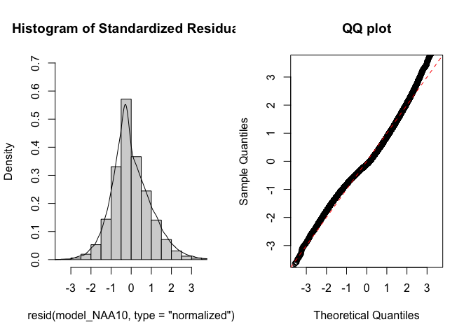
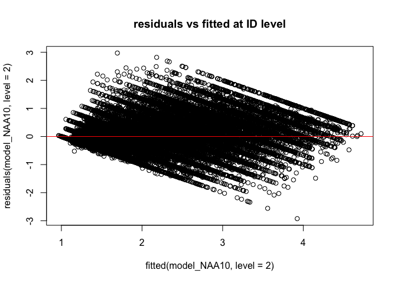
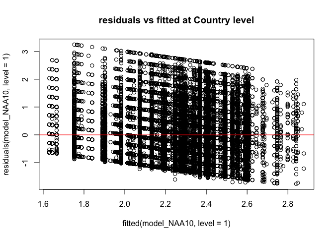
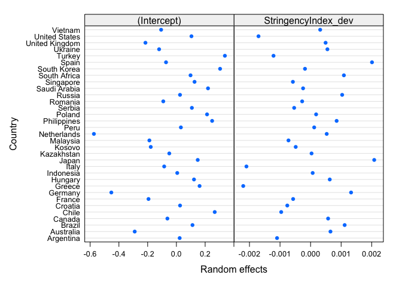
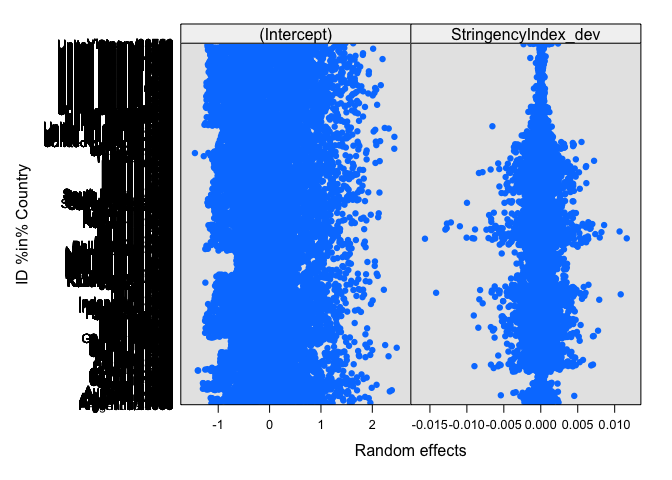
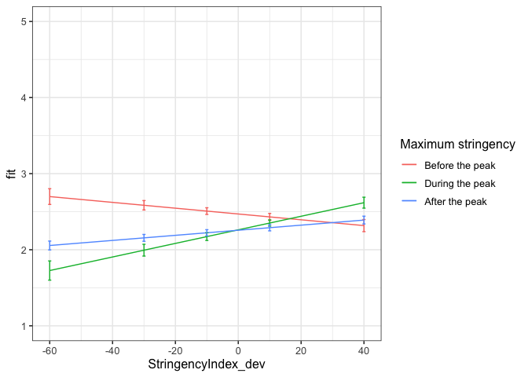

First analyses NAA including all gender categories
================
Anne Margit
4/25/2022

    ## [1] ""

``` r
load("data_analyse1_fg.Rdata")
```

This dataset includes:

1.  Data from all weekly measurement waves (baseline through wave 11,
    Time 1 through 12)
2.  Participants who provided at least 3 measurements
3.  Participants who are residents of the country they currently live in
4.  Participants who provided info on age
5.  Participants who provided info on gender (either male or female)
6.  Data from countries with at least 20 participants
7.  Pooled age groups
8.  Imputed missing emotion scores
9.  Combined emotion scores (NAA, NAD, PAA, PAD)
10. An imputed Stringency index (StringencyIndex_imp)
11. A variable indicating the number of days before and after the day on
    which maximum stringency was reached for the respective country
    (DaysMax)
12. A variable indicating the number of weeks before and after the day
    on which maximum stringency was reached for the respective country
    (WeeksMax)
13. A variable indicating the date on which maximum Stringency was
    reached for that country (DateMaxStr)
14. A dummy Str_dummy with 0 = before the peaj, 1 = during peak, 2 =
    after peak
15. Observations during which there was a second peak are excluded
    (N=583)

> My comments are in block quotes such as this.

``` r
library(dplyr)
library(tidyverse)
library(papaja)
library(ggpubr)
library(ggplot2)
library(rockchalk)
library(effects)
library(nlme)
library(lattice)
library(broom)
library(broom.mixed)
library(purrr)
```

# Country mean centering Stringency Index

``` r
data_analyse1_fcg <- gmc(data_analyse1_fg, "StringencyIndex", "Country", FUN = mean, suffix = c("_mn", "_dev"),
    fulldataframe = TRUE)

save(data_analyse1_fcg, file = "data_analyse1_fcg.Rdata")

data_analyse1_fc <- data_analyse1_fcg
```

# Regression models

**Negative affect high arousal**

*Stringency Index x dummy interaction: random intercept for Country*

``` r
model_NAA1 <- lme(fixed = NAA ~ StringencyIndex_dev + Str_dummy +  StringencyIndex_dev*Str_dummy,
                   random = ~1 | Country, 
                  data = data_analyse1_fc, 
                  na.action = na.omit)

summary(model_NAA1)
```

    Linear mixed-effects model fit by REML
      Data: data_analyse1_fc 
           AIC      BIC    logLik
      160764.7 160836.6 -80374.36

    Random effects:
     Formula: ~1 | Country
            (Intercept)  Residual
    StdDev:     0.23355 0.9425008

    Fixed effects:  NAA ~ StringencyIndex_dev + Str_dummy + StringencyIndex_dev *      Str_dummy 
                                        Value  Std.Error    DF   t-value p-value
    (Intercept)                     2.5093134 0.04416469 59006  56.81718  0.0000
    StringencyIndex_dev            -0.0019522 0.00206485 59006  -0.94546  0.3444
    Str_dummy1                     -0.2207319 0.02310094 59006  -9.55511  0.0000
    Str_dummy2                     -0.2901132 0.01836678 59006 -15.79554  0.0000
    StringencyIndex_dev:Str_dummy1  0.0080300 0.00272550 59006   2.94624  0.0032
    StringencyIndex_dev:Str_dummy2  0.0051137 0.00217218 59006   2.35415  0.0186
     Correlation: 
                                   (Intr) StrnI_ Str_d1 Str_d2 SI_:S_1
    StringencyIndex_dev             0.094                             
    Str_dummy1                     -0.246 -0.270                      
    Str_dummy2                     -0.341 -0.224  0.574               
    StringencyIndex_dev:Str_dummy1 -0.088 -0.659 -0.273  0.254        
    StringencyIndex_dev:Str_dummy2 -0.091 -0.967  0.271  0.256  0.616 

    Standardized Within-Group Residuals:
           Min         Q1        Med         Q3        Max 
    -1.9310685 -0.7644710 -0.1607535  0.7037641  3.4795572 

    Number of Observations: 59044
    Number of Groups: 33 

*Stringency Index x dummy interaction: random intercept for ID*

``` r
model_NAA2 <- lme(fixed = NAA ~ StringencyIndex_dev + Str_dummy +  StringencyIndex_dev*Str_dummy,
                  random = ~1 | ID, 
                 data = data_analyse1_fc, 
                 na.action = na.omit)

summary(model_NAA2)
```

    Linear mixed-effects model fit by REML
      Data: data_analyse1_fc 
           AIC      BIC    logLik
      125913.5 125985.4 -62948.76

    Random effects:
     Formula: ~1 | ID
            (Intercept)  Residual
    StdDev:   0.7865424 0.5682095

    Fixed effects:  NAA ~ StringencyIndex_dev + Str_dummy + StringencyIndex_dev *      Str_dummy 
                                        Value   Std.Error    DF   t-value p-value
    (Intercept)                     2.4194596 0.013191432 48529 183.41145   0e+00
    StringencyIndex_dev            -0.0050246 0.001342879 48529  -3.74168   2e-04
    Str_dummy1                     -0.1651315 0.014036000 48529 -11.76486   0e+00
    Str_dummy2                     -0.2167721 0.011959068 48529 -18.12617   0e+00
    StringencyIndex_dev:Str_dummy1  0.0088238 0.001692311 48529   5.21406   0e+00
    StringencyIndex_dev:Str_dummy2  0.0079416 0.001402210 48529   5.66362   0e+00
     Correlation: 
                                   (Intr) StrnI_ Str_d1 Str_d2 SI_:S_1
    StringencyIndex_dev             0.225                             
    Str_dummy1                     -0.662 -0.266                      
    Str_dummy2                     -0.732 -0.238  0.643               
    StringencyIndex_dev:Str_dummy1 -0.144 -0.725 -0.180  0.248        
    StringencyIndex_dev:Str_dummy2 -0.216 -0.967  0.262  0.268  0.689 

    Standardized Within-Group Residuals:
           Min         Q1        Med         Q3        Max 
    -5.5373815 -0.5510106 -0.1097241  0.5189100  5.4750623 

    Number of Observations: 59044
    Number of Groups: 10510 

*Random intercept for Country and ID*

``` r
model_NAA3 <- lme(fixed = NAA ~ StringencyIndex_dev + Str_dummy +  StringencyIndex_dev*Str_dummy,
                  random = ~1 | Country/ID, 
                  data = data_analyse1_fc, 
                  na.action = na.omit)

summary(model_NAA3)
```

    Linear mixed-effects model fit by REML
      Data: data_analyse1_fc 
           AIC    BIC    logLik
      125270.1 125351 -62626.07

    Random effects:
     Formula: ~1 | Country
            (Intercept)
    StdDev:   0.2198387

     Formula: ~1 | ID %in% Country
            (Intercept)  Residual
    StdDev:   0.7566026 0.5682067

    Fixed effects:  NAA ~ StringencyIndex_dev + Str_dummy + StringencyIndex_dev *      Str_dummy 
                                        Value  Std.Error    DF   t-value p-value
    (Intercept)                     2.4587970 0.04161618 48529  59.08271  0.0000
    StringencyIndex_dev            -0.0040872 0.00135685 48529  -3.01229  0.0026
    Str_dummy1                     -0.1885106 0.01512553 48529 -12.46307  0.0000
    Str_dummy2                     -0.2090802 0.01213656 48529 -17.22730  0.0000
    StringencyIndex_dev:Str_dummy1  0.0111012 0.00178464 48529   6.22041  0.0000
    StringencyIndex_dev:Str_dummy2  0.0068951 0.00141956 48529   4.85718  0.0000
     Correlation: 
                                   (Intr) StrnI_ Str_d1 Str_d2 SI_:S_1
    StringencyIndex_dev             0.068                             
    Str_dummy1                     -0.171 -0.281                      
    Str_dummy2                     -0.236 -0.229  0.574               
    StringencyIndex_dev:Str_dummy1 -0.063 -0.660 -0.265  0.262        
    StringencyIndex_dev:Str_dummy2 -0.066 -0.968  0.278  0.259  0.623 

    Standardized Within-Group Residuals:
           Min         Q1        Med         Q3        Max 
    -5.5459934 -0.5513993 -0.1068956  0.5192584  5.4614536 

    Number of Observations: 59044
    Number of Groups: 
            Country ID %in% Country 
                 33           10510 

*Random slope for Country*

``` r
model_NAA4 <- lme(fixed = NAA ~ StringencyIndex_dev + Str_dummy +  StringencyIndex_dev*Str_dummy,
                  random = list (Country = ~StringencyIndex_dev, ID = ~1), 
                  data = data_analyse1_fc, 
                  na.action = na.omit)

summary(model_NAA4)
```

    Linear mixed-effects model fit by REML
      Data: data_analyse1_fc 
           AIC      BIC    logLik
      125256.7 125355.5 -62617.33

    Random effects:
     Formula: ~StringencyIndex_dev | Country
     Structure: General positive-definite, Log-Cholesky parametrization
                        StdDev      Corr  
    (Intercept)         0.220222610 (Intr)
    StringencyIndex_dev 0.003304732 -0.207

     Formula: ~1 | ID %in% Country
            (Intercept)  Residual
    StdDev:   0.7566866 0.5679105

    Fixed effects:  NAA ~ StringencyIndex_dev + Str_dummy + StringencyIndex_dev *      Str_dummy 
                                        Value  Std.Error    DF   t-value p-value
    (Intercept)                     2.4610298 0.04176026 48529  58.93234  0.0000
    StringencyIndex_dev            -0.0025908 0.00169126 48529  -1.53189  0.1256
    Str_dummy1                     -0.2108790 0.01778144 48529 -11.85950  0.0000
    Str_dummy2                     -0.2080750 0.01261828 48529 -16.48997  0.0000
    StringencyIndex_dev:Str_dummy1  0.0123924 0.00212441 48529   5.83334  0.0000
    StringencyIndex_dev:Str_dummy2  0.0059621 0.00170796 48529   3.49079  0.0005
     Correlation: 
                                   (Intr) StrnI_ Str_d1 Str_d2 SI_:S_1
    StringencyIndex_dev            -0.007                             
    Str_dummy1                     -0.167 -0.293                      
    Str_dummy2                     -0.238 -0.171  0.473               
    StringencyIndex_dev:Str_dummy1 -0.042 -0.518 -0.384  0.228        
    StringencyIndex_dev:Str_dummy2 -0.057 -0.854  0.182  0.232  0.657 

    Standardized Within-Group Residuals:
           Min         Q1        Med         Q3        Max 
    -5.5250916 -0.5527388 -0.1057162  0.5186285  5.5055702 

    Number of Observations: 59044
    Number of Groups: 
            Country ID %in% Country 
                 33           10510 

*Random slope for ID*

``` r
model_NAA5 <- lme(fixed = NAA ~ StringencyIndex_dev + Str_dummy +  StringencyIndex_dev*Str_dummy,
                  random = list (Country = ~1, ID = ~StringencyIndex_dev), 
                  data = data_analyse1_fc, 
                  na.action = na.omit)

summary(model_NAA5)
```

    Linear mixed-effects model fit by REML
      Data: data_analyse1_fc 
           AIC      BIC    logLik
      124857.2 124956.1 -62417.61

    Random effects:
     Formula: ~1 | Country
            (Intercept)
    StdDev:   0.2197043

     Formula: ~StringencyIndex_dev | ID %in% Country
     Structure: General positive-definite, Log-Cholesky parametrization
                        StdDev    Corr  
    (Intercept)         0.7570211 (Intr)
    StringencyIndex_dev 0.0126816 -0.003
    Residual            0.5561100       

    Fixed effects:  NAA ~ StringencyIndex_dev + Str_dummy + StringencyIndex_dev *      Str_dummy 
                                        Value  Std.Error    DF   t-value p-value
    (Intercept)                     2.4611615 0.04157307 48529  59.20087  0.0000
    StringencyIndex_dev            -0.0031027 0.00148080 48529  -2.09529  0.0362
    Str_dummy1                     -0.2008245 0.01544281 48529 -13.00440  0.0000
    Str_dummy2                     -0.2101736 0.01212498 48529 -17.33394  0.0000
    StringencyIndex_dev:Str_dummy1  0.0114611 0.00187867 48529   6.10065  0.0000
    StringencyIndex_dev:Str_dummy2  0.0062856 0.00156299 48529   4.02152  0.0001
     Correlation: 
                                   (Intr) StrnI_ Str_d1 Str_d2 SI_:S_1
    StringencyIndex_dev             0.065                             
    Str_dummy1                     -0.167 -0.293                      
    Str_dummy2                     -0.233 -0.218  0.542               
    StringencyIndex_dev:Str_dummy1 -0.060 -0.659 -0.269  0.264        
    StringencyIndex_dev:Str_dummy2 -0.063 -0.951  0.258  0.261  0.652 

    Standardized Within-Group Residuals:
           Min         Q1        Med         Q3        Max 
    -5.5196311 -0.5428582 -0.1033713  0.5076563  5.4901443 

    Number of Observations: 59044
    Number of Groups: 
            Country ID %in% Country 
                 33           10510 

*Random slope for Country and ID*

``` r
model_NAA6 <- lme(fixed = NAA ~ StringencyIndex_dev + Str_dummy +  StringencyIndex_dev*Str_dummy,
                  random = ~StringencyIndex_dev | Country/ID, 
                  data = data_analyse1_fc, 
                  na.action = na.omit)

summary(model_NAA6)
```

    Linear mixed-effects model fit by REML
      Data: data_analyse1_fc 
           AIC      BIC    logLik
      124847.1 124963.9 -62410.54

    Random effects:
     Formula: ~StringencyIndex_dev | Country
     Structure: General positive-definite, Log-Cholesky parametrization
                        StdDev      Corr  
    (Intercept)         0.220228375 (Intr)
    StringencyIndex_dev 0.003382768 -0.236

     Formula: ~StringencyIndex_dev | ID %in% Country
     Structure: General positive-definite, Log-Cholesky parametrization
                        StdDev     Corr  
    (Intercept)         0.75708969 (Intr)
    StringencyIndex_dev 0.01261512 -0.002
    Residual            0.55593579       

    Fixed effects:  NAA ~ StringencyIndex_dev + Str_dummy + StringencyIndex_dev *      Str_dummy 
                                        Value  Std.Error    DF   t-value p-value
    (Intercept)                     2.4625030 0.04173408 48529  59.00460  0.0000
    StringencyIndex_dev            -0.0018049 0.00176991 48529  -1.01979  0.3078
    Str_dummy1                     -0.2163133 0.01777236 48529 -12.17133  0.0000
    Str_dummy2                     -0.2092333 0.01248289 48529 -16.76160  0.0000
    StringencyIndex_dev:Str_dummy1  0.0120893 0.00214561 48529   5.63441  0.0000
    StringencyIndex_dev:Str_dummy2  0.0053121 0.00176383 48529   3.01168  0.0026
     Correlation: 
                                   (Intr) StrnI_ Str_d1 Str_d2 SI_:S_1
    StringencyIndex_dev            -0.017                             
    Str_dummy1                     -0.165 -0.305                      
    Str_dummy2                     -0.236 -0.163  0.467               
    StringencyIndex_dev:Str_dummy1 -0.041 -0.521 -0.373  0.226        
    StringencyIndex_dev:Str_dummy2 -0.055 -0.853  0.192  0.223  0.664 

    Standardized Within-Group Residuals:
           Min         Q1        Med         Q3        Max 
    -5.5044527 -0.5436498 -0.1030937  0.5079278  5.5291700 

    Number of Observations: 59044
    Number of Groups: 
            Country ID %in% Country 
                 33           10510 

*No correlation between intercept and slope for Country*

``` r
model_NAA7 <- lme(fixed = NAA ~ StringencyIndex_dev + Str_dummy +  StringencyIndex_dev*Str_dummy,
                  random = list(Country = pdDiag(~StringencyIndex_dev), ID = ~StringencyIndex_dev), 
                  data = data_analyse1_fc, 
                  na.action = na.omit)

summary(model_NAA7)
```

    Linear mixed-effects model fit by REML
      Data: data_analyse1_fc 
           AIC      BIC    logLik
      124845.9 124953.8 -62410.96

    Random effects:
     Formula: ~StringencyIndex_dev | Country
     Structure: Diagonal
            (Intercept) StringencyIndex_dev
    StdDev:   0.2202597          0.00356123

     Formula: ~StringencyIndex_dev | ID %in% Country
     Structure: General positive-definite, Log-Cholesky parametrization
                        StdDev     Corr  
    (Intercept)         0.75709443 (Intr)
    StringencyIndex_dev 0.01261254 -0.002
    Residual            0.55592924       

    Fixed effects:  NAA ~ StringencyIndex_dev + Str_dummy + StringencyIndex_dev *      Str_dummy 
                                        Value  Std.Error    DF   t-value p-value
    (Intercept)                     2.4628654 0.04174067 48529  59.00398  0.0000
    StringencyIndex_dev            -0.0017463 0.00179197 48529  -0.97454  0.3298
    Str_dummy1                     -0.2162964 0.01806989 48529 -11.96999  0.0000
    Str_dummy2                     -0.2098335 0.01249975 48529 -16.78701  0.0000
    StringencyIndex_dev:Str_dummy1  0.0121733 0.00217342 48529   5.60101  0.0000
    StringencyIndex_dev:Str_dummy2  0.0054017 0.00177391 48529   3.04505  0.0023
     Correlation: 
                                   (Intr) StrnI_ Str_d1 Str_d2 SI_:S_1
    StringencyIndex_dev             0.056                             
    Str_dummy1                     -0.163 -0.306                      
    Str_dummy2                     -0.236 -0.161  0.460               
    StringencyIndex_dev:Str_dummy1 -0.038 -0.506 -0.387  0.222        
    StringencyIndex_dev:Str_dummy2 -0.053 -0.845  0.186  0.222  0.662 

    Standardized Within-Group Residuals:
           Min         Q1        Med         Q3        Max 
    -5.4987586 -0.5437664 -0.1034367  0.5080794  5.5338424 

    Number of Observations: 59044
    Number of Groups: 
            Country ID %in% Country 
                 33           10510 

*No correlation between intercept and slope for ID*

``` r
model_NAA8 <- lme(fixed = NAA ~ StringencyIndex_dev + Str_dummy +  StringencyIndex_dev*Str_dummy,
                  random = list (Country = ~StringencyIndex_dev, ID = pdDiag(~StringencyIndex_dev)), 
                  data = data_analyse1_fc, 
                  na.action = na.omit)

summary(model_NAA8)
```

    Linear mixed-effects model fit by REML
      Data: data_analyse1_fc 
           AIC      BIC    logLik
      124845.1 124952.9 -62410.54

    Random effects:
     Formula: ~StringencyIndex_dev | Country
     Structure: General positive-definite, Log-Cholesky parametrization
                        StdDev     Corr  
    (Intercept)         0.22023699 (Intr)
    StringencyIndex_dev 0.00337836 -0.236

     Formula: ~StringencyIndex_dev | ID %in% Country
     Structure: Diagonal
            (Intercept) StringencyIndex_dev  Residual
    StdDev:   0.7570777          0.01261655 0.5559332

    Fixed effects:  NAA ~ StringencyIndex_dev + Str_dummy + StringencyIndex_dev *      Str_dummy 
                                        Value  Std.Error    DF   t-value p-value
    (Intercept)                     2.4625071 0.04173532 48529  59.00296  0.0000
    StringencyIndex_dev            -0.0018070 0.00176939 48529  -1.02126  0.3071
    Str_dummy1                     -0.2163185 0.01776846 48529 -12.17430  0.0000
    Str_dummy2                     -0.2092412 0.01248247 48529 -16.76281  0.0000
    StringencyIndex_dev:Str_dummy1  0.0120908 0.00214522 48529   5.63614  0.0000
    StringencyIndex_dev:Str_dummy2  0.0053147 0.00176357 48529   3.01361  0.0026
     Correlation: 
                                   (Intr) StrnI_ Str_d1 Str_d2 SI_:S_1
    StringencyIndex_dev            -0.017                             
    Str_dummy1                     -0.165 -0.305                      
    Str_dummy2                     -0.236 -0.163  0.467               
    StringencyIndex_dev:Str_dummy1 -0.041 -0.521 -0.373  0.226        
    StringencyIndex_dev:Str_dummy2 -0.055 -0.853  0.192  0.223  0.664 

    Standardized Within-Group Residuals:
           Min         Q1        Med         Q3        Max 
    -5.5039530 -0.5436738 -0.1033243  0.5078858  5.5289985 

    Number of Observations: 59044
    Number of Groups: 
            Country ID %in% Country 
                 33           10510 

*No correlation between intercept and slope for Country and ID*

``` r
model_NAA9 <- lme(fixed = NAA ~ StringencyIndex_dev + Str_dummy +  StringencyIndex_dev*Str_dummy,
                  random = list (Country = pdDiag(~StringencyIndex_dev), ID = pdDiag(~StringencyIndex_dev)),
                  data = data_analyse1_fc, 
                  na.action = na.omit)

summary(model_NAA9)
```

    Linear mixed-effects model fit by REML
      Data: data_analyse1_fc 
           AIC      BIC    logLik
      124843.9 124942.8 -62410.96

    Random effects:
     Formula: ~StringencyIndex_dev | Country
     Structure: Diagonal
            (Intercept) StringencyIndex_dev
    StdDev:   0.2202503         0.003559863

     Formula: ~StringencyIndex_dev | ID %in% Country
     Structure: Diagonal
            (Intercept) StringencyIndex_dev  Residual
    StdDev:   0.7570714          0.01261328 0.5559285

    Fixed effects:  NAA ~ StringencyIndex_dev + Str_dummy + StringencyIndex_dev *      Str_dummy 
                                        Value  Std.Error    DF   t-value p-value
    (Intercept)                     2.4628689 0.04173906 48529  59.00633  0.0000
    StringencyIndex_dev            -0.0017475 0.00179179 48529  -0.97528  0.3294
    Str_dummy1                     -0.2163001 0.01806884 48529 -11.97089  0.0000
    Str_dummy2                     -0.2098412 0.01249961 48529 -16.78782  0.0000
    StringencyIndex_dev:Str_dummy1  0.0121746 0.00217334 48529   5.60180  0.0000
    StringencyIndex_dev:Str_dummy2  0.0054040 0.00177382 48529   3.04652  0.0023
     Correlation: 
                                   (Intr) StrnI_ Str_d1 Str_d2 SI_:S_1
    StringencyIndex_dev             0.056                             
    Str_dummy1                     -0.163 -0.306                      
    Str_dummy2                     -0.236 -0.161  0.460               
    StringencyIndex_dev:Str_dummy1 -0.038 -0.506 -0.387  0.223        
    StringencyIndex_dev:Str_dummy2 -0.054 -0.845  0.186  0.222  0.662 

    Standardized Within-Group Residuals:
           Min         Q1        Med         Q3        Max 
    -5.4981322 -0.5437508 -0.1034987  0.5081279  5.5336935 

    Number of Observations: 59044
    Number of Groups: 
            Country ID %in% Country 
                 33           10510 

*Autoregressive correlation structure*

``` r
data_analyse1_fc <- data_analyse1_fc[with(data_analyse1_fc, order(Country, ID, Time)),]
data_analyse1_fc$Time <- as.numeric(data_analyse1_fc$Time)

model_NAA10 <- lme(fixed = NAA ~ StringencyIndex_dev + Str_dummy +  StringencyIndex_dev*Str_dummy,
                   random = list (Country = pdDiag(~StringencyIndex_dev), ID = pdDiag(~StringencyIndex_dev)),
                  data = data_analyse1_fc, 
                  na.action = na.omit,
                  correlation = corAR1(form = ~ Time | Country/ID))

summary(model_NAA10)
```

    Linear mixed-effects model fit by REML
      Data: data_analyse1_fc 
           AIC      BIC    logLik
      122858.7 122966.5 -61417.36

    Random effects:
     Formula: ~StringencyIndex_dev | Country
     Structure: Diagonal
            (Intercept) StringencyIndex_dev
    StdDev:   0.2191325         0.001909094

     Formula: ~StringencyIndex_dev | ID %in% Country
     Structure: Diagonal
            (Intercept) StringencyIndex_dev  Residual
    StdDev:   0.7321364         0.006763933 0.5948587

    Correlation Structure: ARMA(1,0)
     Formula: ~Time | Country/ID 
     Parameter estimate(s):
        Phi1 
    0.339538 
    Fixed effects:  NAA ~ StringencyIndex_dev + Str_dummy + StringencyIndex_dev *      Str_dummy 
                                        Value  Std.Error    DF   t-value p-value
    (Intercept)                     2.4697691 0.04170299 48529  59.22283  0.0000
    StringencyIndex_dev            -0.0038146 0.00162298 48529  -2.35038  0.0188
    Str_dummy1                     -0.2081670 0.01764878 48529 -11.79498  0.0000
    Str_dummy2                     -0.2135847 0.01355121 48529 -15.76130  0.0000
    StringencyIndex_dev:Str_dummy1  0.0127350 0.00210457 48529   6.05109  0.0000
    StringencyIndex_dev:Str_dummy2  0.0071574 0.00169927 48529   4.21207  0.0000
     Correlation: 
                                   (Intr) StrnI_ Str_d1 Str_d2 SI_:S_1
    StringencyIndex_dev             0.067                             
    Str_dummy1                     -0.175 -0.309                      
    Str_dummy2                     -0.252 -0.189  0.495               
    StringencyIndex_dev:Str_dummy1 -0.059 -0.567 -0.332  0.257        
    StringencyIndex_dev:Str_dummy2 -0.065 -0.905  0.231  0.248  0.636 

    Standardized Within-Group Residuals:
           Min         Q1        Med         Q3        Max 
    -4.9171341 -0.5661044 -0.1337406  0.5002225  4.9968179 

    Number of Observations: 59044
    Number of Groups: 
            Country ID %in% Country 
                 33           10510 

*AR without random slope for country, because model without random slope
for country was better*

``` r
model_NAA11 <- lme(fixed = NAA ~ StringencyIndex_dev + Str_dummy +  StringencyIndex_dev*Str_dummy,
                  random = list (Country = ~1, ID = pdDiag(~StringencyIndex_dev)), 
                  data = data_analyse1_fc, 
                  na.action = na.omit,
                  correlation = corAR1(form = ~ Time | Country/ID))

summary(model_NAA11)
```

    Linear mixed-effects model fit by REML
      Data: data_analyse1_fc 
           AIC      BIC    logLik
      122866.6 122965.4 -61422.28

    Random effects:
     Formula: ~1 | Country
            (Intercept)
    StdDev:   0.2188899

     Formula: ~StringencyIndex_dev | ID %in% Country
     Structure: Diagonal
            (Intercept) StringencyIndex_dev  Residual
    StdDev:   0.7320906         0.006802687 0.5950154

    Correlation Structure: ARMA(1,0)
     Formula: ~Time | Country/ID 
     Parameter estimate(s):
         Phi1 
    0.3396941 
    Fixed effects:  NAA ~ StringencyIndex_dev + Str_dummy + StringencyIndex_dev *      Str_dummy 
                                        Value  Std.Error    DF   t-value p-value
    (Intercept)                     2.4650189 0.04160775 48529  59.24423  0.0000
    StringencyIndex_dev            -0.0042917 0.00147590 48529  -2.90786  0.0036
    Str_dummy1                     -0.1916561 0.01615564 48529 -11.86311  0.0000
    Str_dummy2                     -0.2097731 0.01321893 48529 -15.86914  0.0000
    StringencyIndex_dev:Str_dummy1  0.0115068 0.00192467 48529   5.97861  0.0000
    StringencyIndex_dev:Str_dummy2  0.0072515 0.00155759 48529   4.65563  0.0000
     Correlation: 
                                   (Intr) StrnI_ Str_d1 Str_d2 SI_:S_1
    StringencyIndex_dev             0.073                             
    Str_dummy1                     -0.178 -0.299                      
    Str_dummy2                     -0.249 -0.223  0.548               
    StringencyIndex_dev:Str_dummy1 -0.071 -0.649 -0.261  0.275        
    StringencyIndex_dev:Str_dummy2 -0.071 -0.957  0.284  0.260  0.622 

    Standardized Within-Group Residuals:
           Min         Q1        Med         Q3        Max 
    -4.9286656 -0.5663168 -0.1343943  0.4995553  4.9799851 

    Number of Observations: 59044
    Number of Groups: 
            Country ID %in% Country 
                 33           10510 

> Model NAA11 has the best fit (lowest BIC), slightly better than NAA10.
> But the difference in BIC is very small. Because for the other outcome
> variables Model_10 has the best fit, we go for NAA10 this time as
> well.

*QQ plot of residuals*

``` r
par(mfrow = c(1,2))
lims <- c(-3.5,3.5)
hist(resid(model_NAA10, type = "normalized"),
freq = FALSE, xlim = lims, ylim =  c(0,.7),main = "Histogram of Standardized Residuals")
lines(density(scale(resid(model_NAA10))))
qqnorm(resid(model_NAA10, type = "normalized"),
xlim = lims, ylim = lims,main = "QQ plot")
abline(0,1, col = "red", lty = 2)
```

<!-- -->

*Residuals vs fitted*

``` r
plot(fitted(model_NAA10, level=2), residuals(model_NAA10, level=2), 
     main="residuals vs fitted at ID level")
abline(a=0, b=0,col="red")
```

<!-- -->

``` r
plot(fitted(model_NAA10, level=1), residuals(model_NAA10, level=1), 
    main="residuals vs fitted at Country level")
abline(a=0, b=0,col="red")
```

<!-- -->

*Plot random intercepts and slopes*

``` r
plot(ranef(model_NAA10, level = 1))
```

<!-- -->

``` r
plot(ranef(model_NAA10, level = 2))
```

<!-- -->

*Confidence intervals*

``` r
intervals(model_NAA10)
```

    Approximate 95% confidence intervals

     Fixed effects:
                                          lower         est.         upper
    (Intercept)                     2.388030740  2.469769137  2.5515075336
    StringencyIndex_dev            -0.006995670 -0.003814614 -0.0006335586
    Str_dummy1                     -0.242758837 -0.208167009 -0.1735751798
    Str_dummy2                     -0.240145283 -0.213584729 -0.1870241752
    StringencyIndex_dev:Str_dummy1  0.008609969  0.012734955  0.0168599405
    StringencyIndex_dev:Str_dummy2  0.003826838  0.007157419  0.0104880003

     Random Effects:
      Level: Country 
                                   lower        est.       upper
    sd((Intercept))         0.1690344643 0.219132515 0.284078512
    sd(StringencyIndex_dev) 0.0009084476 0.001909094 0.004011941
      Level: ID 
                                  lower        est.       upper
    sd((Intercept))         0.720668005 0.732136428 0.743787355
    sd(StringencyIndex_dev) 0.005644648 0.006763933 0.008105162

     Correlation structure:
             lower     est.     upper
    Phi1 0.3260266 0.339538 0.3529107

     Within-group standard error:
        lower      est.     upper 
    0.5898459 0.5948587 0.5999141 

*Plot of predicted values*

``` r
ef_NAA <- effect("StringencyIndex_dev:Str_dummy", model_NAA10)

plot_NAA <- ggplot(as.data.frame(ef_NAA), 
       aes(StringencyIndex_dev, fit, color=Str_dummy)) + geom_line() + 
  geom_errorbar(aes(ymin=fit-se, ymax=fit+se), width=1) + theme_bw(base_size=12) + scale_color_discrete(name="Maximum stringency", labels = c("Before the peak", "During the peak", "After the peak")) + expand_limits(y=c(1, 5))
```

``` r
plot_NAA
```

<!-- -->

``` r
coef_NAA = broom.mixed::tidy(model_NAA10, 
               effects = "fixed")
```

*Effect sizes* **Within person SD and average within person SD**

``` r
ISDs <- data_analyse1_fc %>% 
  group_by(ID) %>%
  summarize_at(c("StringencyIndex_dev", "NAA", "NAD", "PAA", "PAD"), sd, na.rm=TRUE) %>%
  ungroup()

ISDs_av <- ISDs %>%
  summarize_at(c("StringencyIndex_dev", "NAA", "NAD", "PAA", "PAD"), mean, na.rm=TRUE) %>%
  stack() %>%
  rename(sd=values) 
```

> Effect size = (regression coefficient \* average ISD of X) / average
> ISD of Y)

> For the intercept and the dummy variables (+ interaction) I only
> standardized Y, so the effect size = (regression coefficient / average
> ISD of Y)

``` r
coef_NAA <- coef_NAA %>%
 left_join(., ISDs_av, by=c("term"="ind"))

coef_NAA <- coef_NAA %>%
  mutate(sd = ifelse(is.na(sd), 1, sd))

coef_NAA <- coef_NAA %>%
  mutate(sd = ifelse(row_number()== 5 | row_number()== 6, 6.12091, sd))

coef_NAA <- coef_NAA %>%
 mutate(e_size = (estimate * sd)/0.5046733)

coef_NAA <- coef_NAA %>%
  rename(isd = sd)
```

``` r
coef_NAA
```

    ## # A tibble: 6 × 9
    ##   effect term                           estimate std.error    df statistic  p.value   isd  e_size
    ##   <chr>  <chr>                             <dbl>     <dbl> <dbl>     <dbl>    <dbl> <dbl>   <dbl>
    ## 1 fixed  (Intercept)                     2.47      0.0417  48529     59.2  0         1     4.89  
    ## 2 fixed  StringencyIndex_dev            -0.00381   0.00162 48529     -2.35 1.88e- 2  6.13 -0.0463
    ## 3 fixed  Str_dummy1                     -0.208     0.0176  48529    -11.8  4.58e-32  1    -0.412 
    ## 4 fixed  Str_dummy2                     -0.214     0.0136  48529    -15.8  7.91e-56  1    -0.423 
    ## 5 fixed  StringencyIndex_dev:Str_dummy1  0.0127    0.00210 48529      6.05 1.45e- 9  6.12  0.154 
    ## 6 fixed  StringencyIndex_dev:Str_dummy2  0.00716   0.00170 48529      4.21 2.53e- 5  6.12  0.0868

> Effect size interpretation: small = 0.1, medium = 0.3, large = 0.5

``` r
save(ISDs_av, file="ISDs_av.Rdata")
save(data_analyse1_fc, file = "data_analyse1_fc.Rdata")
```
