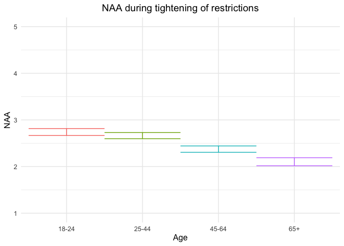
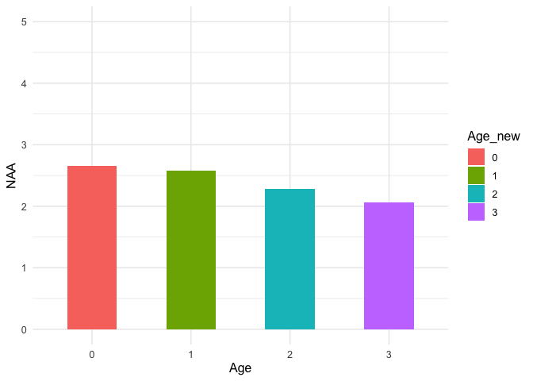
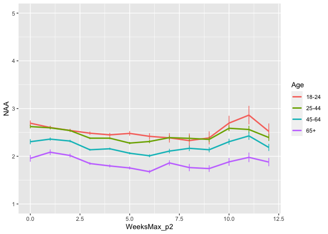
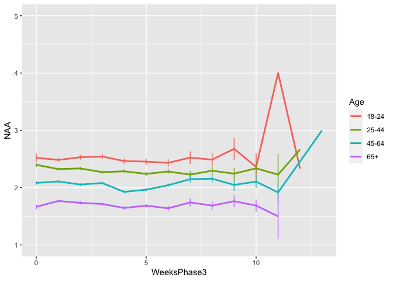
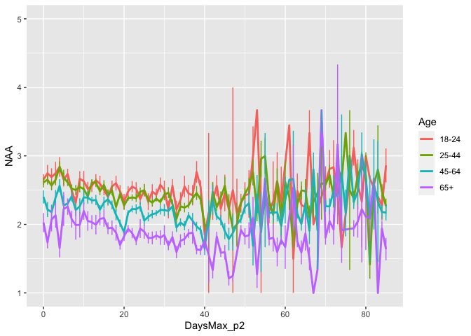
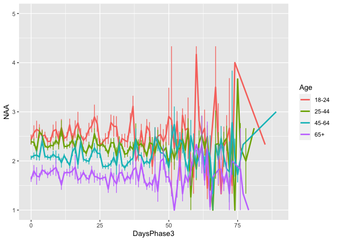
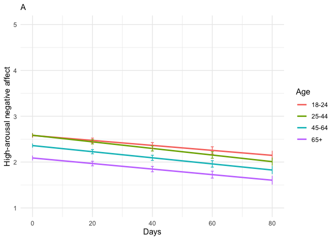
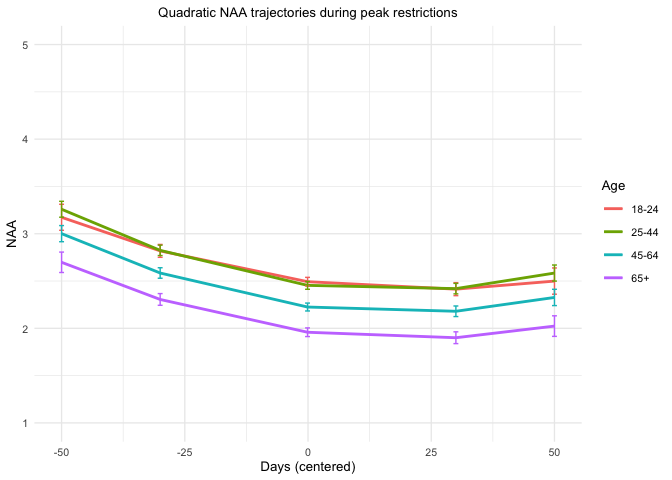
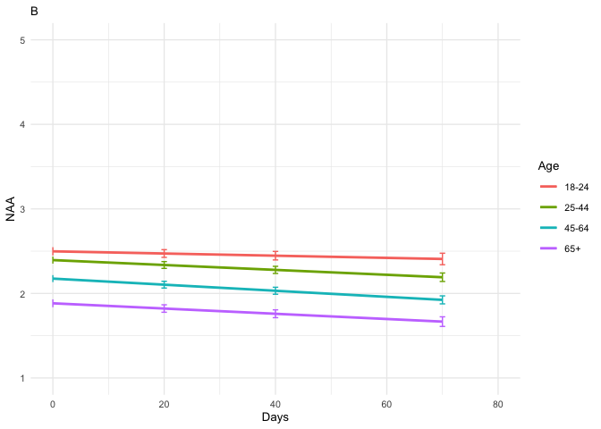
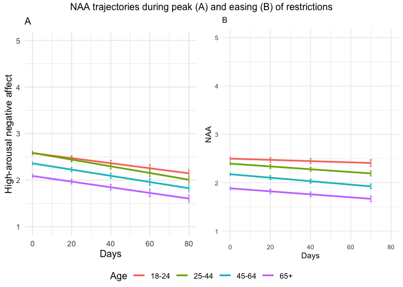

NAA final including gender_tables only
================
Anne Margit
05/09/2022

    ## [1] ""

``` r
load("data_analyse2_p1.Rdata")
load("data_analyse2_p2.Rdata")
load("data_analyse2_p3.Rdata")

levels(data_analyse2_p1$Gender) <- c("M", "F", "O")
```

This dataset includes:

1.  Data from all weekly measurement waves (baseline through wave 11,
    Time 1 through 12)
2.  Participants who provided at least 3 measurements
3.  Participants who are residents of the country they currently live in
4.  Participants who provided info on age
5.  Participants who provided info on gender (either male or female)
6.  Data from countries with at least 20 participants
7.  Pooled age groups
8.  Imputed missing emotion scores
9.  Combined emotion scores (NAA, NAD, PAA, PAD)
10. An imputed Stringency index (StringencyIndex_imp)
11. A dummy Str_dummy with 0 = before the peak, 1 = during peak, 2 =
    after peak
12. A variable indicating the number of days before maximum stringency
    was reached (DaysMax_p1), during (DaysMax_p2), and after
    (DaysPhase3)
13. A variable indicating the number of weeks before maximum stringency
    was reached (WeeksMax_p1), during (WeeksMax_p2), and after
    (WeeksPhase3)
14. A variable indicating the date on which maximum Stringency was
    reached for that country (DateMaxStr) and the max level reached
    (MaxStr) across the entire measurement period
15. A variable indicating the date on which minimum Stringency was
    reached for that country (DateMinStr) and the min level reached
    (MinStr) across the entire measurement period
16. Observations during which there was a second peak are excluded
    (N=583)

> My comments are in block quotes such as this.

``` r
library(dplyr)
library(tidyverse)
library(ggpubr)
library(ggplot2)
library(rockchalk)
library(effects)
library(nlme)
library(lattice)
library(broom.mixed)
library(purrr)
library(stargazer)
library("viridis")  
```

# Descriptives

**Number of participants per age group**

> 0 = 18-24, 1 = 25-44, 3= 45-64, 4= 65+

Phase 1

``` r
data_analyse2_p1 %>%
  group_by(Age_new) %>%
  summarise(NAge = n())
```

    # A tibble: 4 × 2
      Age_new  NAge
      <fct>   <int>
    1 0         704
    2 1        1906
    3 2        1274
    4 3         293

Phase 2

``` r
data_analyse2_p2 %>%
  group_by(Age_new) %>%
  summarise(NAge = n())
```

    # A tibble: 4 × 2
      Age_new  NAge
      <fct>   <int>
    1 0        3741
    2 1       11413
    3 2       10269
    4 3        4370

Phase 3

``` r
data_analyse2_p2 %>%
  group_by(Age_new) %>%
  summarise(NAge = n())
```

    # A tibble: 4 × 2
      Age_new  NAge
      <fct>   <int>
    1 0        3741
    2 1       11413
    3 2       10269
    4 3        4370

**Plots** **Mean NAA against max stringency in WEEKS** Phase 1 (only age
differences)

``` r
plot_NAA1 <- ggplot(data_analyse2_p1, aes(x=Age_new, y=NAA, fill= Age_new))

plot_NAA1 + geom_boxplot() +
   theme_minimal(base_size=12) +
   expand_limits(y=c(1, 5)) +
   theme(legend.position = "none") + 
   scale_x_discrete(labels= c("18-24", "25-44", "45-64", "65+")) +
   labs(title= "High-arousal negative affect", x = "Age", y="Mean NA") +
   theme(axis.title.y = element_text(vjust = 3), plot.title=element_text(hjust=0.5))  
```

<!-- -->

``` r
plot_NAA1 + stat_summary(fun.y=mean, geom="line", size=1)  + 
   theme_minimal(base_size=12) + 
  geom_histogram(stat="summary", fun.data="mean_se", width=0.5) + 
  scale_color_discrete(name = "Age", labels = c("18-24", "25-44", "45-64", "65+")) + expand_limits(y=c(1, 5)) +
  xlab("Age")
```

<!-- -->

Phase 2

``` r
plot_NAA2 <- ggplot(data_analyse2_p2, aes(x=WeeksMax_p2, y=NAA, group = Age_new, color = Age_new))

plot_NAA2 + stat_summary(fun.y=mean, geom="line", size=1)  + geom_errorbar(stat="summary", fun.data="mean_se", width=0) + scale_colour_discrete(name = "Age", labels = c("18-24", "25-44", "45-64", "65+")) + expand_limits(y=c(1, 5))
```

<!-- -->

Phase 3

``` r
plot_NAA3 <- ggplot(data_analyse2_p3, aes(x=WeeksPhase3, y=NAA, group = Age_new, color = Age_new))

plot_NAA3 + stat_summary(fun.y=mean, geom="line", size=1)  + geom_errorbar(stat="summary", fun.data="mean_se", width=0) + scale_colour_discrete(name = "Age", labels = c("18-24", "25-44", "45-64", "65+")) + expand_limits(y=c(1, 5))
```

<!-- -->

**Mean NAA against max stringency in DAYS** Phase 2

``` r
plot_NAA2 <- ggplot(data_analyse2_p2, aes(x=DaysMax_p2, y=NAA, group = Age_new, color = Age_new))

plot_NAA2 + stat_summary(fun.y=mean, geom="line", size=1)  + geom_errorbar(stat="summary", fun.data="mean_se", width=0) + scale_colour_discrete(name = "Age", labels = c("18-24", "25-44", "45-64", "65+")) + expand_limits(y=c(1, 5))
```

<!-- -->

Phase 3

``` r
plot_NAA3 <- ggplot(data_analyse2_p3, aes(x=DaysPhase3, y=NAA, group = Age_new, color = Age_new))

plot_NAA3 + stat_summary(fun.y=mean, geom="line", size=1)  + geom_errorbar(stat="summary", fun.data="mean_se", width=0) + scale_colour_discrete(name = "Age", labels = c("18-24", "25-44", "45-64", "65+")) + expand_limits(y=c(1, 5))
```

<!-- -->

# Phase 1

*Random: IC for ID and Country + Covariates Gender and Education*

> Edu: 0= Primary education, 1= General secondary education, 2=
> Vocational education, 3= Higher education, 4= Bachelors degree, 5=
> Masters degree, 6= PhD degree

``` r
data_analyse2_p1$Edu <- as.numeric(data_analyse2_p1$Edu)

model_NAAp1 <- lme(fixed = NAA ~ Gender + Edu + Age_new,
                  random = ~1 | Country/ID, 
                  data = data_analyse2_p1, 
                  na.action = na.omit)

summary(model_NAAp1)
```

    Linear mixed-effects model fit by REML
      Data: data_analyse2_p1 
           AIC     BIC    logLik
      10457.24 10520.6 -5218.621

    Random effects:
     Formula: ~1 | Country
            (Intercept)
    StdDev:   0.2549617

     Formula: ~1 | ID %in% Country
            (Intercept)  Residual
    StdDev:   0.6876799 0.5881002

    Fixed effects:  NAA ~ Gender + Edu + Age_new 
                     Value  Std.Error   DF   t-value p-value
    (Intercept)  2.5923053 0.09621371 2730 26.943202  0.0000
    GenderF      0.2352169 0.03609095 2730  6.517337  0.0000
    GenderO      0.2340845 0.22380801 2730  1.045917  0.2957
    Edu         -0.0028489 0.01309008 2730 -0.217640  0.8277
    Age_new1    -0.0765259 0.05011910 2730 -1.526881  0.1269
    Age_new2    -0.3662418 0.05327589 2730 -6.874438  0.0000
    Age_new3    -0.6368398 0.07537527 2730 -8.448923  0.0000
     Correlation: 
             (Intr) GendrF GendrO Edu    Ag_nw1 Ag_nw2
    GenderF  -0.283                                   
    GenderO  -0.080  0.119                            
    Edu      -0.561 -0.043  0.030                     
    Age_new1 -0.244  0.077  0.020 -0.244              
    Age_new2 -0.288  0.128  0.058 -0.160  0.713       
    Age_new3 -0.246  0.183  0.049 -0.097  0.494  0.498

    Standardized Within-Group Residuals:
           Min         Q1        Med         Q3        Max 
    -2.8769188 -0.5434445 -0.0383130  0.5147519  2.9866014 

    Number of Observations: 4177
    Number of Groups: 
            Country ID %in% Country 
                 26            2762 

``` r
VarCorr(model_NAAp1)
```

                Variance     StdDev   
    Country =   pdLogChol(1)          
    (Intercept) 0.06500547   0.2549617
    ID =        pdLogChol(1)          
    (Intercept) 0.47290369   0.6876799
    Residual    0.34586182   0.5881002

*Confidence intervals*

``` r
intervals(model_NAAp1)
```

    Approximate 95% confidence intervals

     Fixed effects:
                      lower         est.       upper
    (Intercept)  2.40364627  2.592305310  2.78096435
    GenderF      0.16444855  0.235216886  0.30598522
    GenderO     -0.20476568  0.234084531  0.67293474
    Edu         -0.02851638 -0.002848918  0.02281854
    Age_new1    -0.17480111 -0.076525915  0.02174928
    Age_new2    -0.47070697 -0.366241815 -0.26177667
    Age_new3    -0.78463816 -0.636839817 -0.48904148

     Random Effects:
      Level: Country 
                        lower      est.     upper
    sd((Intercept)) 0.1725149 0.2549617 0.3768107
      Level: ID 
                        lower      est.     upper
    sd((Intercept)) 0.6584498 0.6876799 0.7182077

     Within-group standard error:
        lower      est.     upper 
    0.5677742 0.5881002 0.6091539 

*Plot of predicted values*

``` r
ef_NAAp1 <- effect("Age_new", model_NAAp1)

plot_NAAp1 <- ggplot(as.data.frame(ef_NAAp1), 
  aes(Age_new, fit, color=Age_new)) + geom_line() + 
  geom_errorbar(aes(ymin=fit-se, ymax=fit+se), width=1) + theme_minimal(base_size=12) + 
  labs(title="NAA during tightening of restrictions", y = "NAA") +
  theme(plot.title = element_text(hjust = 0.5)) +
  scale_x_discrete(name ="Age", labels=c("18-24", "25-44", "45-64", "65+")) +
  theme(legend.position = "none") +                 
  scale_color_discrete() + 
  expand_limits(y=c(1, 5))
```

``` r
plot_NAAp1
```

<!-- -->

*Effect sizes*

``` r
ISDs <- data_analyse2_p1 %>% 
  group_by(ID) %>%
  summarize_at(c("NAA"), sd, na.rm=TRUE) %>%
  ungroup()

ISDs_av <- ISDs %>%
  summarize_at(c("NAA"), mean, na.rm=TRUE) %>%
  stack() %>%
  rename(sd=values) 
```

> Effect size = regression coefficient / average ISD of NAA

``` r
coef_NAAp1 = broom.mixed::tidy(model_NAAp1, 
               effects = "fixed")

coef_NAAp1 <- coef_NAAp1 %>%
  mutate (e_size = estimate/0.4676462) %>% 
  mutate(across(3:8, round, 2)) 
```

``` r
coef_NAAp1
```

    ## # A tibble: 7 × 8
    ##   effect term        estimate std.error    df statistic p.value e_size
    ##   <chr>  <chr>          <dbl>     <dbl> <dbl>     <dbl>   <dbl>  <dbl>
    ## 1 fixed  (Intercept)     2.59      0.1   2730     26.9     0      5.54
    ## 2 fixed  GenderF         0.24      0.04  2730      6.52    0      0.5 
    ## 3 fixed  GenderO         0.23      0.22  2730      1.05    0.3    0.5 
    ## 4 fixed  Edu             0         0.01  2730     -0.22    0.83  -0.01
    ## 5 fixed  Age_new1       -0.08      0.05  2730     -1.53    0.13  -0.16
    ## 6 fixed  Age_new2       -0.37      0.05  2730     -6.87    0     -0.78
    ## 7 fixed  Age_new3       -0.64      0.08  2730     -8.45    0     -1.36

``` r
coef_NAAp1 <- as.matrix(coef_NAAp1)
```

> The two oldest groups report lower NAA than the youngest group. Women
> report higher NAA compared to men. No difference between education
> levels.

# Phase 2

*Best model*

> Random intercept for ID and Country, random slope for Country and ID,
> no correlation between random intercept and slope for Country, AR
> correlation structure at Measuement level

``` r
data_analyse2_p2$Edu <- as.numeric(data_analyse2_p2$Edu)

data_analyse2_p2 <- data_analyse2_p2[with(data_analyse2_p2, order(Country, ID, Time)),]
data_analyse2_p2$Time <- as.numeric(data_analyse2_p2$Time)

model_NAAp2 <- lme(fixed = NAA ~ Gender + Edu + DaysMax_p2 + Age_new + DaysMax_p2*Age_new,
                  random = list(Country = pdDiag(~DaysMax_p2), ID = ~DaysMax_p2),  
                  data = data_analyse2_p2, 
                  na.action = na.omit,
                  correlation = corAR1(form = ~ Time | Country/ID))

summary(model_NAAp2)
```

    Linear mixed-effects model fit by REML
      Data: data_analyse2_p2 
           AIC      BIC    logLik
      64824.25 64973.68 -32394.13

    Random effects:
     Formula: ~DaysMax_p2 | Country
     Structure: Diagonal
            (Intercept)  DaysMax_p2
    StdDev:   0.2083537 0.003731047

     Formula: ~DaysMax_p2 | ID %in% Country
     Structure: General positive-definite, Log-Cholesky parametrization
                StdDev      Corr  
    (Intercept) 0.731928255 (Intr)
    DaysMax_p2  0.008124683 -0.193
    Residual    0.557087147       

    Correlation Structure: ARMA(1,0)
     Formula: ~Time | Country/ID 
     Parameter estimate(s):
         Phi1 
    0.2624712 
    Fixed effects:  NAA ~ Gender + Edu + DaysMax_p2 + Age_new + DaysMax_p2 * Age_new 
                             Value  Std.Error    DF   t-value p-value
    (Intercept)          2.5065398 0.05677345 20515  44.14986  0.0000
    Gender1              0.1864606 0.01876065  9221   9.93892  0.0000
    Gender3              0.4683953 0.11976325  9221   3.91101  0.0001
    Edu                 -0.0121373 0.00614522  9221  -1.97508  0.0483
    DaysMax_p2          -0.0054330 0.00126459 20515  -4.29628  0.0000
    Age_new1             0.0040825 0.03588408  9221   0.11377  0.9094
    Age_new2            -0.2213306 0.03693725  9221  -5.99207  0.0000
    Age_new3            -0.4915744 0.04473085  9221 -10.98961  0.0000
    DaysMax_p2:Age_new1 -0.0017627 0.00102768 20515  -1.71518  0.0863
    DaysMax_p2:Age_new2 -0.0012321 0.00105073 20515  -1.17262  0.2410
    DaysMax_p2:Age_new3 -0.0006285 0.00120605 20515  -0.52115  0.6023
     Correlation: 
                        (Intr) Gendr1 Gendr3 Edu    DysM_2 Ag_nw1 Ag_nw2 Ag_nw3 DM_2:A_1 DM_2:A_2
    Gender1             -0.249                                                                   
    Gender3             -0.056  0.117                                                            
    Edu                 -0.407 -0.030  0.003                                                     
    DaysMax_p2          -0.240  0.004 -0.008 -0.006                                              
    Age_new1            -0.342  0.044  0.018 -0.218  0.331                                       
    Age_new2            -0.374  0.075  0.042 -0.135  0.319  0.750                                
    Age_new3            -0.340  0.142  0.044 -0.093  0.265  0.622  0.628                         
    DaysMax_p2:Age_new1  0.246  0.001  0.012  0.023 -0.595 -0.575 -0.449 -0.373                  
    DaysMax_p2:Age_new2  0.238  0.000  0.013  0.028 -0.579 -0.453 -0.594 -0.375  0.802           
    DaysMax_p2:Age_new3  0.212 -0.007  0.011  0.019 -0.508 -0.395 -0.396 -0.612  0.701    0.699  

    Standardized Within-Group Residuals:
            Min          Q1         Med          Q3         Max 
    -3.92458636 -0.53568128 -0.09970109  0.48158437  4.37219758 

    Number of Observations: 29779
    Number of Groups: 
            Country ID %in% Country 
                 33            9260 

``` r
VarCorr(model_NAAp2)
```

                Variance              StdDev      Corr  
    Country =   pdDiag(DaysMax_p2)                      
    (Intercept) 0.04341126047         0.208353691       
    DaysMax_p2  0.00001392071         0.003731047       
    ID =        pdLogChol(DaysMax_p2)                   
    (Intercept) 0.53571897101         0.731928255 (Intr)
    DaysMax_p2  0.00006601048         0.008124683 -0.193
    Residual    0.31034608958         0.557087147       

*Confidence intervals*

``` r
intervals(model_NAAp2, which = 'fixed')
```

    Approximate 95% confidence intervals

     Fixed effects:
                               lower          est.          upper
    (Intercept)          2.395259348  2.5065398285  2.61782030871
    Gender1              0.149685552  0.1864605787  0.22323560497
    Gender3              0.233632800  0.4683952797  0.70315775903
    Edu                 -0.024183275 -0.0121372895 -0.00009130387
    DaysMax_p2          -0.007911750 -0.0054330461 -0.00295434192
    Age_new1            -0.066258266  0.0040824804  0.07442322688
    Age_new2            -0.293735772 -0.2213305936 -0.14892541538
    Age_new3            -0.579256771 -0.4915744136 -0.40389205662
    DaysMax_p2:Age_new1 -0.003776987 -0.0017626518  0.00025168346
    DaysMax_p2:Age_new2 -0.003291614 -0.0012321023  0.00082740933
    DaysMax_p2:Age_new3 -0.002992473 -0.0006285257  0.00173542165

*Plot of predicted values*

``` r
ef_NAAp2 <- effect("DaysMax_p2:Age_new", model_NAAp2)

plot_NAAp2 <- ggplot(as.data.frame(ef_NAAp2), aes(DaysMax_p2, fit, color=Age_new)) + 
  geom_line(size=1) + 
  geom_errorbar(aes(ymin=fit-se, ymax=fit+se), width=1) + 
  theme_minimal(base_size=12) + 
  labs(title="A",
       x="Days", y = "High-arousal negative affect") +
  xlim(0,80)+
  theme(plot.title = element_text(size=12)) +
  scale_color_discrete(name="Age", labels = c("18-24", "25-44", "45-64", "65+")) + 
  expand_limits(y=c(1, 5))
```

``` r
plot_NAAp2
```

<!-- -->

*Effect sizes* **Within person SD and average within person SD**

``` r
ISDs <- data_analyse2_p2 %>% 
  group_by(ID) %>%
  summarize_at(c("DaysMax_p2", "NAA"), sd, na.rm=TRUE) %>%
  ungroup()

ISDs_av <- ISDs %>%
  summarize_at(c("DaysMax_p2", "NAA"), mean, na.rm=TRUE) %>%
  stack() %>%
  rename(sd=values) 
```

> Effect sizes for intercept and main effect of age and covariates =
> regression coefficient / average ISD of NAA Effect size for main
> effect of DaysMax = (regression coefficient \* 28)/ average ISD of NAA
> Effect sizes for interaction effects = (regression coefficient \* 28)/
> average ISD of NAA

> The effect sizes for main effect of DaysMax and the interaction
> effects reflect the increase in SD of NAA over 4 weeks (28 days)

``` r
coef_NAAp2 = broom.mixed::tidy(model_NAAp2, 
               effects = "fixed")

coef_NAAp2 <- coef_NAAp2 %>%
  mutate(e_size = ifelse(row_number()== 1 | row_number()== 2 |  row_number()== 3 |  row_number()== 4 |  row_number()== 6 |  row_number()== 7 |  row_number()== 8, estimate/0.4562862, (estimate*28)/0.4562862)) %>%
  mutate(across(3:7, round, 2)) 
```

``` r
coef_NAAp2 <- as.matrix(coef_NAAp2)
coef_NAAp2
```

    ##       effect  term                  estimate std.error df      statistic p.value e_size        
    ##  [1,] "fixed" "(Intercept)"         " 2.51"  "0.06"    "20515" " 44.15"  "0.00"  " 5.493350070"
    ##  [2,] "fixed" "Gender1"             " 0.19"  "0.02"    " 9221" "  9.94"  "0.00"  " 0.408648297"
    ##  [3,] "fixed" "Gender3"             " 0.47"  "0.12"    " 9221" "  3.91"  "0.00"  " 1.026538343"
    ##  [4,] "fixed" "Edu"                 "-0.01"  "0.01"    " 9221" " -1.98"  "0.05"  "-0.026600168"
    ##  [5,] "fixed" "DaysMax_p2"          "-0.01"  "0.00"    "20515" " -4.30"  "0.00"  "-0.333398841"
    ##  [6,] "fixed" "Age_new1"            " 0.00"  "0.04"    " 9221" "  0.11"  "0.91"  " 0.008947192"
    ##  [7,] "fixed" "Age_new2"            "-0.22"  "0.04"    " 9221" " -5.99"  "0.00"  "-0.485069664"
    ##  [8,] "fixed" "Age_new3"            "-0.49"  "0.04"    " 9221" "-10.99"  "0.00"  "-1.077337894"
    ##  [9,] "fixed" "DaysMax_p2:Age_new1" " 0.00"  "0.00"    "20515" " -1.72"  "0.09"  "-0.108165115"
    ## [10,] "fixed" "DaysMax_p2:Age_new2" " 0.00"  "0.00"    "20515" " -1.17"  "0.24"  "-0.075607950"
    ## [11,] "fixed" "DaysMax_p2:Age_new3" " 0.00"  "0.00"    "20515" " -0.52"  "0.60"  "-0.038569478"

# Quadratic term

The interaction between age and daysmax was not significant (linear
model) so these are dropped in the current model. The time variable
needs to be centered at the midpoint (mean) to reduce collinearity
between the linear and the quadratic components.

``` r
data_analyse2_p2q <- gmc(data_analyse2_p2, "DaysMax_p2", "ID", FUN = mean, suffix = c("_mn", "_dev"),
    fulldataframe = TRUE)
```

``` r
data_analyse2_p2q$Edu <- as.numeric(data_analyse2_p2q$Edu)

data_analyse2_p2q <- data_analyse2_p2q[with(data_analyse2_p2q, order(Country, ID, Time)),]
data_analyse2_p2q$Time <- as.numeric(data_analyse2_p2q$Time)

model_NAAp2q <- lme(fixed = NAA ~ Gender + Edu + DaysMax_p2_dev + Age_new  
                    + I(DaysMax_p2_dev^2) + I(DaysMax_p2_dev^2)*Age_new,
                  random = list(Country = pdDiag(~ DaysMax_p2_dev), 
                  ID = ~DaysMax_p2_dev),
                  data = data_analyse2_p2q, 
                  na.action = na.omit,
                  correlation = corAR1(form = ~ Time | Country/ID))

summary(model_NAAp2q)
```

    Linear mixed-effects model fit by REML
      Data: data_analyse2_p2q 
           AIC     BIC    logLik
      64673.18 64830.9 -32317.59

    Random effects:
     Formula: ~DaysMax_p2_dev | Country
     Structure: Diagonal
            (Intercept) DaysMax_p2_dev
    StdDev:   0.1982244    0.004253783

     Formula: ~DaysMax_p2_dev | ID %in% Country
     Structure: General positive-definite, Log-Cholesky parametrization
                   StdDev      Corr  
    (Intercept)    0.731330654 (Intr)
    DaysMax_p2_dev 0.009294767 0.146 
    Residual       0.545566545       

    Correlation Structure: ARMA(1,0)
     Formula: ~Time | Country/ID 
     Parameter estimate(s):
         Phi1 
    0.2309058 
    Fixed effects:  NAA ~ Gender + Edu + DaysMax_p2_dev + Age_new + I(DaysMax_p2_dev^2) +      I(DaysMax_p2_dev^2) * Age_new 
                                      Value  Std.Error    DF   t-value p-value
    (Intercept)                   2.4193880 0.05299318 20514  45.65471  0.0000
    Gender1                       0.1801976 0.01875057  9221   9.61025  0.0000
    Gender3                       0.4636293 0.11919543  9221   3.88966  0.0001
    Edu                          -0.0116005 0.00613134  9221  -1.89200  0.0585
    DaysMax_p2_dev               -0.0067445 0.00109911 20514  -6.13633  0.0000
    Age_new1                     -0.0390229 0.03002496  9221  -1.29968  0.1937
    Age_new2                     -0.2680395 0.03026632  9221  -8.85603  0.0000
    Age_new3                     -0.5345903 0.03580838  9221 -14.92920  0.0000
    I(DaysMax_p2_dev^2)           0.0001376 0.00004937 20514   2.78813  0.0053
    Age_new1:I(DaysMax_p2_dev^2)  0.0000496 0.00005337 20514   0.92917  0.3528
    Age_new2:I(DaysMax_p2_dev^2)  0.0000381 0.00005368 20514   0.70923  0.4782
    Age_new3:I(DaysMax_p2_dev^2)  0.0000235 0.00006008 20514   0.39140  0.6955
     Correlation: 
                                 (Intr) Gendr1 Gendr3 Edu    DyM_2_ Ag_nw1 Ag_nw2 Ag_nw3 I(DM_2 A_1:I( A_2:I(
    Gender1                      -0.265                                                                      
    Gender3                      -0.062  0.117                                                               
    Edu                          -0.437 -0.031  0.003                                                        
    DaysMax_p2_dev                0.003  0.000  0.000  0.001                                                 
    Age_new1                     -0.283  0.055  0.027 -0.245  0.000                                          
    Age_new2                     -0.337  0.094  0.058 -0.143  0.000  0.757                                   
    Age_new3                     -0.322  0.173  0.060 -0.103 -0.001  0.643  0.661                            
    I(DaysMax_p2_dev^2)          -0.091  0.003 -0.012 -0.010  0.012  0.186  0.183  0.156                     
    Age_new1:I(DaysMax_p2_dev^2)  0.088 -0.004  0.010  0.006 -0.007 -0.205 -0.164 -0.140 -0.922              
    Age_new2:I(DaysMax_p2_dev^2)  0.088 -0.005  0.012  0.004 -0.008 -0.165 -0.205 -0.141 -0.917  0.848       
    Age_new3:I(DaysMax_p2_dev^2)  0.081 -0.012  0.011  0.002 -0.005 -0.147 -0.149 -0.203 -0.819  0.757  0.754

    Standardized Within-Group Residuals:
            Min          Q1         Med          Q3         Max 
    -3.83678532 -0.52155814 -0.09501983  0.48476136  4.56782449 

    Number of Observations: 29779
    Number of Groups: 
            Country ID %in% Country 
                 33            9260 

``` r
VarCorr(model_NAAp2q)
```

                   Variance                  StdDev      Corr  
    Country =      pdDiag(DaysMax_p2_dev)                      
    (Intercept)    0.03929292630             0.198224434       
    DaysMax_p2_dev 0.00001809467             0.004253783       
    ID =           pdLogChol(DaysMax_p2_dev)                   
    (Intercept)    0.53484452538             0.731330654 (Intr)
    DaysMax_p2_dev 0.00008639270             0.009294767 0.146 
    Residual       0.29764285485             0.545566545       

Results suggest that there is a decline of NAA over time. The quadratic
effect was also significant and suggests an decelerated decline in NAA
over time, with no evidence of differences between age groups.

*Confidence intervals*

``` r
intervals(model_NAAp2q, which = 'fixed')
```

    Approximate 95% confidence intervals

     Fixed effects:
                                          lower           est.         upper
    (Intercept)                   2.31551715879  2.41938800320  2.5232588476
    Gender1                       0.14344230316  0.18019756510  0.2169528270
    Gender3                       0.22997987653  0.46362928681  0.6972786971
    Edu                          -0.02361927740 -0.01160048470  0.0004183080
    DaysMax_p2_dev               -0.00889885109 -0.00674450759 -0.0045901641
    Age_new1                     -0.09787847359 -0.03902290058  0.0198326724
    Age_new2                     -0.32736817027 -0.26803947976 -0.2087107893
    Age_new3                     -0.60478263090 -0.53459028621 -0.4643979415
    I(DaysMax_p2_dev^2)           0.00004088051  0.00013764918  0.0002344178
    Age_new1:I(DaysMax_p2_dev^2) -0.00005501929  0.00004958970  0.0001541987
    Age_new2:I(DaysMax_p2_dev^2) -0.00006714363  0.00003806993  0.0001432835
    Age_new3:I(DaysMax_p2_dev^2) -0.00009424181  0.00002351433  0.0001412705

*Plot of predicted values*

``` r
ef_NAAp2q <- effect("Age_new:I(DaysMax_p2_dev^2)", model_NAAp2q)

plot_NAAp2q <- ggplot(as.data.frame(ef_NAAp2q), aes(DaysMax_p2_dev, fit, color=Age_new)) + 
  geom_line(size=1) + 
  geom_errorbar(aes(ymin=fit-se, ymax=fit+se), width=1) + 
  theme_minimal(base_size=10) + 
  labs(title="Quadratic NAA trajectories during peak restrictions",
       x="Days (centered)", y = "NAA") +
  theme(plot.title = element_text(hjust = 0.5, size=10)) +
  scale_color_discrete(name="Age", labels = c("18-24", "25-44", "45-64", "65+")) + 
  expand_limits(y=c(1, 5))
```

``` r
plot_NAAp2q
```

<!-- -->

# Phase 3

``` r
data_analyse2_p3$Edu <- as.numeric(data_analyse2_p3$Edu)

data_analyse2_p3 <- data_analyse2_p3[with(data_analyse2_p3, order(Country, ID, Time)),]
data_analyse2_p3$Time <- as.numeric(data_analyse2_p3$Time)

model_NAAp3 <- lme(fixed = NAA ~ Gender + Edu + DaysPhase3 + Age_new + DaysPhase3*Age_new,
                  random = list (Country = ~1, ID = ~DaysPhase3), 
                  data = data_analyse2_p3, 
                  na.action = na.omit,
                  correlation = corAR1(form = ~ Time | Country/ID))

summary(model_NAAp3)
```

    Linear mixed-effects model fit by REML
      Data: data_analyse2_p3 
           AIC      BIC    logLik
      52221.55 52359.75 -26093.77

    Random effects:
     Formula: ~1 | Country
            (Intercept)
    StdDev:   0.1956529

     Formula: ~DaysPhase3 | ID %in% Country
     Structure: General positive-definite, Log-Cholesky parametrization
                StdDev      Corr  
    (Intercept) 0.774962874 (Intr)
    DaysPhase3  0.009512125 -0.311
    Residual    0.524393284       

    Correlation Structure: ARMA(1,0)
     Formula: ~Time | Country/ID 
     Parameter estimate(s):
         Phi1 
    0.1962655 
    Fixed effects:  NAA ~ Gender + Edu + DaysPhase3 + Age_new + DaysPhase3 * Age_new 
                             Value  Std.Error    DF   t-value p-value
    (Intercept)          2.4955433 0.05816876 18008  42.90178  0.0000
    Gender1              0.1198719 0.02145620  7031   5.58682  0.0000
    Gender3              0.2578240 0.17226170  7031   1.49670  0.1345
    Edu                 -0.0171693 0.00712445  7031  -2.40991  0.0160
    DaysPhase3          -0.0012916 0.00097308 18008  -1.32729  0.1844
    Age_new1            -0.1037214 0.04033413  7031  -2.57155  0.0101
    Age_new2            -0.3226093 0.03972410  7031  -8.12125  0.0000
    Age_new3            -0.6146359 0.04559046  7031 -13.48168  0.0000
    DaysPhase3:Age_new1 -0.0016058 0.00112677 18008  -1.42512  0.1541
    DaysPhase3:Age_new2 -0.0023033 0.00109102 18008  -2.11112  0.0348
    DaysPhase3:Age_new3 -0.0018066 0.00120804 18008  -1.49546  0.1348
     Correlation: 
                        (Intr) Gendr1 Gendr3 Edu    DysPh3 Ag_nw1 Ag_nw2 Ag_nw3 DP3:A_1 DP3:A_2
    Gender1             -0.287                                                                 
    Gender3             -0.056  0.095                                                          
    Edu                 -0.461 -0.027  0.003                                                   
    DaysPhase3          -0.297 -0.002 -0.007 -0.006                                            
    Age_new1            -0.381  0.050  0.015 -0.220  0.435                                     
    Age_new2            -0.456  0.106  0.047 -0.115  0.441  0.749                              
    Age_new3            -0.441  0.183  0.050 -0.074  0.384  0.655  0.697                       
    DaysPhase3:Age_new1  0.260  0.000  0.004  0.003 -0.861 -0.508 -0.382 -0.333                
    DaysPhase3:Age_new2  0.267  0.001  0.008  0.006 -0.890 -0.389 -0.505 -0.345  0.769         
    DaysPhase3:Age_new3  0.243 -0.001  0.007  0.002 -0.804 -0.350 -0.356 -0.496  0.694   0.718 

    Standardized Within-Group Residuals:
           Min         Q1        Med         Q3        Max 
    -4.9028076 -0.4728247 -0.1161496  0.4420643  5.0726451 

    Number of Observations: 25081
    Number of Groups: 
            Country ID %in% Country 
                 32            7069 

``` r
VarCorr(model_NAAp3)
```

                Variance              StdDev      Corr  
    Country =   pdLogChol(1)                            
    (Intercept) 0.03828004431         0.195652867       
    ID =        pdLogChol(DaysPhase3)                   
    (Intercept) 0.60056745585         0.774962874 (Intr)
    DaysPhase3  0.00009048051         0.009512125 -0.311
    Residual    0.27498831579         0.524393284       

> Random intercept for ID and Country, random slope for ID and AR
> correlation structure at Measurement level

*Confidence intervals*

``` r
intervals(model_NAAp3, which = 'fixed')
```

    Approximate 95% confidence intervals

     Fixed effects:
                               lower         est.         upper
    (Intercept)          2.381526991  2.495543333  2.6095596754
    Gender1              0.077811238  0.119871862  0.1619324859
    Gender3             -0.079860851  0.257824002  0.5955088554
    Edu                 -0.031135352 -0.017169292 -0.0032032314
    DaysPhase3          -0.003198899 -0.001291562  0.0006157744
    Age_new1            -0.182788424 -0.103721364 -0.0246543036
    Age_new2            -0.400480470 -0.322609267 -0.2447380643
    Age_new3            -0.704006932 -0.614635892 -0.5252648509
    DaysPhase3:Age_new1 -0.003814361 -0.001605783  0.0006027959
    DaysPhase3:Age_new2 -0.004441792 -0.002303280 -0.0001647674
    DaysPhase3:Age_new3 -0.004174457 -0.001806577  0.0005613024

*Plot of predicted values*

``` r
ef_NAAp3 <- effect("DaysPhase3:Age_new", model_NAAp3)

plot_NAAp3 <- ggplot(as.data.frame(ef_NAAp3), aes(DaysPhase3, fit, color=Age_new)) + 
  geom_line(size=1) + 
  geom_errorbar(aes(ymin=fit-se, ymax=fit+se), width=1) + 
  theme_minimal(base_size=10) + 
  xlim(0,80)+
  labs(title="B",
       x="Days", y = "NAA") +
  theme(plot.title = element_text(size = 10)) +
  scale_color_discrete(name="Age", labels = c("18-24", "25-44", "45-64", "65+")) + 
  expand_limits(y=c(1, 5))
```

``` r
plot_NAAp3
```

    ## Warning: Removed 4 row(s) containing missing values (geom_path).

<!-- -->

``` r
plot_NAAp2and3 <- ggarrange(plot_NAAp2, plot_NAAp3 , 
          ncol = 2, nrow = 1, common.legend=TRUE, legend= "bottom")
```

    ## Warning: Removed 4 row(s) containing missing values (geom_path).

``` r
plot_NAAp2and3 <- annotate_figure(plot_NAAp2and3,top = text_grob("NAA trajectories during peak (A) and easing (B) of restrictions", size = 12))
```

``` r
plot_NAAp2and3
```

<!-- -->

*Effect sizes* **Within person SD and average within person SD for NAA**

``` r
ISDs <- data_analyse2_p3 %>% 
  group_by(ID) %>%
  summarize_at(c("NAA"), sd, na.rm=TRUE) %>%
  ungroup()

ISDs_av <- ISDs %>%
  summarize_at(c("NAA"), mean, na.rm=TRUE) %>%
  stack() %>%
  rename(sd=values) 
```

> Effect sizes for intercept and main effect of age = regression
> coefficient / average ISD of NAA Effect size for main effect of
> DaysMax = (regression coefficient \* 28)/ average ISD of NAA Effect
> sizes for interaction effects = (regression coefficient \* 28)/
> average ISD of NAA

> The effect sizes for main effect of DaysMax and the interaction
> effects reflect the increase in SD of NAA over 4 weeks (28 days)

``` r
coef_NAAp3 = broom.mixed::tidy(model_NAAp3, 
               effects = "fixed")

coef_NAAp3 <- coef_NAAp3 %>%
 mutate(e_size = ifelse(row_number()== 1 | row_number()== 2 |  row_number()== 3 |  row_number()== 4 |  row_number()== 6 |  row_number()== 7 |  row_number()== 8, estimate/0.421019, (estimate*28)/0.421019)) %>%
  mutate(across(3:7, round, 2)) 
```

``` r
coef_NAAp3 <- as.matrix(coef_NAAp3)
coef_NAAp3
```

    ##       effect  term                  estimate std.error df      statistic p.value e_size       
    ##  [1,] "fixed" "(Intercept)"         " 2.50"  "0.06"    "18008" " 42.90"  "0.00"  " 5.92738887"
    ##  [2,] "fixed" "Gender1"             " 0.12"  "0.02"    " 7031" "  5.59"  "0.00"  " 0.28471841"
    ##  [3,] "fixed" "Gender3"             " 0.26"  "0.17"    " 7031" "  1.50"  "0.13"  " 0.61238092"
    ##  [4,] "fixed" "Edu"                 "-0.02"  "0.01"    " 7031" " -2.41"  "0.02"  "-0.04078033"
    ##  [5,] "fixed" "DaysPhase3"          " 0.00"  "0.00"    "18008" " -1.33"  "0.18"  "-0.08589576"
    ##  [6,] "fixed" "Age_new1"            "-0.10"  "0.04"    " 7031" " -2.57"  "0.01"  "-0.24635792"
    ##  [7,] "fixed" "Age_new2"            "-0.32"  "0.04"    " 7031" " -8.12"  "0.00"  "-0.76625821"
    ##  [8,] "fixed" "Age_new3"            "-0.61"  "0.05"    " 7031" "-13.48"  "0.00"  "-1.45987685"
    ##  [9,] "fixed" "DaysPhase3:Age_new1" " 0.00"  "0.00"    "18008" " -1.43"  "0.15"  "-0.10679307"
    ## [10,] "fixed" "DaysPhase3:Age_new2" " 0.00"  "0.00"    "18008" " -2.11"  "0.03"  "-0.15318034"
    ## [11,] "fixed" "DaysPhase3:Age_new3" " 0.00"  "0.00"    "18008" " -1.50"  "0.13"  "-0.12014699"

> Older people report lower NAA compared to younger people on the first
> day stringency reduces after the peak (main effect), there is no
> change over time in NAA for the youngest group, but the middle aged
> group (45-64) reports decreasing NAA over time (interaction effect).
> This trend is visible for the other age groups as well in the plot but
> not significant.

``` r
stargazer(coef_NAAp1, coef_NAAp2, coef_NAAp3,
type="html", df = TRUE, out="star_coefallphase_NAA.doc",  single.row=TRUE, digits = 3, align = TRUE)
```

    ## 
    ## <table style="text-align:center"><tr><td colspan="8" style="border-bottom: 1px solid black"></td></tr><tr><td>effect</td><td>term</td><td>estimate</td><td>std.error</td><td>df</td><td>statistic</td><td>p.value</td><td>e_size</td></tr>
    ## <tr><td colspan="8" style="border-bottom: 1px solid black"></td></tr><tr><td>fixed</td><td>(Intercept)</td><td>2.59</td><td>0.10</td><td>2730</td><td>26.94</td><td>0.00</td><td>5.54</td></tr>
    ## <tr><td>fixed</td><td>GenderF</td><td>0.24</td><td>0.04</td><td>2730</td><td>6.52</td><td>0.00</td><td>0.50</td></tr>
    ## <tr><td>fixed</td><td>GenderO</td><td>0.23</td><td>0.22</td><td>2730</td><td>1.05</td><td>0.30</td><td>0.50</td></tr>
    ## <tr><td>fixed</td><td>Edu</td><td>0.00</td><td>0.01</td><td>2730</td><td>-0.22</td><td>0.83</td><td>-0.01</td></tr>
    ## <tr><td>fixed</td><td>Age_new1</td><td>-0.08</td><td>0.05</td><td>2730</td><td>-1.53</td><td>0.13</td><td>-0.16</td></tr>
    ## <tr><td>fixed</td><td>Age_new2</td><td>-0.37</td><td>0.05</td><td>2730</td><td>-6.87</td><td>0.00</td><td>-0.78</td></tr>
    ## <tr><td>fixed</td><td>Age_new3</td><td>-0.64</td><td>0.08</td><td>2730</td><td>-8.45</td><td>0.00</td><td>-1.36</td></tr>
    ## <tr><td colspan="8" style="border-bottom: 1px solid black"></td></tr></table>
    ## 
    ## <table style="text-align:center"><tr><td colspan="8" style="border-bottom: 1px solid black"></td></tr><tr><td>effect</td><td>term</td><td>estimate</td><td>std.error</td><td>df</td><td>statistic</td><td>p.value</td><td>e_size</td></tr>
    ## <tr><td colspan="8" style="border-bottom: 1px solid black"></td></tr><tr><td>fixed</td><td>(Intercept)</td><td>2.51</td><td>0.06</td><td>20515</td><td>44.15</td><td>0.00</td><td>5.493350070</td></tr>
    ## <tr><td>fixed</td><td>Gender1</td><td>0.19</td><td>0.02</td><td>9221</td><td>9.94</td><td>0.00</td><td>0.408648297</td></tr>
    ## <tr><td>fixed</td><td>Gender3</td><td>0.47</td><td>0.12</td><td>9221</td><td>3.91</td><td>0.00</td><td>1.026538343</td></tr>
    ## <tr><td>fixed</td><td>Edu</td><td>-0.01</td><td>0.01</td><td>9221</td><td>-1.98</td><td>0.05</td><td>-0.026600168</td></tr>
    ## <tr><td>fixed</td><td>DaysMax_p2</td><td>-0.01</td><td>0.00</td><td>20515</td><td>-4.30</td><td>0.00</td><td>-0.333398841</td></tr>
    ## <tr><td>fixed</td><td>Age_new1</td><td>0.00</td><td>0.04</td><td>9221</td><td>0.11</td><td>0.91</td><td>0.008947192</td></tr>
    ## <tr><td>fixed</td><td>Age_new2</td><td>-0.22</td><td>0.04</td><td>9221</td><td>-5.99</td><td>0.00</td><td>-0.485069664</td></tr>
    ## <tr><td>fixed</td><td>Age_new3</td><td>-0.49</td><td>0.04</td><td>9221</td><td>-10.99</td><td>0.00</td><td>-1.077337894</td></tr>
    ## <tr><td>fixed</td><td>DaysMax_p2:Age_new1</td><td>0.00</td><td>0.00</td><td>20515</td><td>-1.72</td><td>0.09</td><td>-0.108165115</td></tr>
    ## <tr><td>fixed</td><td>DaysMax_p2:Age_new2</td><td>0.00</td><td>0.00</td><td>20515</td><td>-1.17</td><td>0.24</td><td>-0.075607950</td></tr>
    ## <tr><td>fixed</td><td>DaysMax_p2:Age_new3</td><td>0.00</td><td>0.00</td><td>20515</td><td>-0.52</td><td>0.60</td><td>-0.038569478</td></tr>
    ## <tr><td colspan="8" style="border-bottom: 1px solid black"></td></tr></table>
    ## 
    ## <table style="text-align:center"><tr><td colspan="8" style="border-bottom: 1px solid black"></td></tr><tr><td>effect</td><td>term</td><td>estimate</td><td>std.error</td><td>df</td><td>statistic</td><td>p.value</td><td>e_size</td></tr>
    ## <tr><td colspan="8" style="border-bottom: 1px solid black"></td></tr><tr><td>fixed</td><td>(Intercept)</td><td>2.50</td><td>0.06</td><td>18008</td><td>42.90</td><td>0.00</td><td>5.92738887</td></tr>
    ## <tr><td>fixed</td><td>Gender1</td><td>0.12</td><td>0.02</td><td>7031</td><td>5.59</td><td>0.00</td><td>0.28471841</td></tr>
    ## <tr><td>fixed</td><td>Gender3</td><td>0.26</td><td>0.17</td><td>7031</td><td>1.50</td><td>0.13</td><td>0.61238092</td></tr>
    ## <tr><td>fixed</td><td>Edu</td><td>-0.02</td><td>0.01</td><td>7031</td><td>-2.41</td><td>0.02</td><td>-0.04078033</td></tr>
    ## <tr><td>fixed</td><td>DaysPhase3</td><td>0.00</td><td>0.00</td><td>18008</td><td>-1.33</td><td>0.18</td><td>-0.08589576</td></tr>
    ## <tr><td>fixed</td><td>Age_new1</td><td>-0.10</td><td>0.04</td><td>7031</td><td>-2.57</td><td>0.01</td><td>-0.24635792</td></tr>
    ## <tr><td>fixed</td><td>Age_new2</td><td>-0.32</td><td>0.04</td><td>7031</td><td>-8.12</td><td>0.00</td><td>-0.76625821</td></tr>
    ## <tr><td>fixed</td><td>Age_new3</td><td>-0.61</td><td>0.05</td><td>7031</td><td>-13.48</td><td>0.00</td><td>-1.45987685</td></tr>
    ## <tr><td>fixed</td><td>DaysPhase3:Age_new1</td><td>0.00</td><td>0.00</td><td>18008</td><td>-1.43</td><td>0.15</td><td>-0.10679307</td></tr>
    ## <tr><td>fixed</td><td>DaysPhase3:Age_new2</td><td>0.00</td><td>0.00</td><td>18008</td><td>-2.11</td><td>0.03</td><td>-0.15318034</td></tr>
    ## <tr><td>fixed</td><td>DaysPhase3:Age_new3</td><td>0.00</td><td>0.00</td><td>18008</td><td>-1.50</td><td>0.13</td><td>-0.12014699</td></tr>
    ## <tr><td colspan="8" style="border-bottom: 1px solid black"></td></tr></table>

``` r
stargazer(model_NAAp1, model_NAAp2, model_NAAp2q, model_NAAp3,
type="html", df = TRUE, out="starallphasesNAA.doc",  single.row=TRUE, digits = 3, align = TRUE,
intercept.top = TRUE, intercept.bottom = FALSE)
```

    ## 
    ## <table style="text-align:center"><tr><td colspan="5" style="border-bottom: 1px solid black"></td></tr><tr><td style="text-align:left"></td><td colspan="4"><em>Dependent variable:</em></td></tr>
    ## <tr><td></td><td colspan="4" style="border-bottom: 1px solid black"></td></tr>
    ## <tr><td style="text-align:left"></td><td colspan="4">NAA</td></tr>
    ## <tr><td style="text-align:left"></td><td>(1)</td><td>(2)</td><td>(3)</td><td>(4)</td></tr>
    ## <tr><td colspan="5" style="border-bottom: 1px solid black"></td></tr><tr><td style="text-align:left">Constant</td><td>2.592<sup>***</sup> (0.096)</td><td>2.507<sup>***</sup> (0.057)</td><td>2.419<sup>***</sup> (0.053)</td><td>2.496<sup>***</sup> (0.058)</td></tr>
    ## <tr><td style="text-align:left">GenderF</td><td>0.235<sup>***</sup> (0.036)</td><td></td><td></td><td></td></tr>
    ## <tr><td style="text-align:left">GenderO</td><td>0.234 (0.224)</td><td></td><td></td><td></td></tr>
    ## <tr><td style="text-align:left">Gender1</td><td></td><td>0.186<sup>***</sup> (0.019)</td><td>0.180<sup>***</sup> (0.019)</td><td>0.120<sup>***</sup> (0.021)</td></tr>
    ## <tr><td style="text-align:left">Gender3</td><td></td><td>0.468<sup>***</sup> (0.120)</td><td>0.464<sup>***</sup> (0.119)</td><td>0.258 (0.172)</td></tr>
    ## <tr><td style="text-align:left">Edu</td><td>-0.003 (0.013)</td><td>-0.012<sup>**</sup> (0.006)</td><td>-0.012<sup>*</sup> (0.006)</td><td>-0.017<sup>**</sup> (0.007)</td></tr>
    ## <tr><td style="text-align:left">DaysMax_p2</td><td></td><td>-0.005<sup>***</sup> (0.001)</td><td></td><td></td></tr>
    ## <tr><td style="text-align:left">DaysMax_p2_dev</td><td></td><td></td><td>-0.007<sup>***</sup> (0.001)</td><td></td></tr>
    ## <tr><td style="text-align:left">DaysPhase3</td><td></td><td></td><td></td><td>-0.001 (0.001)</td></tr>
    ## <tr><td style="text-align:left">Age_new1</td><td>-0.077 (0.050)</td><td>0.004 (0.036)</td><td>-0.039 (0.030)</td><td>-0.104<sup>**</sup> (0.040)</td></tr>
    ## <tr><td style="text-align:left">Age_new2</td><td>-0.366<sup>***</sup> (0.053)</td><td>-0.221<sup>***</sup> (0.037)</td><td>-0.268<sup>***</sup> (0.030)</td><td>-0.323<sup>***</sup> (0.040)</td></tr>
    ## <tr><td style="text-align:left">Age_new3</td><td>-0.637<sup>***</sup> (0.075)</td><td>-0.492<sup>***</sup> (0.045)</td><td>-0.535<sup>***</sup> (0.036)</td><td>-0.615<sup>***</sup> (0.046)</td></tr>
    ## <tr><td style="text-align:left">DaysMax_p2:Age_new1</td><td></td><td>-0.002<sup>*</sup> (0.001)</td><td></td><td></td></tr>
    ## <tr><td style="text-align:left">DaysMax_p2:Age_new2</td><td></td><td>-0.001 (0.001)</td><td></td><td></td></tr>
    ## <tr><td style="text-align:left">DaysMax_p2:Age_new3</td><td></td><td>-0.001 (0.001)</td><td></td><td></td></tr>
    ## <tr><td style="text-align:left">I(DaysMax_p2_dev2)</td><td></td><td></td><td>0.0001<sup>***</sup> (0.00005)</td><td></td></tr>
    ## <tr><td style="text-align:left">Age_new1:I(DaysMax_p2_dev2)</td><td></td><td></td><td>0.00005 (0.0001)</td><td></td></tr>
    ## <tr><td style="text-align:left">Age_new2:I(DaysMax_p2_dev2)</td><td></td><td></td><td>0.00004 (0.0001)</td><td></td></tr>
    ## <tr><td style="text-align:left">Age_new3:I(DaysMax_p2_dev2)</td><td></td><td></td><td>0.00002 (0.0001)</td><td></td></tr>
    ## <tr><td style="text-align:left">DaysPhase3:Age_new1</td><td></td><td></td><td></td><td>-0.002 (0.001)</td></tr>
    ## <tr><td style="text-align:left">DaysPhase3:Age_new2</td><td></td><td></td><td></td><td>-0.002<sup>**</sup> (0.001)</td></tr>
    ## <tr><td style="text-align:left">DaysPhase3:Age_new3</td><td></td><td></td><td></td><td>-0.002 (0.001)</td></tr>
    ## <tr><td colspan="5" style="border-bottom: 1px solid black"></td></tr><tr><td style="text-align:left">Observations</td><td>4,177</td><td>29,779</td><td>29,779</td><td>25,081</td></tr>
    ## <tr><td style="text-align:left">Log Likelihood</td><td>-5,218.621</td><td>-32,394.130</td><td>-32,317.590</td><td>-26,093.770</td></tr>
    ## <tr><td style="text-align:left">Akaike Inf. Crit.</td><td>10,457.240</td><td>64,824.250</td><td>64,673.180</td><td>52,221.550</td></tr>
    ## <tr><td style="text-align:left">Bayesian Inf. Crit.</td><td>10,520.600</td><td>64,973.680</td><td>64,830.900</td><td>52,359.750</td></tr>
    ## <tr><td colspan="5" style="border-bottom: 1px solid black"></td></tr><tr><td style="text-align:left"><em>Note:</em></td><td colspan="4" style="text-align:right"><sup>*</sup>p<0.1; <sup>**</sup>p<0.05; <sup>***</sup>p<0.01</td></tr>
    ## </table>
