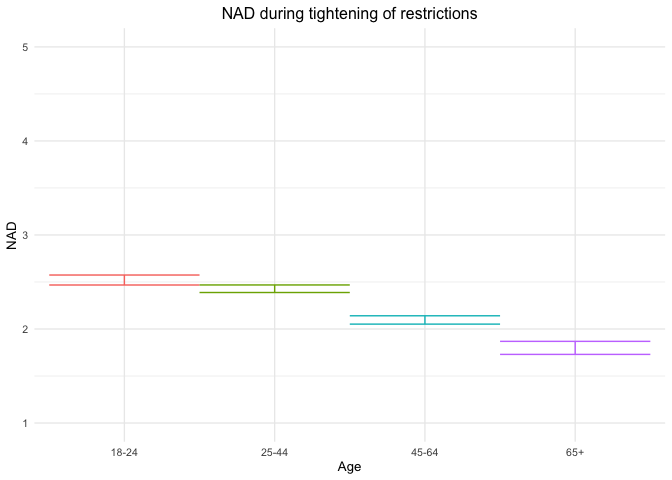
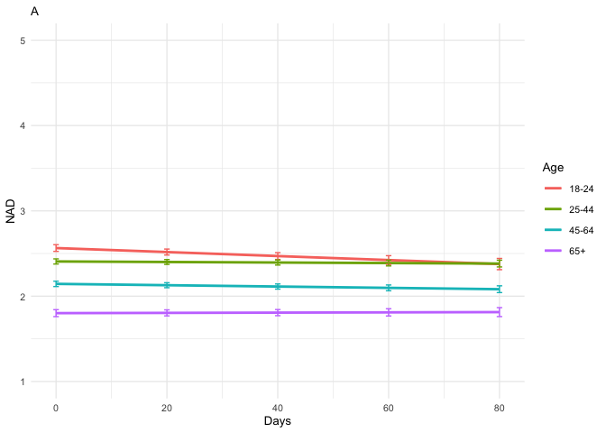
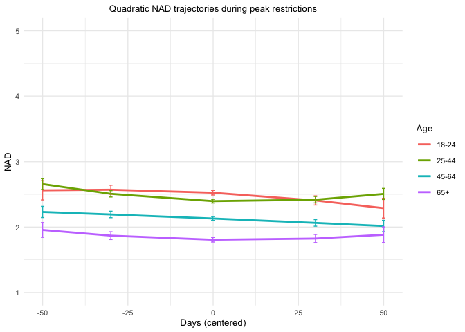
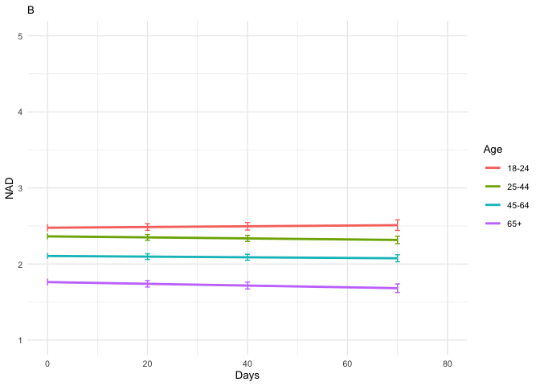
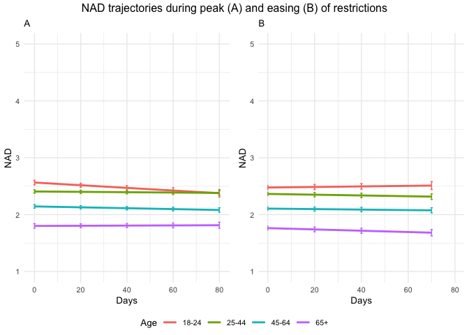

NAD final including gender_tables only
================
Anne Margit
05/09/2022

    ## [1] ""

``` r
load("data_analyse2_p1.Rdata")
load("data_analyse2_p2.Rdata")
load("data_analyse2_p3.Rdata")

levels(data_analyse2_p1$Gender) <- c("M", "F", "O")
levels(data_analyse2_p2$Gender) <- c("M", "F", "O")
levels(data_analyse2_p3$Gender) <- c("M", "F", "O")
```

This dataset includes:

1.  Data from all weekly measurement waves (baseline through wave 11,
    Time 1 through 12)
2.  Participants who provided at least 3 measurements
3.  Participants who are residents of the country they currently live in
4.  Participants who provided info on age
5.  Participants who provided info on gender (either male or female)
6.  Data from countries with at least 20 participants
7.  Pooled age groups
8.  Imputed missing emotion scores
9.  Combined emotion scores (NAA, NAD, PAA, PAD)
10. An imputed Stringency index (StringencyIndex_imp)
11. A dummy Str_dummy with 0 = before the peak, 1 = during peak, 2 =
    after peak
12. A variable indicating the number of days before maximum stringency
    was reached (DaysMax_p1), during (DaysMax_p2), and after
    (DaysPhase3)
13. A variable indicating the number of weeks before maximum stringency
    was reached (WeeksMax_p1), during (WeeksMax_p2), and after
    (WeeksPhase3)
14. A variable indicating the date on which maximum Stringency was
    reached for that country (DateMaxStr) and the max level reached
    (MaxStr) across the entire measurement period
15. A variable indicating the date on which minimum Stringency was
    reached for that country (DateMinStr) and the min level reached
    (MinStr) across the entire measurement period
16. Observations during which there was a second peak are excluded
    (N=583)

> My comments are in block quotes such as this.

``` r
library(dplyr)
library(tidyverse)
library(ggpubr)
library(ggplot2)
library(rockchalk)
library(effects)
library(nlme)
library(lattice)
library(broom.mixed)
library(purrr)
library(stargazer)
library(viridis)
```

# Phase 1

*Random: IC for ID and Country + Covariates Gender and Education*

> Edu: 0= Primary education, 1= General secondary education, 2=
> Vocational education, 3= Higher education, 4= Bachelors degree, 5=
> Masters degree, 6= PhD degree

``` r
data_analyse2_p1$Edu <- as.numeric(data_analyse2_p1$Edu)
model_NADp1 <- lme(fixed = NAD ~ Gender + Edu + Age_new,
                  random = ~1 | Country/ID, 
                  data = data_analyse2_p1, 
                  na.action = na.omit)

summary(model_NADp1)
```

    Linear mixed-effects model fit by REML
      Data: data_analyse2_p1 
           AIC      BIC    logLik
      10940.95 11004.31 -5460.476

    Random effects:
     Formula: ~1 | Country
            (Intercept)
    StdDev:   0.1142644

     Formula: ~1 | ID %in% Country
            (Intercept)  Residual
    StdDev:   0.6894055 0.6505575

    Fixed effects:  NAD ~ Gender + Edu + Age_new 
                     Value  Std.Error   DF   t-value p-value
    (Intercept)  2.4997104 0.08176950 2730 30.570207  0.0000
    GenderF      0.2308406 0.03742589 2730  6.167939  0.0000
    GenderO      0.3965981 0.23228834 2730  1.707353  0.0879
    Edu         -0.0295946 0.01349654 2730 -2.192753  0.0284
    Age_new1    -0.0927589 0.05171997 2730 -1.793484  0.0730
    Age_new2    -0.4247351 0.05479333 2730 -7.751584  0.0000
    Age_new3    -0.7217488 0.07734864 2730 -9.331112  0.0000
     Correlation: 
             (Intr) GendrF GendrO Edu    Ag_nw1 Ag_nw2
    GenderF  -0.339                                   
    GenderO  -0.098  0.119                            
    Edu      -0.672 -0.046  0.031                     
    Age_new1 -0.295  0.076  0.022 -0.243              
    Age_new2 -0.351  0.128  0.061 -0.154  0.710       
    Age_new3 -0.302  0.183  0.052 -0.092  0.493  0.492

    Standardized Within-Group Residuals:
           Min         Q1        Med         Q3        Max 
    -3.4970695 -0.5613742 -0.1028814  0.5052675  3.6145974 

    Number of Observations: 4177
    Number of Groups: 
            Country ID %in% Country 
                 26            2762 

``` r
VarCorr(model_NADp1)
```

                Variance     StdDev   
    Country =   pdLogChol(1)          
    (Intercept) 0.01305636   0.1142644
    ID =        pdLogChol(1)          
    (Intercept) 0.47527992   0.6894055
    Residual    0.42322509   0.6505575

*Confidence intervals*

``` r
intervals(model_NADp1)
```

    Approximate 95% confidence intervals

     Fixed effects:
                      lower        est.        upper
    (Intercept)  2.33937406  2.49971041  2.660046765
    GenderF      0.15745466  0.23084059  0.304226516
    GenderO     -0.05888058  0.39659814  0.852076852
    Edu         -0.05605904 -0.02959458 -0.003130112
    Age_new1    -0.19417316 -0.09275893  0.008655306
    Age_new2    -0.53217563 -0.42473505 -0.317294475
    Age_new3    -0.87341662 -0.72174883 -0.570081038

     Random Effects:
      Level: Country 
                         lower      est.     upper
    sd((Intercept)) 0.06740828 0.1142644 0.1936907
      Level: ID 
                        lower      est.     upper
    sd((Intercept)) 0.6568061 0.6894055 0.7236229

     Within-group standard error:
        lower      est.     upper 
    0.6278350 0.6505575 0.6741025 

*Plot of predicted values*

``` r
ef_NADp1 <- effect("Age_new", model_NADp1)

plot_NADp1 <- ggplot(as.data.frame(ef_NADp1), 
  aes(Age_new, fit, color=Age_new)) + geom_line() + 
  geom_errorbar(aes(ymin=fit-se, ymax=fit+se), width=1) + theme_minimal(base_size=10) + 
  labs(title="NAD during tightening of restrictions", y = "NAD") +
  theme(plot.title = element_text(hjust = 0.5)) +
  scale_x_discrete(name ="Age", labels=c("18-24", "25-44", "45-64", "65+")) +
  theme(legend.position = "none") +                 
  scale_color_discrete() + 
  expand_limits(y=c(1, 5))
```

``` r
plot_NADp1
```

<!-- -->

*Effect sizes*

``` r
ISDs <- data_analyse2_p1 %>% 
  group_by(ID) %>%
  summarize_at(c("NAD"), sd, na.rm=TRUE) %>%
  ungroup()

ISDs_av <- ISDs %>%
  summarize_at(c("NAD"), mean, na.rm=TRUE) %>%
  stack() %>%
  rename(sd=values) 
```

> Effect size = regression coefficient / average ISD of NAD

``` r
coef_NADp1 = broom.mixed::tidy(model_NADp1, 
               effects = "fixed")

coef_NADp1 <- coef_NADp1 %>%
  mutate (e_size = estimate/0.4864555) %>% 
  mutate(across(3:8, round, 2)) 
```

``` r
coef_NADp1
```

    ## # A tibble: 7 × 8
    ##   effect term        estimate std.error    df statistic p.value e_size
    ##   <chr>  <chr>          <dbl>     <dbl> <dbl>     <dbl>   <dbl>  <dbl>
    ## 1 fixed  (Intercept)     2.5       0.08  2730     30.6     0      5.14
    ## 2 fixed  GenderF         0.23      0.04  2730      6.17    0      0.47
    ## 3 fixed  GenderO         0.4       0.23  2730      1.71    0.09   0.82
    ## 4 fixed  Edu            -0.03      0.01  2730     -2.19    0.03  -0.06
    ## 5 fixed  Age_new1       -0.09      0.05  2730     -1.79    0.07  -0.19
    ## 6 fixed  Age_new2       -0.42      0.05  2730     -7.75    0     -0.87
    ## 7 fixed  Age_new3       -0.72      0.08  2730     -9.33    0     -1.48

``` r
coef_NADp1 <- as.matrix(coef_NADp1)
```

# Phase 2

*Best model*

> Random intercept for ID and Country, random slope for Country, AR
> correlation structure at Measuement level

``` r
data_analyse2_p2$Edu <- as.numeric(data_analyse2_p2$Edu)
data_analyse2_p2 <- data_analyse2_p2[with(data_analyse2_p2, order(Country, ID, Time)),]
data_analyse2_p2$Time <- as.numeric(data_analyse2_p2$Time)

model_NADp2 <- lme(fixed = NAD ~ Gender + Edu + DaysMax_p2 + Age_new + DaysMax_p2*Age_new,
                  random = list (Country = ~1, ID = ~DaysMax_p2), 
                  data = data_analyse2_p2, 
                  na.action = na.omit,
                  correlation = corAR1(form = ~ Time | Country/ID))

summary(model_NADp2)
```

    Linear mixed-effects model fit by REML
      Data: data_analyse2_p2 
           AIC      BIC    logLik
      68646.95 68788.07 -34306.48

    Random effects:
     Formula: ~1 | Country
            (Intercept)
    StdDev:   0.1162199

     Formula: ~DaysMax_p2 | ID %in% Country
     Structure: General positive-definite, Log-Cholesky parametrization
                StdDev      Corr  
    (Intercept) 0.776166806 (Intr)
    DaysMax_p2  0.007084993 -0.232
    Residual    0.595777847       

    Correlation Structure: ARMA(1,0)
     Formula: ~Time | Country/ID 
     Parameter estimate(s):
         Phi1 
    0.2236097 
    Fixed effects:  NAD ~ Gender + Edu + DaysMax_p2 + Age_new + DaysMax_p2 * Age_new 
                             Value  Std.Error    DF   t-value p-value
    (Intercept)          2.5093432 0.04806757 20515  52.20450  0.0000
    GenderF              0.2149897 0.01965046  9221  10.94069  0.0000
    GenderO              0.6833501 0.12510221  9221   5.46233  0.0000
    Edu                 -0.0210406 0.00641809  9221  -3.27832  0.0010
    DaysMax_p2          -0.0023466 0.00091921 20515  -2.55282  0.0107
    Age_new1            -0.1571795 0.03724980  9221  -4.21961  0.0000
    Age_new2            -0.4199371 0.03804358  9221 -11.03832  0.0000
    Age_new3            -0.7629796 0.04609566  9221 -16.55209  0.0000
    DaysMax_p2:Age_new1  0.0020347 0.00102109 20515   1.99269  0.0463
    DaysMax_p2:Age_new2  0.0015662 0.00103460 20515   1.51378  0.1301
    DaysMax_p2:Age_new3  0.0024987 0.00118406 20515   2.11024  0.0348
     Correlation: 
                        (Intr) GendrF GendrO Edu    DysM_2 Ag_nw1 Ag_nw2 Ag_nw3 DM_2:A_1 DM_2:A_2
    GenderF             -0.309                                                                   
    GenderO             -0.067  0.117                                                            
    Edu                 -0.494 -0.030  0.003                                                     
    DaysMax_p2          -0.359  0.001 -0.015 -0.020                                              
    Age_new1            -0.443  0.048  0.018 -0.215  0.499                                       
    Age_new2            -0.488  0.080  0.043 -0.130  0.490  0.743                                
    Age_new3            -0.442  0.148  0.045 -0.088  0.404  0.614  0.616                         
    DaysMax_p2:Age_new1  0.325 -0.002  0.012  0.020 -0.895 -0.567 -0.433 -0.358                  
    DaysMax_p2:Age_new2  0.318 -0.002  0.014  0.024 -0.885 -0.440 -0.583 -0.356  0.795           
    DaysMax_p2:Age_new3  0.283 -0.011  0.012  0.016 -0.773 -0.384 -0.378 -0.603  0.695    0.687  

    Standardized Within-Group Residuals:
           Min         Q1        Med         Q3        Max 
    -4.0402305 -0.5230660 -0.1173865  0.4955772  4.0661154 

    Number of Observations: 29779
    Number of Groups: 
            Country ID %in% Country 
                 33            9260 

``` r
VarCorr(model_NADp2)
```

                Variance              StdDev      Corr  
    Country =   pdLogChol(1)                            
    (Intercept) 1.350706e-02          0.116219893       
    ID =        pdLogChol(DaysMax_p2)                   
    (Intercept) 6.024349e-01          0.776166806 (Intr)
    DaysMax_p2  5.019713e-05          0.007084993 -0.232
    Residual    3.549512e-01          0.595777847       

*Confidence intervals*

``` r
intervals(model_NADp2, which = 'fixed')
```

    Approximate 95% confidence intervals

     Fixed effects:
                                lower         est.         upper
    (Intercept)          2.415127e+00  2.509343183  2.6035594398
    GenderF              1.764704e-01  0.214989708  0.2535089663
    GenderO              4.381221e-01  0.683350098  0.9285781074
    Edu                 -3.362143e-02 -0.021040563 -0.0084596941
    DaysMax_p2          -4.148307e-03 -0.002346578 -0.0005448501
    Age_new1            -2.301974e-01 -0.157179542 -0.0841616958
    Age_new2            -4.945109e-01 -0.419937084 -0.3453632584
    Age_new3            -8.533373e-01 -0.762979636 -0.6726219472
    DaysMax_p2:Age_new1  3.329638e-05  0.002034709  0.0040361211
    DaysMax_p2:Age_new2 -4.617382e-04  0.001566153  0.0035940442
    DaysMax_p2:Age_new3  1.778048e-04  0.002498662  0.0048195200

*Plot of predicted values*

``` r
ef_NADp2 <- effect("DaysMax_p2:Age_new", model_NADp2)

plot_NADp2 <- ggplot(as.data.frame(ef_NADp2), aes(DaysMax_p2, fit, color=Age_new)) + 
  geom_line(size=1) + 
  geom_errorbar(aes(ymin=fit-se, ymax=fit+se), width=1) + 
  theme_minimal(base_size=10) + 
  labs(title="A",
       x="Days", y = "NAD") +
  theme(plot.title = element_text(size=10)) +
  scale_color_discrete(name="Age", labels = c("18-24", "25-44", "45-64", "65+")) + 
  expand_limits(y=c(1, 5))
```

``` r
plot_NADp2
```

<!-- -->

*Effect sizes* **Within person SD and average within person SD**

``` r
ISDs <- data_analyse2_p2 %>% 
  group_by(ID) %>%
  summarize_at(c("DaysMax_p2", "NAD"), sd, na.rm=TRUE) %>%
  ungroup()

ISDs_av <- ISDs %>%
  summarize_at(c("DaysMax_p2", "NAD"), mean, na.rm=TRUE) %>%
  stack() %>%
  rename(sd=values) 
```

> Effect sizes for intercept and main effect of age and covariates =
> regression coefficient / average ISD of NAD Effect size for main
> effect of DaysMax = (regression coefficient \* 28)/ average ISD of NAD
> Effect sizes for interaction effects = (regression coefficient \* 28)/
> average ISD of NAD

> The effect sizes for main effect of DaysMax and the interaction
> effects reflect the increase in SD of NAD over 4 weeks (28 days)

``` r
coef_NADp2 = broom.mixed::tidy(model_NADp2, 
               effects = "fixed")

coef_NADp2 <- coef_NADp2 %>%
  mutate(e_size = ifelse(row_number()== 1 | row_number()== 2 |  row_number()== 3 |  row_number()== 4 |  row_number()== 6 |  row_number()== 7 |  row_number()== 8, estimate/0.4758088, (estimate*28)/0.4758088)) %>%
  mutate(across(3:8, round, 2)) 
```

``` r
coef_NADp2
```

    ## # A tibble: 11 × 8
    ##    effect term                estimate std.error    df statistic p.value e_size
    ##    <chr>  <chr>                  <dbl>     <dbl> <dbl>     <dbl>   <dbl>  <dbl>
    ##  1 fixed  (Intercept)             2.51      0.05 20515     52.2     0      5.27
    ##  2 fixed  GenderF                 0.21      0.02  9221     10.9     0      0.45
    ##  3 fixed  GenderO                 0.68      0.13  9221      5.46    0      1.44
    ##  4 fixed  Edu                    -0.02      0.01  9221     -3.28    0     -0.04
    ##  5 fixed  DaysMax_p2              0         0    20515     -2.55    0.01  -0.14
    ##  6 fixed  Age_new1               -0.16      0.04  9221     -4.22    0     -0.33
    ##  7 fixed  Age_new2               -0.42      0.04  9221    -11.0     0     -0.88
    ##  8 fixed  Age_new3               -0.76      0.05  9221    -16.6     0     -1.6 
    ##  9 fixed  DaysMax_p2:Age_new1     0         0    20515      1.99    0.05   0.12
    ## 10 fixed  DaysMax_p2:Age_new2     0         0    20515      1.51    0.13   0.09
    ## 11 fixed  DaysMax_p2:Age_new3     0         0    20515      2.11    0.03   0.15

``` r
coef_NADp2 <- as.matrix(coef_NADp2)
```

> NAD decreases over time in the youngest age group (main effect), but
> not or minimally in the older age groups (interaction effect). Older
> people report lower NAD than the youngest age group at t=0 (first day
> of max stringency, main effect).

# Quadratic term

The interaction between age and daysmax was significant so these are
kept in the current model. The time variable needs to be centered at the
midpoint (mean) to reduce collinearity between the linear and the
quadratic components.

``` r
data_analyse2_p2q <- gmc(data_analyse2_p2, "DaysMax_p2", "ID", FUN = mean, suffix = c("_mn", "_dev"),
    fulldataframe = TRUE)
```

``` r
data_analyse2_p2q$Edu <- as.numeric(data_analyse2_p2q$Edu)

data_analyse2_p2q <- data_analyse2_p2q[with(data_analyse2_p2q, order(Country, ID, Time)),]
data_analyse2_p2q$Time <- as.numeric(data_analyse2_p2q$Time)

model_NADp2q <- lme(fixed = NAD ~ Gender + Edu + DaysMax_p2_dev + Age_new + DaysMax_p2_dev*Age_new +  
                    + I(DaysMax_p2_dev^2) + I(DaysMax_p2_dev^2)*Age_new,
                  random = list(Country = pdDiag(~ DaysMax_p2_dev), 
                  ID = ~DaysMax_p2_dev),
                  data = data_analyse2_p2q, 
                  na.action = na.omit,
                  correlation = corAR1(form = ~ Time | Country/ID))

summary(model_NADp2q)
```

    Linear mixed-effects model fit by REML
      Data: data_analyse2_p2q 
           AIC     BIC    logLik
      68692.67 68875.3 -34324.34

    Random effects:
     Formula: ~DaysMax_p2_dev | Country
     Structure: Diagonal
            (Intercept) DaysMax_p2_dev
    StdDev:   0.1179348    0.004188905

     Formula: ~DaysMax_p2_dev | ID %in% Country
     Structure: General positive-definite, Log-Cholesky parametrization
                   StdDev      Corr  
    (Intercept)    0.760385138 (Intr)
    DaysMax_p2_dev 0.007630242 0.077 
    Residual       0.592173161       

    Correlation Structure: ARMA(1,0)
     Formula: ~Time | Country/ID 
     Parameter estimate(s):
         Phi1 
    0.2150666 
    Fixed effects:  NAD ~ Gender + Edu + DaysMax_p2_dev + Age_new + DaysMax_p2_dev *      Age_new + +I(DaysMax_p2_dev^2) + I(DaysMax_p2_dev^2) * Age_new 
                                      Value  Std.Error    DF   t-value p-value
    (Intercept)                   2.4710757 0.04531003 20511  54.53706  0.0000
    GenderF                       0.2151522 0.01964605  9221  10.95142  0.0000
    GenderO                       0.6763636 0.12484397  9221   5.41767  0.0000
    Edu                          -0.0212257 0.00641480  9221  -3.30886  0.0009
    DaysMax_p2_dev               -0.0027309 0.00140182 20511  -1.94810  0.0514
    Age_new1                     -0.1286086 0.03136515  9221  -4.10037  0.0000
    Age_new2                     -0.3941501 0.03152185  9221 -12.50403  0.0000
    Age_new3                     -0.7189237 0.03728926  9221 -19.27965  0.0000
    I(DaysMax_p2_dev^2)          -0.0000398 0.00005283 20511  -0.75298  0.4515
    DaysMax_p2_dev:Age_new1       0.0012291 0.00112175 20511   1.09571  0.2732
    DaysMax_p2_dev:Age_new2       0.0005792 0.00114581 20511   0.50549  0.6132
    DaysMax_p2_dev:Age_new3       0.0019958 0.00131671 20511   1.51576  0.1296
    Age_new1:I(DaysMax_p2_dev^2)  0.0001140 0.00005712 20511   1.99628  0.0459
    Age_new2:I(DaysMax_p2_dev^2)  0.0000368 0.00005744 20511   0.64007  0.5221
    Age_new3:I(DaysMax_p2_dev^2)  0.0000851 0.00006442 20511   1.32061  0.1866
     Correlation: 
                                 (Intr) GendrF GendrO Edu    DyM_2_ Ag_nw1 Ag_nw2 Ag_nw3 I(DM_2 DM_2_:A_1 DM_2_:A_2 DM_2_:A_3 A_1:I( A_2:I(
    GenderF                      -0.327                                                                                                    
    GenderO                      -0.075  0.117                                                                                             
    Edu                          -0.531 -0.030  0.003                                                                                      
    DaysMax_p2_dev                0.008  0.000  0.001  0.000                                                                               
    Age_new1                     -0.352  0.056  0.027 -0.244 -0.011                                                                        
    Age_new2                     -0.421  0.096  0.059 -0.141 -0.011  0.754                                                                 
    Age_new3                     -0.404  0.175  0.061 -0.100 -0.009  0.641  0.656                                                          
    I(DaysMax_p2_dev^2)          -0.114  0.003 -0.012 -0.009  0.025  0.188  0.186  0.157                                                   
    DaysMax_p2_dev:Age_new1      -0.010  0.000 -0.001  0.000 -0.586  0.020  0.015  0.013 -0.024                                            
    DaysMax_p2_dev:Age_new2      -0.010  0.000 -0.001  0.000 -0.570  0.015  0.019  0.013 -0.023  0.808                                     
    DaysMax_p2_dev:Age_new3      -0.008  0.000 -0.001  0.000 -0.501  0.014  0.014  0.016 -0.021  0.705     0.703                           
    Age_new1:I(DaysMax_p2_dev^2)  0.110 -0.005  0.010  0.006 -0.022 -0.207 -0.166 -0.142 -0.922  0.027     0.022     0.019                 
    Age_new2:I(DaysMax_p2_dev^2)  0.110 -0.005  0.011  0.004 -0.022 -0.166 -0.207 -0.142 -0.917  0.022     0.029     0.018     0.848       
    Age_new3:I(DaysMax_p2_dev^2)  0.102 -0.012  0.011  0.001 -0.021 -0.149 -0.150 -0.204 -0.818  0.019     0.018     0.053     0.756  0.752

    Standardized Within-Group Residuals:
           Min         Q1        Med         Q3        Max 
    -4.0749096 -0.5191861 -0.1141516  0.4947924  4.0255088 

    Number of Observations: 29779
    Number of Groups: 
            Country ID %in% Country 
                 33            9260 

``` r
VarCorr(model_NADp2q)
```

                   Variance                  StdDev      Corr  
    Country =      pdDiag(DaysMax_p2_dev)                      
    (Intercept)    1.390862e-02              0.117934813       
    DaysMax_p2_dev 1.754692e-05              0.004188905       
    ID =           pdLogChol(DaysMax_p2_dev)                   
    (Intercept)    5.781856e-01              0.760385138 (Intr)
    DaysMax_p2_dev 5.822059e-05              0.007630242 0.077 
    Residual       3.506691e-01              0.592173161       

Results suggest that there is a linear decline of NAD over time in the
youngest age group. There was a significant decelerated decline in NAD
over time in the age group 25-44 compared with the youngest age group.

*Confidence intervals*

``` r
intervals(model_NADp2q, which = 'fixed')
```

    Approximate 95% confidence intervals

     Fixed effects:
                                         lower          est.         upper
    (Intercept)                   2.382264e+00  2.471076e+00  2.559887e+00
    GenderF                       1.766416e-01  2.151522e-01  2.536628e-01
    GenderO                       4.316418e-01  6.763636e-01  9.210854e-01
    Edu                          -3.380014e-02 -2.122570e-02 -8.651268e-03
    DaysMax_p2_dev               -5.478590e-03 -2.730902e-03  1.678641e-05
    Age_new1                     -1.900913e-01 -1.286086e-01 -6.712598e-02
    Age_new2                     -4.559399e-01 -3.941501e-01 -3.323603e-01
    Age_new3                     -7.920189e-01 -7.189237e-01 -6.458285e-01
    I(DaysMax_p2_dev^2)          -1.433412e-04 -3.978292e-05  6.377534e-05
    DaysMax_p2_dev:Age_new1      -9.696050e-04  1.229122e-03  3.427848e-03
    DaysMax_p2_dev:Age_new2      -1.666683e-03  5.791959e-04  2.825075e-03
    DaysMax_p2_dev:Age_new3      -5.850454e-04  1.995819e-03  4.576683e-03
    Age_new1:I(DaysMax_p2_dev^2)  2.067571e-06  1.140236e-04  2.259797e-04
    Age_new2:I(DaysMax_p2_dev^2) -7.582156e-05  3.676600e-05  1.493536e-04
    Age_new3:I(DaysMax_p2_dev^2) -4.119558e-05  8.507473e-05  2.113450e-04

*Plot of predicted values*

``` r
ef_NADp2q <- effect("Age_new:I(DaysMax_p2_dev^2)", model_NADp2q)

plot_NADp2q <- ggplot(as.data.frame(ef_NADp2q), aes(DaysMax_p2_dev, fit, color=Age_new)) + 
  geom_line(size=1) + 
  geom_errorbar(aes(ymin=fit-se, ymax=fit+se), width=1) + 
  theme_minimal(base_size=10) + 
  labs(title="Quadratic NAD trajectories during peak restrictions",
       x="Days (centered)", y = "NAD") +
  theme(plot.title = element_text(hjust = 0.5, size=10)) +
  scale_color_discrete(name="Age", labels = c("18-24", "25-44", "45-64", "65+")) + 
  expand_limits(y=c(1, 5))
```

``` r
plot_NADp2q
```

<!-- -->

# Phase 3

> Random IC for Country and ID, random S for ID, AR structure

``` r
data_analyse2_p3$Edu <- as.numeric(data_analyse2_p3$Edu)
data_analyse2_p3 <- data_analyse2_p3[with(data_analyse2_p3, order(Country, ID, Time)),]
data_analyse2_p3$Time <- as.numeric(data_analyse2_p3$Time)

model_NADp3 <- lme(fixed = NAD ~ Gender + Edu + DaysPhase3 + Age_new + DaysPhase3*Age_new,
                  random = list (Country = ~1, ID = ~DaysPhase3), 
                  data = data_analyse2_p3, 
                  na.action = na.omit,
                  correlation = corAR1(form = ~ Time | Country/ID))

summary(model_NADp3)
```

    Linear mixed-effects model fit by REML
      Data: data_analyse2_p3 
           AIC      BIC    logLik
      55923.95 56062.15 -27944.98

    Random effects:
     Formula: ~1 | Country
            (Intercept)
    StdDev:   0.1757421

     Formula: ~DaysPhase3 | ID %in% Country
     Structure: General positive-definite, Log-Cholesky parametrization
                StdDev     Corr  
    (Intercept) 0.77725654 (Intr)
    DaysPhase3  0.00841084 -0.205
    Residual    0.57537007       

    Correlation Structure: ARMA(1,0)
     Formula: ~Time | Country/ID 
     Parameter estimate(s):
        Phi1 
    0.185155 
    Fixed effects:  NAD ~ Gender + Edu + DaysPhase3 + Age_new + DaysPhase3 * Age_new 
                             Value  Std.Error    DF   t-value p-value
    (Intercept)          2.4454297 0.05752134 18008  42.51344  0.0000
    GenderF              0.1723415 0.02229612  7031   7.72966  0.0000
    GenderO              0.2702432 0.17918628  7031   1.50817  0.1316
    Edu                 -0.0183721 0.00740034  7031  -2.48261  0.0131
    DaysPhase3           0.0004876 0.00102072 18008   0.47770  0.6329
    Age_new1            -0.1127605 0.04162372  7031  -2.70904  0.0068
    Age_new2            -0.3707810 0.04095693  7031  -9.05295  0.0000
    Age_new3            -0.7140157 0.04699340  7031 -15.19396  0.0000
    DaysPhase3:Age_new1 -0.0011615 0.00118150 18008  -0.98305  0.3256
    DaysPhase3:Age_new2 -0.0009214 0.00114392 18008  -0.80548  0.4206
    DaysPhase3:Age_new3 -0.0016328 0.00126552 18008  -1.29023  0.1970
     Correlation: 
                        (Intr) GendrF GendrO Edu    DysPh3 Ag_nw1 Ag_nw2 Ag_nw3 DP3:A_1 DP3:A_2
    GenderF             -0.302                                                                 
    GenderO             -0.059  0.095                                                          
    Edu                 -0.484 -0.027  0.003                                                   
    DaysPhase3          -0.305 -0.003 -0.007 -0.006                                            
    Age_new1            -0.398  0.050  0.015 -0.221  0.428                                     
    Age_new2            -0.478  0.106  0.048 -0.114  0.434  0.749                              
    Age_new3            -0.463  0.184  0.050 -0.074  0.378  0.656  0.697                       
    DaysPhase3:Age_new1  0.267  0.000  0.004  0.003 -0.862 -0.499 -0.376 -0.328                
    DaysPhase3:Age_new2  0.274  0.002  0.007  0.006 -0.891 -0.383 -0.496 -0.339  0.770         
    DaysPhase3:Age_new3  0.249 -0.001  0.007  0.002 -0.805 -0.345 -0.351 -0.487  0.696   0.719 

    Standardized Within-Group Residuals:
           Min         Q1        Med         Q3        Max 
    -4.9161393 -0.5067113 -0.1297521  0.4686230  4.9663812 

    Number of Observations: 25081
    Number of Groups: 
            Country ID %in% Country 
                 32            7069 

``` r
VarCorr(model_NADp3)
```

                Variance              StdDev     Corr  
    Country =   pdLogChol(1)                           
    (Intercept) 3.088527e-02          0.17574206       
    ID =        pdLogChol(DaysPhase3)                  
    (Intercept) 6.041277e-01          0.77725654 (Intr)
    DaysPhase3  7.074223e-05          0.00841084 -0.205
    Residual    3.310507e-01          0.57537007       

*Confidence intervals*

``` r
intervals(model_NADp3, which = 'fixed')
```

    Approximate 95% confidence intervals

     Fixed effects:
                               lower          est.         upper
    (Intercept)          2.332682425  2.4454297484  2.5581770723
    GenderF              0.128634419  0.1723415356  0.2160486524
    GenderO             -0.081015898  0.2702432178  0.6215023335
    Edu                 -0.032879043 -0.0183721388 -0.0038652345
    DaysPhase3          -0.001513116  0.0004875973  0.0024883106
    Age_new1            -0.194355571 -0.1127605300 -0.0311654891
    Age_new2            -0.451068916 -0.3707809882 -0.2904930599
    Age_new3            -0.806136918 -0.7140156946 -0.6218944715
    DaysPhase3:Age_new1 -0.003477332 -0.0011614767  0.0011543785
    DaysPhase3:Age_new2 -0.003163587 -0.0009214020  0.0013207829
    DaysPhase3:Age_new3 -0.004113359 -0.0016328134  0.0008477325

*Plot of predicted values*

``` r
ef_NADp3 <- effect("DaysPhase3:Age_new", model_NADp3)

plot_NADp3 <- ggplot(as.data.frame(ef_NADp3), aes(DaysPhase3, fit, color=Age_new)) + 
  geom_line(size=1) + 
  geom_errorbar(aes(ymin=fit-se, ymax=fit+se), width=1) + 
  theme_minimal(base_size=10) + 
  xlim(0,80)+
  labs(title="B",
       x="Days", y = "NAD") +
  theme(plot.title = element_text(size=10)) +
  scale_color_discrete(name="Age", labels = c("18-24", "25-44", "45-64", "65+")) + 
  expand_limits(y=c(1, 5))
```

``` r
plot_NADp3
```

    ## Warning: Removed 4 row(s) containing missing values (geom_path).

<!-- -->

``` r
plot_NADp2and3 <- ggarrange(plot_NADp2, plot_NADp3 , 
          ncol = 2, nrow = 1, common.legend=TRUE, legend= "bottom")
```

    ## Warning: Removed 4 row(s) containing missing values (geom_path).

``` r
plot_NADp2and3 <- annotate_figure(plot_NADp2and3,top = text_grob("NAD trajectories during peak (A) and easing (B) of restrictions", size = 12))
```

``` r
plot_NADp2and3
```

<!-- -->
*Effect sizes* **Within person SD and average within person SD for NAD**

``` r
ISDs <- data_analyse2_p3 %>% 
  group_by(ID) %>%
  summarize_at(c("NAD"), sd, na.rm=TRUE) %>%
  ungroup()

ISDs_av <- ISDs %>%
  summarize_at(c("NAD"), mean, na.rm=TRUE) %>%
  stack() %>%
  rename(sd=values) 
```

> Effect sizes for intercept and main effect of age = regression
> coefficient / average ISD of NAD Effect size for main effect of
> DaysMax = (regression coefficient \* 28)/ average ISD of NAD Effect
> sizes for interaction effects = (regression coefficient \* 28)/
> average ISD of NAD

> The effect sizes for main effect of DaysMax and the interaction
> effects reflect the increase in SD of NAD over 4 weeks (28 days)

``` r
coef_NADp3 = broom.mixed::tidy(model_NADp3, 
               effects = "fixed")

coef_NADp3 <- coef_NADp3 %>%
 mutate(e_size = ifelse(row_number()== 1 | row_number()== 2 |  row_number()== 3 |  row_number()== 4 |  row_number()== 6 |  row_number()== 7 |  row_number()== 8,  estimate/0.4577752, (estimate*28)/0.4577752)) %>%
  mutate(across(3:8, round, 2)) 
```

``` r
coef_NADp3
```

    ## # A tibble: 11 × 8
    ##    effect term                estimate std.error    df statistic p.value e_size
    ##    <chr>  <chr>                  <dbl>     <dbl> <dbl>     <dbl>   <dbl>  <dbl>
    ##  1 fixed  (Intercept)             2.45      0.06 18008     42.5     0      5.34
    ##  2 fixed  GenderF                 0.17      0.02  7031      7.73    0      0.38
    ##  3 fixed  GenderO                 0.27      0.18  7031      1.51    0.13   0.59
    ##  4 fixed  Edu                    -0.02      0.01  7031     -2.48    0.01  -0.04
    ##  5 fixed  DaysPhase3              0         0    18008      0.48    0.63   0.03
    ##  6 fixed  Age_new1               -0.11      0.04  7031     -2.71    0.01  -0.25
    ##  7 fixed  Age_new2               -0.37      0.04  7031     -9.05    0     -0.81
    ##  8 fixed  Age_new3               -0.71      0.05  7031    -15.2     0     -1.56
    ##  9 fixed  DaysPhase3:Age_new1     0         0    18008     -0.98    0.33  -0.07
    ## 10 fixed  DaysPhase3:Age_new2     0         0    18008     -0.81    0.42  -0.06
    ## 11 fixed  DaysPhase3:Age_new3     0         0    18008     -1.29    0.2   -0.1

``` r
coef_NADp3 <- as.matrix(coef_NADp3)
```

> NAD does not change over time in the youngest group (main effect) or
> older groups (interaction effect). All older age groups report lower
> NAD compared with the youngest on the first day when stringency
> reduces (main effect).

``` r
stargazer(coef_NADp1, coef_NADp2, coef_NADp3,
type="html", df = TRUE, out="star_coefallphase_NAD.doc",  single.row=TRUE, digits = 3, align = TRUE)
```

    ## 
    ## <table style="text-align:center"><tr><td colspan="8" style="border-bottom: 1px solid black"></td></tr><tr><td>effect</td><td>term</td><td>estimate</td><td>std.error</td><td>df</td><td>statistic</td><td>p.value</td><td>e_size</td></tr>
    ## <tr><td colspan="8" style="border-bottom: 1px solid black"></td></tr><tr><td>fixed</td><td>(Intercept)</td><td>2.50</td><td>0.08</td><td>2730</td><td>30.57</td><td>0.00</td><td>5.14</td></tr>
    ## <tr><td>fixed</td><td>GenderF</td><td>0.23</td><td>0.04</td><td>2730</td><td>6.17</td><td>0.00</td><td>0.47</td></tr>
    ## <tr><td>fixed</td><td>GenderO</td><td>0.40</td><td>0.23</td><td>2730</td><td>1.71</td><td>0.09</td><td>0.82</td></tr>
    ## <tr><td>fixed</td><td>Edu</td><td>-0.03</td><td>0.01</td><td>2730</td><td>-2.19</td><td>0.03</td><td>-0.06</td></tr>
    ## <tr><td>fixed</td><td>Age_new1</td><td>-0.09</td><td>0.05</td><td>2730</td><td>-1.79</td><td>0.07</td><td>-0.19</td></tr>
    ## <tr><td>fixed</td><td>Age_new2</td><td>-0.42</td><td>0.05</td><td>2730</td><td>-7.75</td><td>0.00</td><td>-0.87</td></tr>
    ## <tr><td>fixed</td><td>Age_new3</td><td>-0.72</td><td>0.08</td><td>2730</td><td>-9.33</td><td>0.00</td><td>-1.48</td></tr>
    ## <tr><td colspan="8" style="border-bottom: 1px solid black"></td></tr></table>
    ## 
    ## <table style="text-align:center"><tr><td colspan="8" style="border-bottom: 1px solid black"></td></tr><tr><td>effect</td><td>term</td><td>estimate</td><td>std.error</td><td>df</td><td>statistic</td><td>p.value</td><td>e_size</td></tr>
    ## <tr><td colspan="8" style="border-bottom: 1px solid black"></td></tr><tr><td>fixed</td><td>(Intercept)</td><td>2.51</td><td>0.05</td><td>20515</td><td>52.20</td><td>0.00</td><td>5.27</td></tr>
    ## <tr><td>fixed</td><td>GenderF</td><td>0.21</td><td>0.02</td><td>9221</td><td>10.94</td><td>0.00</td><td>0.45</td></tr>
    ## <tr><td>fixed</td><td>GenderO</td><td>0.68</td><td>0.13</td><td>9221</td><td>5.46</td><td>0.00</td><td>1.44</td></tr>
    ## <tr><td>fixed</td><td>Edu</td><td>-0.02</td><td>0.01</td><td>9221</td><td>-3.28</td><td>0.00</td><td>-0.04</td></tr>
    ## <tr><td>fixed</td><td>DaysMax_p2</td><td>0.00</td><td>0.00</td><td>20515</td><td>-2.55</td><td>0.01</td><td>-0.14</td></tr>
    ## <tr><td>fixed</td><td>Age_new1</td><td>-0.16</td><td>0.04</td><td>9221</td><td>-4.22</td><td>0.00</td><td>-0.33</td></tr>
    ## <tr><td>fixed</td><td>Age_new2</td><td>-0.42</td><td>0.04</td><td>9221</td><td>-11.04</td><td>0.00</td><td>-0.88</td></tr>
    ## <tr><td>fixed</td><td>Age_new3</td><td>-0.76</td><td>0.05</td><td>9221</td><td>-16.55</td><td>0.00</td><td>-1.60</td></tr>
    ## <tr><td>fixed</td><td>DaysMax_p2:Age_new1</td><td>0.00</td><td>0.00</td><td>20515</td><td>1.99</td><td>0.05</td><td>0.12</td></tr>
    ## <tr><td>fixed</td><td>DaysMax_p2:Age_new2</td><td>0.00</td><td>0.00</td><td>20515</td><td>1.51</td><td>0.13</td><td>0.09</td></tr>
    ## <tr><td>fixed</td><td>DaysMax_p2:Age_new3</td><td>0.00</td><td>0.00</td><td>20515</td><td>2.11</td><td>0.03</td><td>0.15</td></tr>
    ## <tr><td colspan="8" style="border-bottom: 1px solid black"></td></tr></table>
    ## 
    ## <table style="text-align:center"><tr><td colspan="8" style="border-bottom: 1px solid black"></td></tr><tr><td>effect</td><td>term</td><td>estimate</td><td>std.error</td><td>df</td><td>statistic</td><td>p.value</td><td>e_size</td></tr>
    ## <tr><td colspan="8" style="border-bottom: 1px solid black"></td></tr><tr><td>fixed</td><td>(Intercept)</td><td>2.45</td><td>0.06</td><td>18008</td><td>42.51</td><td>0.00</td><td>5.34</td></tr>
    ## <tr><td>fixed</td><td>GenderF</td><td>0.17</td><td>0.02</td><td>7031</td><td>7.73</td><td>0.00</td><td>0.38</td></tr>
    ## <tr><td>fixed</td><td>GenderO</td><td>0.27</td><td>0.18</td><td>7031</td><td>1.51</td><td>0.13</td><td>0.59</td></tr>
    ## <tr><td>fixed</td><td>Edu</td><td>-0.02</td><td>0.01</td><td>7031</td><td>-2.48</td><td>0.01</td><td>-0.04</td></tr>
    ## <tr><td>fixed</td><td>DaysPhase3</td><td>0.00</td><td>0.00</td><td>18008</td><td>0.48</td><td>0.63</td><td>0.03</td></tr>
    ## <tr><td>fixed</td><td>Age_new1</td><td>-0.11</td><td>0.04</td><td>7031</td><td>-2.71</td><td>0.01</td><td>-0.25</td></tr>
    ## <tr><td>fixed</td><td>Age_new2</td><td>-0.37</td><td>0.04</td><td>7031</td><td>-9.05</td><td>0.00</td><td>-0.81</td></tr>
    ## <tr><td>fixed</td><td>Age_new3</td><td>-0.71</td><td>0.05</td><td>7031</td><td>-15.19</td><td>0.00</td><td>-1.56</td></tr>
    ## <tr><td>fixed</td><td>DaysPhase3:Age_new1</td><td>0.00</td><td>0.00</td><td>18008</td><td>-0.98</td><td>0.33</td><td>-0.07</td></tr>
    ## <tr><td>fixed</td><td>DaysPhase3:Age_new2</td><td>0.00</td><td>0.00</td><td>18008</td><td>-0.81</td><td>0.42</td><td>-0.06</td></tr>
    ## <tr><td>fixed</td><td>DaysPhase3:Age_new3</td><td>0.00</td><td>0.00</td><td>18008</td><td>-1.29</td><td>0.20</td><td>-0.10</td></tr>
    ## <tr><td colspan="8" style="border-bottom: 1px solid black"></td></tr></table>

``` r
stargazer(model_NADp1, model_NADp2, model_NADp2q, model_NADp3,
type="html", df = TRUE, out="starallphasesNAD.doc",  single.row=TRUE, digits = 3, align = TRUE,
intercept.top = TRUE, intercept.bottom = FALSE)
```

    ## 
    ## <table style="text-align:center"><tr><td colspan="5" style="border-bottom: 1px solid black"></td></tr><tr><td style="text-align:left"></td><td colspan="4"><em>Dependent variable:</em></td></tr>
    ## <tr><td></td><td colspan="4" style="border-bottom: 1px solid black"></td></tr>
    ## <tr><td style="text-align:left"></td><td colspan="4">NAD</td></tr>
    ## <tr><td style="text-align:left"></td><td>(1)</td><td>(2)</td><td>(3)</td><td>(4)</td></tr>
    ## <tr><td colspan="5" style="border-bottom: 1px solid black"></td></tr><tr><td style="text-align:left">Constant</td><td>2.500<sup>***</sup> (0.082)</td><td>2.509<sup>***</sup> (0.048)</td><td>2.471<sup>***</sup> (0.045)</td><td>2.445<sup>***</sup> (0.058)</td></tr>
    ## <tr><td style="text-align:left">GenderF</td><td>0.231<sup>***</sup> (0.037)</td><td>0.215<sup>***</sup> (0.020)</td><td>0.215<sup>***</sup> (0.020)</td><td>0.172<sup>***</sup> (0.022)</td></tr>
    ## <tr><td style="text-align:left">GenderO</td><td>0.397<sup>*</sup> (0.232)</td><td>0.683<sup>***</sup> (0.125)</td><td>0.676<sup>***</sup> (0.125)</td><td>0.270 (0.179)</td></tr>
    ## <tr><td style="text-align:left">Edu</td><td>-0.030<sup>**</sup> (0.013)</td><td>-0.021<sup>***</sup> (0.006)</td><td>-0.021<sup>***</sup> (0.006)</td><td>-0.018<sup>**</sup> (0.007)</td></tr>
    ## <tr><td style="text-align:left">DaysMax_p2</td><td></td><td>-0.002<sup>**</sup> (0.001)</td><td></td><td></td></tr>
    ## <tr><td style="text-align:left">DaysMax_p2_dev</td><td></td><td></td><td>-0.003<sup>*</sup> (0.001)</td><td></td></tr>
    ## <tr><td style="text-align:left">DaysPhase3</td><td></td><td></td><td></td><td>0.0005 (0.001)</td></tr>
    ## <tr><td style="text-align:left">Age_new1</td><td>-0.093<sup>*</sup> (0.052)</td><td>-0.157<sup>***</sup> (0.037)</td><td>-0.129<sup>***</sup> (0.031)</td><td>-0.113<sup>***</sup> (0.042)</td></tr>
    ## <tr><td style="text-align:left">Age_new2</td><td>-0.425<sup>***</sup> (0.055)</td><td>-0.420<sup>***</sup> (0.038)</td><td>-0.394<sup>***</sup> (0.032)</td><td>-0.371<sup>***</sup> (0.041)</td></tr>
    ## <tr><td style="text-align:left">Age_new3</td><td>-0.722<sup>***</sup> (0.077)</td><td>-0.763<sup>***</sup> (0.046)</td><td>-0.719<sup>***</sup> (0.037)</td><td>-0.714<sup>***</sup> (0.047)</td></tr>
    ## <tr><td style="text-align:left">DaysMax_p2:Age_new1</td><td></td><td>0.002<sup>**</sup> (0.001)</td><td></td><td></td></tr>
    ## <tr><td style="text-align:left">DaysMax_p2:Age_new2</td><td></td><td>0.002 (0.001)</td><td></td><td></td></tr>
    ## <tr><td style="text-align:left">DaysMax_p2:Age_new3</td><td></td><td>0.002<sup>**</sup> (0.001)</td><td></td><td></td></tr>
    ## <tr><td style="text-align:left">I(DaysMax_p2_dev2)</td><td></td><td></td><td>-0.00004 (0.0001)</td><td></td></tr>
    ## <tr><td style="text-align:left">DaysMax_p2_dev:Age_new1</td><td></td><td></td><td>0.001 (0.001)</td><td></td></tr>
    ## <tr><td style="text-align:left">DaysMax_p2_dev:Age_new2</td><td></td><td></td><td>0.001 (0.001)</td><td></td></tr>
    ## <tr><td style="text-align:left">DaysMax_p2_dev:Age_new3</td><td></td><td></td><td>0.002 (0.001)</td><td></td></tr>
    ## <tr><td style="text-align:left">Age_new1:I(DaysMax_p2_dev2)</td><td></td><td></td><td>0.0001<sup>**</sup> (0.0001)</td><td></td></tr>
    ## <tr><td style="text-align:left">Age_new2:I(DaysMax_p2_dev2)</td><td></td><td></td><td>0.00004 (0.0001)</td><td></td></tr>
    ## <tr><td style="text-align:left">Age_new3:I(DaysMax_p2_dev2)</td><td></td><td></td><td>0.0001 (0.0001)</td><td></td></tr>
    ## <tr><td style="text-align:left">DaysPhase3:Age_new1</td><td></td><td></td><td></td><td>-0.001 (0.001)</td></tr>
    ## <tr><td style="text-align:left">DaysPhase3:Age_new2</td><td></td><td></td><td></td><td>-0.001 (0.001)</td></tr>
    ## <tr><td style="text-align:left">DaysPhase3:Age_new3</td><td></td><td></td><td></td><td>-0.002 (0.001)</td></tr>
    ## <tr><td colspan="5" style="border-bottom: 1px solid black"></td></tr><tr><td style="text-align:left">Observations</td><td>4,177</td><td>29,779</td><td>29,779</td><td>25,081</td></tr>
    ## <tr><td style="text-align:left">Log Likelihood</td><td>-5,460.476</td><td>-34,306.470</td><td>-34,324.340</td><td>-27,944.980</td></tr>
    ## <tr><td style="text-align:left">Akaike Inf. Crit.</td><td>10,940.950</td><td>68,646.950</td><td>68,692.670</td><td>55,923.950</td></tr>
    ## <tr><td style="text-align:left">Bayesian Inf. Crit.</td><td>11,004.310</td><td>68,788.070</td><td>68,875.300</td><td>56,062.150</td></tr>
    ## <tr><td colspan="5" style="border-bottom: 1px solid black"></td></tr><tr><td style="text-align:left"><em>Note:</em></td><td colspan="4" style="text-align:right"><sup>*</sup>p<0.1; <sup>**</sup>p<0.05; <sup>***</sup>p<0.01</td></tr>
    ## </table>
