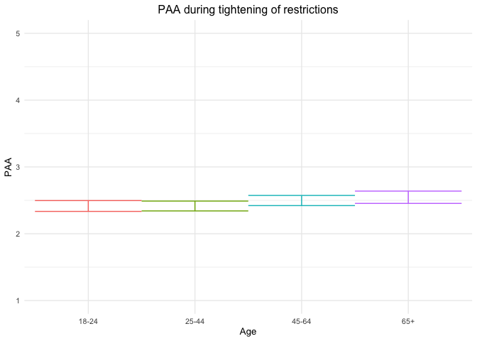
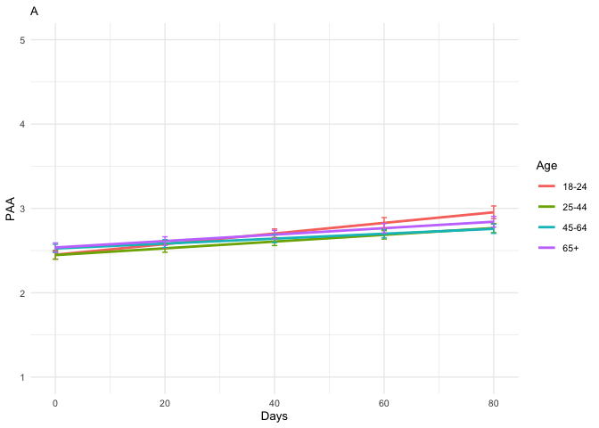
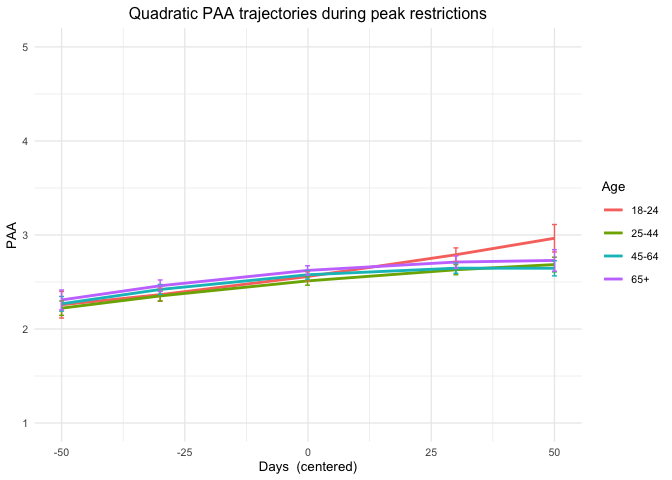
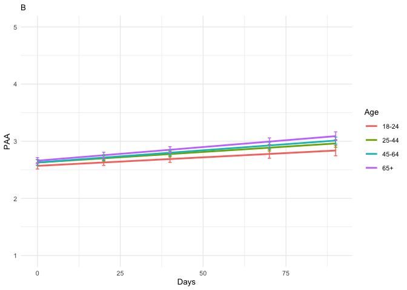
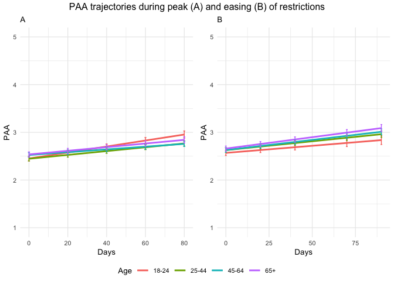

PAA final including gender_tables only
================
Anne Margit
05/16/2022

    ## [1] ""

``` r
load("data_analyse2_p1.Rdata")
load("data_analyse2_p2.Rdata")
load("data_analyse2_p3.Rdata")

levels(data_analyse2_p1$Gender) <- c("M", "F", "O")
levels(data_analyse2_p2$Gender) <- c("M", "F", "O")
levels(data_analyse2_p3$Gender) <- c("M", "F", "O")
```

This dataset includes:

1.  Data from all weekly measurement waves (baseline through wave 11,
    Time 1 through 12)
2.  Participants who provided at least 3 measurements
3.  Participants who are residents of the country they currently live in
4.  Participants who provided info on age
5.  Participants who provided info on gender (either male or female)
6.  Data from countries with at least 20 participants
7.  Pooled age groups
8.  Imputed missing emotion scores
9.  Combined emotion scores (NAA, NAD, PAA, PAD)
10. An imputed Stringency index (StringencyIndex_imp)
11. A dummy Str_dummy with 0 = before the peak, 1 = during peak, 2 =
    after peak
12. A variable indicating the number of days before maximum stringency
    was reached (DaysMax_p1), during (DaysMax_p2), and after
    (DaysPhase3)
13. A variable indicating the number of weeks before maximum stringency
    was reached (WeeksMax_p1), during (WeeksMax_p2), and after
    (WeeksPhase3)
14. A variable indicating the date on which maximum Stringency was
    reached for that country (DateMaxStr) and the max level reached
    (MaxStr) across the entire measurement period
15. A variable indicating the date on which minimum Stringency was
    reached for that country (DateMinStr) and the min level reached
    (MinStr) across the entire measurement period
16. Observations during which there was a second peak are excluded
    (N=583)

> My comments are in block quotes such as this.

``` r
library(dplyr)
library(tidyverse)
library(ggpubr)
library(ggplot2)
library(rockchalk)
library(effects)
library(nlme)
library(lattice)
library(broom.mixed)
library(purrr)
library(stargazer)
library(viridis)
```

# Phase 1

*Random: IC for ID and Country + Covariates Gender and Education*

> Edu: 0= Primary education, 1= General secondary education, 2=
> Vocational education, 3= Higher education, 4= Bachelors degree, 5=
> Masters degree, 6= PhD degree

``` r
data_analyse2_p1$Edu <- as.numeric(data_analyse2_p1$Edu)
model_PAAp1 <- lme(fixed = PAA ~ Gender + Edu + Age_new,
                  random = ~1 | Country/ID, 
                  data = data_analyse2_p1, 
                  na.action = na.omit)

summary(model_PAAp1)
```

    Linear mixed-effects model fit by REML
      Data: data_analyse2_p1 
           AIC      BIC    logLik
      10493.72 10557.07 -5236.858

    Random effects:
     Formula: ~1 | Country
            (Intercept)
    StdDev:   0.2938698

     Formula: ~1 | ID %in% Country
            (Intercept) Residual
    StdDev:    0.674069  0.60056

    Fixed effects:  PAA ~ Gender + Edu + Age_new 
                     Value  Std.Error   DF   t-value p-value
    (Intercept)  2.3464452 0.10146230 2730 23.126276  0.0000
    GenderF     -0.1521706 0.03590517 2730 -4.238126  0.0000
    GenderO      0.2022528 0.22257593 2730  0.908691  0.3636
    Edu          0.0367903 0.01303096 2730  2.823298  0.0048
    Age_new1    -0.0001508 0.04985639 2730 -0.003025  0.9976
    Age_new2     0.0818941 0.05302665 2730  1.544395  0.1226
    Age_new3     0.1308391 0.07512699 2730  1.741573  0.0817
     Correlation: 
             (Intr) GendrF GendrO Edu    Ag_nw1 Ag_nw2
    GenderF  -0.268                                   
    GenderO  -0.075  0.119                            
    Edu      -0.531 -0.043  0.030                     
    Age_new1 -0.230  0.078  0.020 -0.245              
    Age_new2 -0.272  0.128  0.058 -0.161  0.713       
    Age_new3 -0.231  0.183  0.049 -0.098  0.493  0.498

    Standardized Within-Group Residuals:
            Min          Q1         Med          Q3         Max 
    -2.75426112 -0.54681452 -0.05144756  0.49850610  2.93017561 

    Number of Observations: 4177
    Number of Groups: 
            Country ID %in% Country 
                 26            2762 

``` r
VarCorr(model_PAAp1)
```

                Variance     StdDev   
    Country =   pdLogChol(1)          
    (Intercept) 0.08635948   0.2938698
    ID =        pdLogChol(1)          
    (Intercept) 0.45436898   0.6740690
    Residual    0.36067233   0.6005600

*Confidence intervals*

``` r
intervals(model_PAAp1)
```

    Approximate 95% confidence intervals

     Fixed effects:
                      lower          est.       upper
    (Intercept)  2.14749454  2.3464452048  2.54539587
    GenderF     -0.22257468 -0.1521706302 -0.08176658
    GenderO     -0.23418150  0.2022527956  0.63868709
    Edu          0.01123875  0.0367902889  0.06234183
    Age_new1    -0.09791087 -0.0001508032  0.09760926
    Age_new2    -0.02208233  0.0818940951  0.18587052
    Age_new3    -0.01647236  0.1308391398  0.27815064

     Random Effects:
      Level: Country 
                        lower      est.     upper
    sd((Intercept)) 0.1993859 0.2938698 0.4331272
      Level: ID 
                        lower     est.     upper
    sd((Intercept)) 0.6439611 0.674069 0.7055845

     Within-group standard error:
        lower      est.     upper 
    0.5795258 0.6005600 0.6223576 

*Plot of predicted values*

``` r
ef_PAAp1 <- effect("Age_new", model_PAAp1)

plot_PAAp1 <- ggplot(as.data.frame(ef_PAAp1), 
  aes(Age_new, fit, color=Age_new)) + geom_line() + 
  geom_errorbar(aes(ymin=fit-se, ymax=fit+se), width=1) + theme_minimal(base_size=10) + 
  labs(title="PAA during tightening of restrictions", y = "PAA") +
  theme(plot.title = element_text(hjust = 0.5)) +
  scale_x_discrete(name ="Age", labels=c("18-24", "25-44", "45-64", "65+")) +
  theme(legend.position = "none") +                 
  scale_color_discrete() + 
  expand_limits(y=c(1, 5))
```

``` r
plot_PAAp1
```

<!-- -->

*Effect sizes*

``` r
ISDs <- data_analyse2_p1 %>% 
  group_by(ID) %>%
  summarize_at(c("PAA"), sd, na.rm=TRUE) %>%
  ungroup()

ISDs_av <- ISDs %>%
  summarize_at(c("PAA"), mean, na.rm=TRUE) %>%
  stack() %>%
  rename(sd=values) 
```

> Effect size = regression coefficient / average ISD of PAA

``` r
coef_PAAp1 = broom.mixed::tidy(model_PAAp1, 
               effects = "fixed")

coef_PAAp1 <- coef_PAAp1 %>%
  mutate (e_size = estimate/0.4684283) %>% 
  mutate(across(3:8, round, 2)) 
```

``` r
coef_PAAp1
```

    ## # A tibble: 7 × 8
    ##   effect term        estimate std.error    df statistic p.value e_size
    ##   <chr>  <chr>          <dbl>     <dbl> <dbl>     <dbl>   <dbl>  <dbl>
    ## 1 fixed  (Intercept)     2.35      0.1   2730     23.1     0      5.01
    ## 2 fixed  GenderF        -0.15      0.04  2730     -4.24    0     -0.32
    ## 3 fixed  GenderO         0.2       0.22  2730      0.91    0.36   0.43
    ## 4 fixed  Edu             0.04      0.01  2730      2.82    0      0.08
    ## 5 fixed  Age_new1        0         0.05  2730      0       1      0   
    ## 6 fixed  Age_new2        0.08      0.05  2730      1.54    0.12   0.17
    ## 7 fixed  Age_new3        0.13      0.08  2730      1.74    0.08   0.28

``` r
coef_PAAp1 <- as.matrix(coef_PAAp1)
```

# Phase 2

*Best model*

> Random intercept for ID and Country, random slope for ID, no
> correlation between IC and S for ID + AR correlation structure at
> Measurement level

``` r
data_analyse2_p2$Edu <- as.numeric(data_analyse2_p2$Edu)
data_analyse2_p2 <- data_analyse2_p2[with(data_analyse2_p2, order(Country, ID, Time)),]
data_analyse2_p2$Time <- as.numeric(data_analyse2_p2$Time)

model_PAAp2 <- lme(fixed = PAA ~ Gender + Edu + DaysMax_p2 + Age_new + DaysMax_p2*Age_new,
                  random = list(Country = ~1, ID = pdDiag(~DaysMax_p2)),
                  data = data_analyse2_p2, 
                  na.action = na.omit,
                  correlation = corAR1(form = ~Time | Country/ID))

summary(model_PAAp2)
```

    Linear mixed-effects model fit by REML
      Data: data_analyse2_p2 
           AIC     BIC    logLik
      67159.58 67292.4 -33563.79

    Random effects:
     Formula: ~1 | Country
            (Intercept)
    StdDev:   0.2324059

     Formula: ~DaysMax_p2 | ID %in% Country
     Structure: Diagonal
            (Intercept)  DaysMax_p2  Residual
    StdDev:   0.6797519 0.006224011 0.5914479

    Correlation Structure: ARMA(1,0)
     Formula: ~Time | Country/ID 
     Parameter estimate(s):
         Phi1 
    0.2136823 
    Fixed effects:  PAA ~ Gender + Edu + DaysMax_p2 + Age_new + DaysMax_p2 * Age_new 
                             Value  Std.Error    DF  t-value p-value
    (Intercept)          2.3235594 0.05888786 20515 39.45736  0.0000
    GenderF             -0.1661044 0.01843102  9221 -9.01222  0.0000
    GenderO             -0.0740776 0.11733384  9221 -0.63134  0.5278
    Edu                  0.0523089 0.00603201  9221  8.67189  0.0000
    DaysMax_p2           0.0062861 0.00090160 20515  6.97214  0.0000
    Age_new1            -0.0045434 0.03476810  9221 -0.13068  0.8960
    Age_new2             0.0739954 0.03565910  9221  2.07508  0.0380
    Age_new3             0.0855845 0.04326893  9221  1.97797  0.0480
    DaysMax_p2:Age_new1 -0.0022787 0.00100023 20515 -2.27819  0.0227
    DaysMax_p2:Age_new2 -0.0033739 0.00101324 20515 -3.32981  0.0009
    DaysMax_p2:Age_new3 -0.0024699 0.00115827 20515 -2.13238  0.0330
     Correlation: 
                        (Intr) GendrF GendrO Edu    DysM_2 Ag_nw1 Ag_nw2 Ag_nw3 DM_2:A_1 DM_2:A_2
    GenderF             -0.234                                                                   
    GenderO             -0.052  0.117                                                            
    Edu                 -0.383 -0.031  0.003                                                     
    DaysMax_p2          -0.266  0.001 -0.013 -0.020                                              
    Age_new1            -0.329  0.046  0.018 -0.219  0.496                                       
    Age_new2            -0.361  0.078  0.043 -0.136  0.487  0.746                                
    Age_new3            -0.326  0.144  0.045 -0.094  0.401  0.616  0.620                         
    DaysMax_p2:Age_new1  0.243 -0.001  0.011  0.020 -0.896 -0.562 -0.430 -0.355                  
    DaysMax_p2:Age_new2  0.237 -0.001  0.012  0.026 -0.886 -0.439 -0.577 -0.354  0.797           
    DaysMax_p2:Age_new3  0.209 -0.008  0.010  0.018 -0.775 -0.384 -0.377 -0.596  0.697    0.690  

    Standardized Within-Group Residuals:
            Min          Q1         Med          Q3         Max 
    -3.86114389 -0.55563981 -0.01978266  0.54940649  4.47779776 

    Number of Observations: 29779
    Number of Groups: 
            Country ID %in% Country 
                 33            9260 

``` r
VarCorr(model_PAAp2)
```

                Variance           StdDev     
    Country =   pdLogChol(1)                  
    (Intercept) 5.401248e-02       0.232405862
    ID =        pdDiag(DaysMax_p2)            
    (Intercept) 4.620627e-01       0.679751927
    DaysMax_p2  3.873831e-05       0.006224011
    Residual    3.498106e-01       0.591447900

*Confidence intervals*

``` r
intervals(model_PAAp2, which = 'fixed')
```

    Approximate 95% confidence intervals

     Fixed effects:
                                lower         est.         upper
    (Intercept)          2.2081344826  2.323559385  2.4389842869
    GenderF             -0.2022333186 -0.166104442 -0.1299755652
    GenderO             -0.3040778707 -0.074077579  0.1559227136
    Edu                  0.0404848380  0.052308904  0.0641329691
    DaysMax_p2           0.0045188974  0.006286114  0.0080533305
    Age_new1            -0.0726965720 -0.004543397  0.0636097782
    Age_new2             0.0040957062  0.073995432  0.1438951574
    Age_new3             0.0007678465  0.085584525  0.1704012039
    DaysMax_p2:Age_new1 -0.0042392505 -0.002278718 -0.0003181863
    DaysMax_p2:Age_new2 -0.0053599211 -0.003373894 -0.0013878659
    DaysMax_p2:Age_new3 -0.0047401803 -0.002469874 -0.0001995676

*Plot of predicted values*

``` r
ef_PAAp2 <- effect("DaysMax_p2:Age_new", model_PAAp2)

plot_PAAp2 <- ggplot(as.data.frame(ef_PAAp2), aes(DaysMax_p2, fit, color=Age_new)) + 
  geom_line(size=1) + 
  geom_errorbar(aes(ymin=fit-se, ymax=fit+se), width=1) + 
  theme_minimal(base_size=10) + 
  labs(title="A",
       x="Days", y = "PAA") +
  theme(plot.title = element_text(size=10)) +
  scale_color_discrete(name="Age", labels = c("18-24", "25-44", "45-64", "65+")) + 
  expand_limits(y=c(1, 5))
```

``` r
plot_PAAp2
```

<!-- -->

*Effect sizes* **Within person SD and average within person SD**

``` r
ISDs <- data_analyse2_p2 %>% 
  group_by(ID) %>%
  summarize_at(c("DaysMax_p2", "PAA"), sd, na.rm=TRUE) %>%
  ungroup()

ISDs_av <- ISDs %>%
  summarize_at(c("DaysMax_p2", "PAA"), mean, na.rm=TRUE) %>%
  stack() %>%
  rename(sd=values) 
```

> Effect sizes for intercept and main effect of age and covariates =
> regression coefficient / average ISD of PAA Effect size for main
> effect of DaysMax = (regression coefficient \* 28)/ average ISD of PAA
> Effect sizes for interaction effects = (regression coefficient \* 28)/
> average ISD of PAA

> The effect sizes for main effect of DaysMax and the interaction
> effects reflect the increase in SD of PAA over 4 weeks (28 days)

``` r
coef_PAAp2 = tidy(model_PAAp2, 
               effects = "fixed")

coef_PAAp2 <- coef_PAAp2 %>%
  mutate(e_size = ifelse(row_number()== 1 | row_number()== 2 |  row_number()== 3 |  row_number()== 4 |  row_number()== 6 |  row_number()== 7 |  row_number()== 8,  estimate/0.4889919, (estimate*28)/0.4889919)) %>%
  mutate(across(3:8, round, 2)) 
```

``` r
coef_PAAp2
```

    ## # A tibble: 11 × 8
    ##    effect term                estimate std.error    df statistic p.value e_size
    ##    <chr>  <chr>                  <dbl>     <dbl> <dbl>     <dbl>   <dbl>  <dbl>
    ##  1 fixed  (Intercept)             2.32      0.06 20515     39.5     0      4.75
    ##  2 fixed  GenderF                -0.17      0.02  9221     -9.01    0     -0.34
    ##  3 fixed  GenderO                -0.07      0.12  9221     -0.63    0.53  -0.15
    ##  4 fixed  Edu                     0.05      0.01  9221      8.67    0      0.11
    ##  5 fixed  DaysMax_p2              0.01      0    20515      6.97    0      0.36
    ##  6 fixed  Age_new1                0         0.03  9221     -0.13    0.9   -0.01
    ##  7 fixed  Age_new2                0.07      0.04  9221      2.08    0.04   0.15
    ##  8 fixed  Age_new3                0.09      0.04  9221      1.98    0.05   0.18
    ##  9 fixed  DaysMax_p2:Age_new1     0         0    20515     -2.28    0.02  -0.13
    ## 10 fixed  DaysMax_p2:Age_new2     0         0    20515     -3.33    0     -0.19
    ## 11 fixed  DaysMax_p2:Age_new3     0         0    20515     -2.13    0.03  -0.14

``` r
coef_PAAp2 <- as.matrix(coef_PAAp2)
```

> PAA increases over time in the youngest age group (main effect), and
> also increases in the older groups but more slowly (interaction
> effect). There are no significant differences in PAA between age
> groups on the first day of max stringency (main effect). Women report
> lower PAA compared to men, and higher educated people report higher
> PAA compared to lower educated people.

# Quadratic term

The interaction between age and daysmax was significant so these are
kept in the current model. The time variable needs to be centered at the
midpoint (mean) to reduce collinearity between the linear and the
quadratic components.

``` r
data_analyse2_p2q <- gmc(data_analyse2_p2, "DaysMax_p2", "ID", FUN = mean, suffix = c("_mn", "_dev"),
    fulldataframe = TRUE)
```

``` r
data_analyse2_p2q$Edu <- as.numeric(data_analyse2_p2q$Edu)

data_analyse2_p2q <- data_analyse2_p2q[with(data_analyse2_p2q, order(Country, ID, Time)),]
data_analyse2_p2q$Time <- as.numeric(data_analyse2_p2q$Time)

model_PAAp2q <- lme(fixed = PAA ~ Gender + Edu + DaysMax_p2_dev + Age_new + DaysMax_p2_dev*Age_new +  
                    + I(DaysMax_p2_dev^2) + I(DaysMax_p2_dev^2)*Age_new,
                  random = list(Country = pdDiag(~ DaysMax_p2_dev), 
                  ID = ~DaysMax_p2_dev),
                  data = data_analyse2_p2q, 
                  na.action = na.omit,
                  correlation = corAR1(form = ~ Time | Country/ID))

summary(model_PAAp2q)
```

    Linear mixed-effects model fit by REML
      Data: data_analyse2_p2q 
           AIC      BIC    logLik
      67238.95 67421.58 -33597.48

    Random effects:
     Formula: ~DaysMax_p2_dev | Country
     Structure: Diagonal
            (Intercept) DaysMax_p2_dev
    StdDev:    0.224557    0.001366473

     Formula: ~DaysMax_p2_dev | ID %in% Country
     Structure: General positive-definite, Log-Cholesky parametrization
                   StdDev      Corr  
    (Intercept)    0.704448319 (Intr)
    DaysMax_p2_dev 0.007383023 0.213 
    Residual       0.585942119       

    Correlation Structure: ARMA(1,0)
     Formula: ~Time | Country/ID 
     Parameter estimate(s):
         Phi1 
    0.1994973 
    Fixed effects:  PAA ~ Gender + Edu + DaysMax_p2_dev + Age_new + DaysMax_p2_dev *      Age_new + +I(DaysMax_p2_dev^2) + I(DaysMax_p2_dev^2) * Age_new 
                                      Value  Std.Error    DF  t-value p-value
    (Intercept)                   2.4262074 0.05607374 20511 43.26816  0.0000
    GenderF                      -0.1621679 0.01844331  9221 -8.79277  0.0000
    GenderO                      -0.0526263 0.11660708  9221 -0.45131  0.6518
    Edu                           0.0527156 0.00602831  9221  8.74467  0.0000
    DaysMax_p2_dev                0.0070734 0.00104644 20511  6.75948  0.0000
    Age_new1                     -0.0465436 0.02967075  9221 -1.56867  0.1168
    Age_new2                      0.0186271 0.02993037  9221  0.62235  0.5337
    Age_new3                      0.0649453 0.03539767  9221  1.83473  0.0666
    I(DaysMax_p2_dev^2)           0.0000212 0.00005194 20511  0.40808  0.6832
    DaysMax_p2_dev:Age_new1      -0.0024351 0.00108640 20511 -2.24148  0.0250
    DaysMax_p2_dev:Age_new2      -0.0032961 0.00110337 20511 -2.98733  0.0028
    DaysMax_p2_dev:Age_new3      -0.0028685 0.00126626 20511 -2.26535  0.0235
    Age_new1:I(DaysMax_p2_dev^2) -0.0000446 0.00005614 20511 -0.79480  0.4267
    Age_new2:I(DaysMax_p2_dev^2) -0.0000693 0.00005645 20511 -1.22730  0.2197
    Age_new3:I(DaysMax_p2_dev^2) -0.0000629 0.00006330 20511 -0.99400  0.3202
     Correlation: 
                                 (Intr) GendrF GendrO Edu    DyM_2_ Ag_nw1 Ag_nw2 Ag_nw3 I(DM_2 DM_2_:A_1 DM_2_:A_2 DM_2_:A_3 A_1:I( A_2:I(
    GenderF                      -0.246                                                                                                    
    GenderO                      -0.058  0.118                                                                                             
    Edu                          -0.407 -0.031  0.003                                                                                      
    DaysMax_p2_dev                0.016 -0.001  0.003  0.002                                                                               
    Age_new1                     -0.264  0.054  0.027 -0.244 -0.033                                                                        
    Age_new2                     -0.314  0.093  0.058 -0.143 -0.033  0.757                                                                 
    Age_new3                     -0.300  0.171  0.060 -0.103 -0.029  0.644  0.661                                                          
    I(DaysMax_p2_dev^2)          -0.089  0.003 -0.013 -0.011  0.044  0.197  0.194  0.165                                                   
    DaysMax_p2_dev:Age_new1      -0.017  0.000 -0.003 -0.001 -0.784  0.044  0.033  0.028 -0.037                                            
    DaysMax_p2_dev:Age_new2      -0.016  0.001 -0.003  0.000 -0.771  0.033  0.044  0.028 -0.036  0.803                                     
    DaysMax_p2_dev:Age_new3      -0.015  0.002 -0.003  0.000 -0.679  0.029  0.029  0.041 -0.032  0.699     0.693                           
    Age_new1:I(DaysMax_p2_dev^2)  0.087 -0.005  0.010  0.006 -0.039 -0.217 -0.174 -0.148 -0.922  0.041     0.034     0.030                 
    Age_new2:I(DaysMax_p2_dev^2)  0.087 -0.006  0.012  0.005 -0.039 -0.175 -0.217 -0.150 -0.917  0.035     0.045     0.029     0.848       
    Age_new3:I(DaysMax_p2_dev^2)  0.080 -0.013  0.011  0.002 -0.036 -0.156 -0.157 -0.214 -0.818  0.030     0.030     0.069     0.756  0.753

    Standardized Within-Group Residuals:
           Min         Q1        Med         Q3        Max 
    -3.8945213 -0.5520230 -0.0211382  0.5429883  4.5105708 

    Number of Observations: 29779
    Number of Groups: 
            Country ID %in% Country 
                 33            9260 

``` r
VarCorr(model_PAAp2q)
```

                   Variance                  StdDev      Corr  
    Country =      pdDiag(DaysMax_p2_dev)                      
    (Intercept)    5.042583e-02              0.224556968       
    DaysMax_p2_dev 1.867247e-06              0.001366473       
    ID =           pdLogChol(DaysMax_p2_dev)                   
    (Intercept)    4.962474e-01              0.704448319 (Intr)
    DaysMax_p2_dev 5.450902e-05              0.007383023 0.213 
    Residual       3.433282e-01              0.585942119       

Results suggest that there is a linear increase of PAA over time in the
youngest age group and a slower increase in the older age groups. There
was no significant quadratic effect.

*Confidence intervals*

``` r
intervals(model_PAAp2q, which = 'fixed')
```

    Approximate 95% confidence intervals

     Fixed effects:
                                         lower          est.         upper
    (Intercept)                   2.3162984081  2.426207e+00  2.536116e+00
    GenderF                      -0.1983208405 -1.621679e-01 -1.260149e-01
    GenderO                      -0.2812020146 -5.262634e-02  1.759493e-01
    Edu                           0.0408987454  5.271557e-02  6.453239e-02
    DaysMax_p2_dev                0.0050222991  7.073410e-03  9.124520e-03
    Age_new1                     -0.1047047969 -4.654357e-02  1.161766e-02
    Age_new2                     -0.0400430677  1.862708e-02  7.729722e-02
    Age_new3                     -0.0044419848  6.494528e-02  1.343325e-01
    I(DaysMax_p2_dev^2)          -0.0000806110  2.119596e-05  1.230029e-04
    DaysMax_p2_dev:Age_new1      -0.0045645667 -2.435139e-03 -3.057113e-04
    DaysMax_p2_dev:Age_new2      -0.0054588452 -3.296143e-03 -1.133440e-03
    DaysMax_p2_dev:Age_new3      -0.0053505116 -2.868533e-03 -3.865542e-04
    Age_new1:I(DaysMax_p2_dev^2) -0.0001546537 -4.461850e-05  6.541669e-05
    Age_new2:I(DaysMax_p2_dev^2) -0.0001799419 -6.928646e-05  4.136896e-05
    Age_new3:I(DaysMax_p2_dev^2) -0.0001869991 -6.292208e-05  6.115494e-05

*Plot of predicted values*

``` r
ef_PAAp2q <- effect("Age_new:I(DaysMax_p2_dev^2)", model_PAAp2q)

plot_PAAp2q <- ggplot(as.data.frame(ef_PAAp2q), aes(DaysMax_p2_dev, fit, color=Age_new)) + 
  geom_line(size=1) + 
  geom_errorbar(aes(ymin=fit-se, ymax=fit+se), width=1) + 
  theme_minimal(base_size=10) + 
  labs(title="Quadratic PAA trajectories during peak restrictions",
       x="Days  (centered)", y = "PAA") +
  theme(plot.title = element_text(hjust = 0.5)) +
  scale_color_discrete(name="Age", labels = c("18-24", "25-44", "45-64", "65+")) + 
  expand_limits(y=c(1, 5))
```

``` r
plot_PAAp2q
```

<!-- -->

# Phase 3

> Random: IC for ID and Country, S for ID, no correlation between IC and
> S for ID + AR

``` r
data_analyse2_p3$Edu <- as.numeric(data_analyse2_p3$Edu)
data_analyse2_p3 <- data_analyse2_p3[with(data_analyse2_p3, order(Country, ID, Time)),]
data_analyse2_p3$Time <- as.numeric(data_analyse2_p3$Time)

model_PAAp3 <- lme(fixed = PAA ~ Gender + Edu + DaysPhase3 + Age_new + DaysPhase3*Age_new,
                  random = list (Country = ~1, ID = pdDiag(~DaysPhase3)), 
                  data = data_analyse2_p3, 
                  na.action = na.omit,
                  correlation = corAR1(form = ~ Time | Country/ID))

summary(model_PAAp3)
```

    Linear mixed-effects model fit by REML
      Data: data_analyse2_p3 
           AIC      BIC    logLik
      56224.98 56355.05 -28096.49

    Random effects:
     Formula: ~1 | Country
            (Intercept)
    StdDev:   0.2460421

     Formula: ~DaysPhase3 | ID %in% Country
     Structure: Diagonal
            (Intercept)  DaysPhase3  Residual
    StdDev:   0.7195345 0.007097471 0.5894157

    Correlation Structure: ARMA(1,0)
     Formula: ~Time | Country/ID 
     Parameter estimate(s):
         Phi1 
    0.1844827 
    Fixed effects:  PAA ~ Gender + Edu + DaysPhase3 + Age_new + DaysPhase3 * Age_new 
                             Value  Std.Error    DF  t-value p-value
    (Intercept)          2.4734928 0.06400804 18008 38.64347  0.0000
    GenderF             -0.1944994 0.02169404  7031 -8.96557  0.0000
    GenderO             -0.0546109 0.17468344  7031 -0.31263  0.7546
    Edu                  0.0501440 0.00720700  7031  6.95769  0.0000
    DaysPhase3           0.0029816 0.00101842 18008  2.92767  0.0034
    Age_new1             0.0580617 0.04020127  7031  1.44428  0.1487
    Age_new2             0.0597240 0.03962673  7031  1.50716  0.1318
    Age_new3             0.0907320 0.04546321  7031  1.99572  0.0460
    DaysPhase3:Age_new1  0.0007288 0.00117843 18008  0.61847  0.5363
    DaysPhase3:Age_new2  0.0012734 0.00114087 18008  1.11616  0.2644
    DaysPhase3:Age_new3  0.0017886 0.00126120 18008  1.41817  0.1562
     Correlation: 
                        (Intr) GendrF GendrO Edu    DysPh3 Ag_nw1 Ag_nw2 Ag_nw3 DP3:A_1 DP3:A_2
    GenderF             -0.263                                                                 
    GenderO             -0.051  0.095                                                          
    Edu                 -0.424 -0.027  0.003                                                   
    DaysPhase3          -0.257 -0.003 -0.006 -0.006                                            
    Age_new1            -0.340  0.050  0.016 -0.224  0.414                                     
    Age_new2            -0.409  0.107  0.048 -0.117  0.419  0.751                              
    Age_new3            -0.397  0.185  0.050 -0.077  0.365  0.658  0.701                       
    DaysPhase3:Age_new1  0.225  0.000  0.003  0.003 -0.862 -0.483 -0.364 -0.317                
    DaysPhase3:Age_new2  0.231  0.002  0.007  0.006 -0.891 -0.371 -0.479 -0.328  0.770         
    DaysPhase3:Age_new3  0.210 -0.001  0.006  0.002 -0.806 -0.335 -0.340 -0.469  0.697   0.720 

    Standardized Within-Group Residuals:
             Min           Q1          Med           Q3          Max 
    -5.102676683 -0.529760709  0.009309751  0.534327568  4.442963608 

    Number of Observations: 25081
    Number of Groups: 
            Country ID %in% Country 
                 32            7069 

``` r
VarCorr(model_PAAp3)
```

                Variance           StdDev     
    Country =   pdLogChol(1)                  
    (Intercept) 6.053673e-02       0.246042126
    ID =        pdDiag(DaysPhase3)            
    (Intercept) 5.177299e-01       0.719534513
    DaysPhase3  5.037409e-05       0.007097471
    Residual    3.474109e-01       0.589415694

*Confidence intervals*

``` r
intervals(model_PAAp3, which = 'fixed')
```

    Approximate 95% confidence intervals

     Fixed effects:
                                lower          est.        upper
    (Intercept)          2.3480309252  2.4734928024  2.598954680
    GenderF             -0.2370262431 -0.1944993840 -0.151972525
    GenderO             -0.3970431440 -0.0546109374  0.287821269
    Edu                  0.0360161508  0.0501440445  0.064271938
    DaysPhase3           0.0009853972  0.0029816002  0.004977803
    Age_new1            -0.0207448864  0.0580617210  0.136868328
    Age_new2            -0.0179563312  0.0597240064  0.137404344
    Age_new3             0.0016104411  0.0907320336  0.179853626
    DaysPhase3:Age_new1 -0.0015810170  0.0007288275  0.003038672
    DaysPhase3:Age_new2 -0.0009628242  0.0012733926  0.003509609
    DaysPhase3:Age_new3 -0.0006834773  0.0017885906  0.004260659

*Plot of predicted values*

``` r
ef_PAAp3 <- effect("DaysPhase3:Age_new", model_PAAp3)

plot_PAAp3 <- ggplot(as.data.frame(ef_PAAp3), aes(DaysPhase3, fit, color=Age_new)) + 
  geom_line(size=1) + 
  geom_errorbar(aes(ymin=fit-se, ymax=fit+se), width=1) + 
  theme_minimal(base_size=10) + 
  labs(title="B",
       x="Days", y = "PAA") +
  theme(plot.title = element_text(size=10)) +
  scale_color_discrete(name="Age", labels = c("18-24", "25-44", "45-64", "65+")) + 
  expand_limits(y=c(1, 5))
```

``` r
plot_PAAp3
```

<!-- -->

``` r
plot_PAAp2and3 <- ggarrange(plot_PAAp2, plot_PAAp3 , 
          ncol = 2, nrow = 1, common.legend=TRUE, legend= "bottom")

plot_PAAp2and3 <- annotate_figure(plot_PAAp2and3,top = text_grob("PAA trajectories during peak (A) and easing (B) of restrictions", size = 12))
```

``` r
plot_PAAp2and3
```

<!-- -->

*Effect sizes* **Within person SD and average within person SD for PAA**

``` r
ISDs <- data_analyse2_p3 %>% 
  group_by(ID) %>%
  summarize_at(c("PAA"), sd, na.rm=TRUE) %>%
  ungroup()

ISDs_av <- ISDs %>%
  summarize_at(c("PAA"), mean, na.rm=TRUE) %>%
  stack() %>%
  rename(sd=values) 
```

> Effect sizes for intercept and main effect of age = regression
> coefficient / average ISD of PAA Effect size for main effect of
> DaysMax = (regression coefficient \* 28)/ average ISD of PAA Effect
> sizes for interaction effects = (regression coefficient \* 28)/
> average ISD of PAA

> The effect sizes for main effect of DaysMax and the interaction
> effects reflect the increase in SD of PAA over 4 weeks (28 days)

``` r
coef_PAAp3 = broom.mixed::tidy(model_PAAp3, 
               effects = "fixed")

coef_PAAp3 <- coef_PAAp3 %>%
 mutate(e_size = ifelse(row_number()== 1 | row_number()== 2 |  row_number()== 3 |  row_number()== 4 |  row_number()== 6 |  row_number()== 7 |  row_number()== 8,  estimate/0.4894116, (estimate*28)/0.4894116)) %>%
  mutate(across(3:8, round, 2)) 
```

``` r
coef_PAAp3
```

    ## # A tibble: 11 × 8
    ##    effect term                estimate std.error    df statistic p.value e_size
    ##    <chr>  <chr>                  <dbl>     <dbl> <dbl>     <dbl>   <dbl>  <dbl>
    ##  1 fixed  (Intercept)             2.47      0.06 18008     38.6     0      5.05
    ##  2 fixed  GenderF                -0.19      0.02  7031     -8.97    0     -0.4 
    ##  3 fixed  GenderO                -0.05      0.17  7031     -0.31    0.75  -0.11
    ##  4 fixed  Edu                     0.05      0.01  7031      6.96    0      0.1 
    ##  5 fixed  DaysPhase3              0         0    18008      2.93    0      0.17
    ##  6 fixed  Age_new1                0.06      0.04  7031      1.44    0.15   0.12
    ##  7 fixed  Age_new2                0.06      0.04  7031      1.51    0.13   0.12
    ##  8 fixed  Age_new3                0.09      0.05  7031      2       0.05   0.19
    ##  9 fixed  DaysPhase3:Age_new1     0         0    18008      0.62    0.54   0.04
    ## 10 fixed  DaysPhase3:Age_new2     0         0    18008      1.12    0.26   0.07
    ## 11 fixed  DaysPhase3:Age_new3     0         0    18008      1.42    0.16   0.1

``` r
coef_PAAp3 <- as.matrix(coef_PAAp3)
```

> PAA increases over time in the youngest group (main effect) and older
> groups with the same degree (interaction effect). There are no age
> differences in PAA on the first day stringency reduces again after the
> peak (main effect). Women report lower PAA, two higher educated groups
> report higher PAA.

``` r
stargazer(coef_PAAp1, coef_PAAp2, coef_PAAp3,
type="html", df = TRUE, out="star_coefallphase_PAA.doc",  single.row=TRUE, digits = 3, align = TRUE)
```

    ## 
    ## <table style="text-align:center"><tr><td colspan="8" style="border-bottom: 1px solid black"></td></tr><tr><td>effect</td><td>term</td><td>estimate</td><td>std.error</td><td>df</td><td>statistic</td><td>p.value</td><td>e_size</td></tr>
    ## <tr><td colspan="8" style="border-bottom: 1px solid black"></td></tr><tr><td>fixed</td><td>(Intercept)</td><td>2.35</td><td>0.10</td><td>2730</td><td>23.13</td><td>0.00</td><td>5.01</td></tr>
    ## <tr><td>fixed</td><td>GenderF</td><td>-0.15</td><td>0.04</td><td>2730</td><td>-4.24</td><td>0.00</td><td>-0.32</td></tr>
    ## <tr><td>fixed</td><td>GenderO</td><td>0.20</td><td>0.22</td><td>2730</td><td>0.91</td><td>0.36</td><td>0.43</td></tr>
    ## <tr><td>fixed</td><td>Edu</td><td>0.04</td><td>0.01</td><td>2730</td><td>2.82</td><td>0.00</td><td>0.08</td></tr>
    ## <tr><td>fixed</td><td>Age_new1</td><td>0.00</td><td>0.05</td><td>2730</td><td>0.00</td><td>1.00</td><td>0.00</td></tr>
    ## <tr><td>fixed</td><td>Age_new2</td><td>0.08</td><td>0.05</td><td>2730</td><td>1.54</td><td>0.12</td><td>0.17</td></tr>
    ## <tr><td>fixed</td><td>Age_new3</td><td>0.13</td><td>0.08</td><td>2730</td><td>1.74</td><td>0.08</td><td>0.28</td></tr>
    ## <tr><td colspan="8" style="border-bottom: 1px solid black"></td></tr></table>
    ## 
    ## <table style="text-align:center"><tr><td colspan="8" style="border-bottom: 1px solid black"></td></tr><tr><td>effect</td><td>term</td><td>estimate</td><td>std.error</td><td>df</td><td>statistic</td><td>p.value</td><td>e_size</td></tr>
    ## <tr><td colspan="8" style="border-bottom: 1px solid black"></td></tr><tr><td>fixed</td><td>(Intercept)</td><td>2.32</td><td>0.06</td><td>20515</td><td>39.46</td><td>0.00</td><td>4.75</td></tr>
    ## <tr><td>fixed</td><td>GenderF</td><td>-0.17</td><td>0.02</td><td>9221</td><td>-9.01</td><td>0.00</td><td>-0.34</td></tr>
    ## <tr><td>fixed</td><td>GenderO</td><td>-0.07</td><td>0.12</td><td>9221</td><td>-0.63</td><td>0.53</td><td>-0.15</td></tr>
    ## <tr><td>fixed</td><td>Edu</td><td>0.05</td><td>0.01</td><td>9221</td><td>8.67</td><td>0.00</td><td>0.11</td></tr>
    ## <tr><td>fixed</td><td>DaysMax_p2</td><td>0.01</td><td>0.00</td><td>20515</td><td>6.97</td><td>0.00</td><td>0.36</td></tr>
    ## <tr><td>fixed</td><td>Age_new1</td><td>0.00</td><td>0.03</td><td>9221</td><td>-0.13</td><td>0.90</td><td>-0.01</td></tr>
    ## <tr><td>fixed</td><td>Age_new2</td><td>0.07</td><td>0.04</td><td>9221</td><td>2.08</td><td>0.04</td><td>0.15</td></tr>
    ## <tr><td>fixed</td><td>Age_new3</td><td>0.09</td><td>0.04</td><td>9221</td><td>1.98</td><td>0.05</td><td>0.18</td></tr>
    ## <tr><td>fixed</td><td>DaysMax_p2:Age_new1</td><td>0.00</td><td>0.00</td><td>20515</td><td>-2.28</td><td>0.02</td><td>-0.13</td></tr>
    ## <tr><td>fixed</td><td>DaysMax_p2:Age_new2</td><td>0.00</td><td>0.00</td><td>20515</td><td>-3.33</td><td>0.00</td><td>-0.19</td></tr>
    ## <tr><td>fixed</td><td>DaysMax_p2:Age_new3</td><td>0.00</td><td>0.00</td><td>20515</td><td>-2.13</td><td>0.03</td><td>-0.14</td></tr>
    ## <tr><td colspan="8" style="border-bottom: 1px solid black"></td></tr></table>
    ## 
    ## <table style="text-align:center"><tr><td colspan="8" style="border-bottom: 1px solid black"></td></tr><tr><td>effect</td><td>term</td><td>estimate</td><td>std.error</td><td>df</td><td>statistic</td><td>p.value</td><td>e_size</td></tr>
    ## <tr><td colspan="8" style="border-bottom: 1px solid black"></td></tr><tr><td>fixed</td><td>(Intercept)</td><td>2.47</td><td>0.06</td><td>18008</td><td>38.64</td><td>0.00</td><td>5.05</td></tr>
    ## <tr><td>fixed</td><td>GenderF</td><td>-0.19</td><td>0.02</td><td>7031</td><td>-8.97</td><td>0.00</td><td>-0.40</td></tr>
    ## <tr><td>fixed</td><td>GenderO</td><td>-0.05</td><td>0.17</td><td>7031</td><td>-0.31</td><td>0.75</td><td>-0.11</td></tr>
    ## <tr><td>fixed</td><td>Edu</td><td>0.05</td><td>0.01</td><td>7031</td><td>6.96</td><td>0.00</td><td>0.10</td></tr>
    ## <tr><td>fixed</td><td>DaysPhase3</td><td>0.00</td><td>0.00</td><td>18008</td><td>2.93</td><td>0.00</td><td>0.17</td></tr>
    ## <tr><td>fixed</td><td>Age_new1</td><td>0.06</td><td>0.04</td><td>7031</td><td>1.44</td><td>0.15</td><td>0.12</td></tr>
    ## <tr><td>fixed</td><td>Age_new2</td><td>0.06</td><td>0.04</td><td>7031</td><td>1.51</td><td>0.13</td><td>0.12</td></tr>
    ## <tr><td>fixed</td><td>Age_new3</td><td>0.09</td><td>0.05</td><td>7031</td><td>2.00</td><td>0.05</td><td>0.19</td></tr>
    ## <tr><td>fixed</td><td>DaysPhase3:Age_new1</td><td>0.00</td><td>0.00</td><td>18008</td><td>0.62</td><td>0.54</td><td>0.04</td></tr>
    ## <tr><td>fixed</td><td>DaysPhase3:Age_new2</td><td>0.00</td><td>0.00</td><td>18008</td><td>1.12</td><td>0.26</td><td>0.07</td></tr>
    ## <tr><td>fixed</td><td>DaysPhase3:Age_new3</td><td>0.00</td><td>0.00</td><td>18008</td><td>1.42</td><td>0.16</td><td>0.10</td></tr>
    ## <tr><td colspan="8" style="border-bottom: 1px solid black"></td></tr></table>

``` r
stargazer(model_PAAp1, model_PAAp2, model_PAAp2q, model_PAAp3,
type="html", df = TRUE, out="starallphasesPAA.doc",  single.row=TRUE, digits = 3, align = TRUE,
intercept.top = TRUE, intercept.bottom = FALSE)
```

    ## 
    ## <table style="text-align:center"><tr><td colspan="5" style="border-bottom: 1px solid black"></td></tr><tr><td style="text-align:left"></td><td colspan="4"><em>Dependent variable:</em></td></tr>
    ## <tr><td></td><td colspan="4" style="border-bottom: 1px solid black"></td></tr>
    ## <tr><td style="text-align:left"></td><td colspan="4">PAA</td></tr>
    ## <tr><td style="text-align:left"></td><td>(1)</td><td>(2)</td><td>(3)</td><td>(4)</td></tr>
    ## <tr><td colspan="5" style="border-bottom: 1px solid black"></td></tr><tr><td style="text-align:left">Constant</td><td>2.346<sup>***</sup> (0.101)</td><td>2.324<sup>***</sup> (0.059)</td><td>2.426<sup>***</sup> (0.056)</td><td>2.473<sup>***</sup> (0.064)</td></tr>
    ## <tr><td style="text-align:left">GenderF</td><td>-0.152<sup>***</sup> (0.036)</td><td>-0.166<sup>***</sup> (0.018)</td><td>-0.162<sup>***</sup> (0.018)</td><td>-0.194<sup>***</sup> (0.022)</td></tr>
    ## <tr><td style="text-align:left">GenderO</td><td>0.202 (0.223)</td><td>-0.074 (0.117)</td><td>-0.053 (0.117)</td><td>-0.055 (0.175)</td></tr>
    ## <tr><td style="text-align:left">Edu</td><td>0.037<sup>***</sup> (0.013)</td><td>0.052<sup>***</sup> (0.006)</td><td>0.053<sup>***</sup> (0.006)</td><td>0.050<sup>***</sup> (0.007)</td></tr>
    ## <tr><td style="text-align:left">DaysMax_p2</td><td></td><td>0.006<sup>***</sup> (0.001)</td><td></td><td></td></tr>
    ## <tr><td style="text-align:left">DaysMax_p2_dev</td><td></td><td></td><td>0.007<sup>***</sup> (0.001)</td><td></td></tr>
    ## <tr><td style="text-align:left">DaysPhase3</td><td></td><td></td><td></td><td>0.003<sup>***</sup> (0.001)</td></tr>
    ## <tr><td style="text-align:left">Age_new1</td><td>-0.0002 (0.050)</td><td>-0.005 (0.035)</td><td>-0.047 (0.030)</td><td>0.058 (0.040)</td></tr>
    ## <tr><td style="text-align:left">Age_new2</td><td>0.082 (0.053)</td><td>0.074<sup>**</sup> (0.036)</td><td>0.019 (0.030)</td><td>0.060 (0.040)</td></tr>
    ## <tr><td style="text-align:left">Age_new3</td><td>0.131<sup>*</sup> (0.075)</td><td>0.086<sup>**</sup> (0.043)</td><td>0.065<sup>*</sup> (0.035)</td><td>0.091<sup>**</sup> (0.045)</td></tr>
    ## <tr><td style="text-align:left">DaysMax_p2:Age_new1</td><td></td><td>-0.002<sup>**</sup> (0.001)</td><td></td><td></td></tr>
    ## <tr><td style="text-align:left">DaysMax_p2:Age_new2</td><td></td><td>-0.003<sup>***</sup> (0.001)</td><td></td><td></td></tr>
    ## <tr><td style="text-align:left">DaysMax_p2:Age_new3</td><td></td><td>-0.002<sup>**</sup> (0.001)</td><td></td><td></td></tr>
    ## <tr><td style="text-align:left">I(DaysMax_p2_dev2)</td><td></td><td></td><td>0.00002 (0.0001)</td><td></td></tr>
    ## <tr><td style="text-align:left">DaysMax_p2_dev:Age_new1</td><td></td><td></td><td>-0.002<sup>**</sup> (0.001)</td><td></td></tr>
    ## <tr><td style="text-align:left">DaysMax_p2_dev:Age_new2</td><td></td><td></td><td>-0.003<sup>***</sup> (0.001)</td><td></td></tr>
    ## <tr><td style="text-align:left">DaysMax_p2_dev:Age_new3</td><td></td><td></td><td>-0.003<sup>**</sup> (0.001)</td><td></td></tr>
    ## <tr><td style="text-align:left">Age_new1:I(DaysMax_p2_dev2)</td><td></td><td></td><td>-0.00004 (0.0001)</td><td></td></tr>
    ## <tr><td style="text-align:left">Age_new2:I(DaysMax_p2_dev2)</td><td></td><td></td><td>-0.0001 (0.0001)</td><td></td></tr>
    ## <tr><td style="text-align:left">Age_new3:I(DaysMax_p2_dev2)</td><td></td><td></td><td>-0.0001 (0.0001)</td><td></td></tr>
    ## <tr><td style="text-align:left">DaysPhase3:Age_new1</td><td></td><td></td><td></td><td>0.001 (0.001)</td></tr>
    ## <tr><td style="text-align:left">DaysPhase3:Age_new2</td><td></td><td></td><td></td><td>0.001 (0.001)</td></tr>
    ## <tr><td style="text-align:left">DaysPhase3:Age_new3</td><td></td><td></td><td></td><td>0.002 (0.001)</td></tr>
    ## <tr><td colspan="5" style="border-bottom: 1px solid black"></td></tr><tr><td style="text-align:left">Observations</td><td>4,177</td><td>29,779</td><td>29,779</td><td>25,081</td></tr>
    ## <tr><td style="text-align:left">Log Likelihood</td><td>-5,236.858</td><td>-33,563.790</td><td>-33,597.480</td><td>-28,096.490</td></tr>
    ## <tr><td style="text-align:left">Akaike Inf. Crit.</td><td>10,493.720</td><td>67,159.580</td><td>67,238.950</td><td>56,224.980</td></tr>
    ## <tr><td style="text-align:left">Bayesian Inf. Crit.</td><td>10,557.070</td><td>67,292.400</td><td>67,421.580</td><td>56,355.050</td></tr>
    ## <tr><td colspan="5" style="border-bottom: 1px solid black"></td></tr><tr><td style="text-align:left"><em>Note:</em></td><td colspan="4" style="text-align:right"><sup>*</sup>p<0.1; <sup>**</sup>p<0.05; <sup>***</sup>p<0.01</td></tr>
    ## </table>
